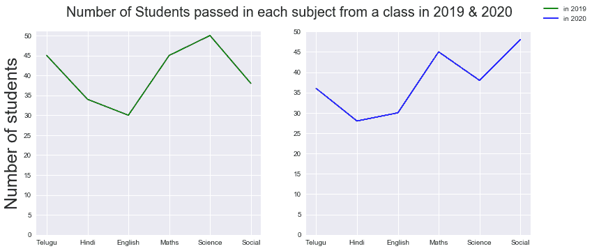
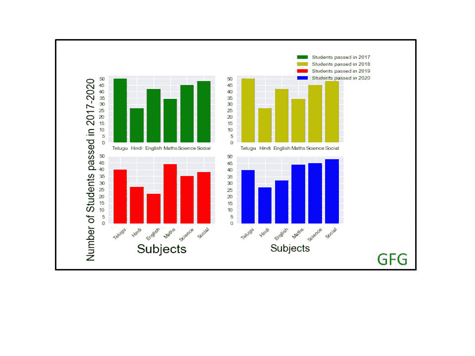

# 如何在 Matplotlib 中为所有支线剧情创建一个单独的传说？

> 原文:[https://www . geesforgeks . org/如何在 matplotlib 中为所有子情节创建单个图例/](https://www.geeksforgeeks.org/how-to-create-a-single-legend-for-all-subplots-in-matplotlib/)

matplotlib 中的 subplot()函数有助于在单个图形中创建一个 subplot 网格。在图中，子情节从左上角开始逐行创建和排序。Matplotlib 库中的一个图例基本上描述了图形元素。[图例()](https://www.geeksforgeeks.org/matplotlib-pyplot-legend-in-python/)可以通过将其放置在各种位置来定制和调整图形内部或外部的任何位置。有时需要为所有支线剧情创建一个单独的传说。以下是显示所有支线剧情的单一图例的示例。

**子剧情()语法:**

```py
subplot(nrows,ncols,nsubplot)
```

例如，子图(2，1，1)是用 2 行 1 列表示第一个子图的图形，第一个子图位于第一行。

子图(2，1，2)表示位于第一列第二行的第二个子图。

**图例命令语法:**

```py
legend(*args, **kwargs)
```

如果图例命令中的参数长度(即 args)为 0，则它会通过调用 get_legend_handles_labels()方法，从标签属性中自动生成图例。

例如，ax.legend()相当于:

```py
handles, labels = ax.get_legend_handles_labels()
ax.legend(handles, labels)
```

get_legend_handles_labels()方法返回两个列表的元组，即艺术家列表和标签列表。

**例 1:**

## 蟒蛇 3

```py
# Importing required libraries
import matplotlib.pyplot as plt
import numpy as np

# 2 subplots in 1 row and 2 columns
fig, (ax1, ax2) = plt.subplots(1, 2, figsize=(12, 5))

x1 = ['Telugu', 'Hindi', 'English',
      'Maths', 'Science', 'Social']
y1 = [45, 34, 30, 45, 50, 38]
y2 = [36, 28, 30, 45, 38, 48]

# Labels to use in the legend for each line
labels = ["in 2019", "in 2020"]

# Title for subplots
fig.suptitle('Number of Students passed in each subject\
from a class in 2019 & 2020', fontsize=20)

# Creating the sub-plots.
l1 = ax1.plot(x1, y1, color="green")
l2 = ax2.plot(x1, y2, color="blue")

ax1.set_yticks(np.arange(0, 51, 5))
ax2.set_yticks(np.arange(0, 51, 5))

ax1.set_ylabel('Number of students', fontsize=25)

fig.legend([l1, l2], labels=labels,
           loc="upper right")

# Adjusting the sub-plots
plt.subplots_adjust(right=0.9)

plt.show()
```

**输出:**



**例 2:**

## 蟒蛇 3

```py
# Plotting sub-plots of number of 
# students passed in each subject 
# in academic year 2017-20.
import matplotlib.pyplot as plt
import numpy as np

plt.style.use('seaborn')  # Plot Styles

fig = plt.figure()

# 4 subplots in 2 rows and 2 columns in a figure
axes = fig.subplots(nrows=2, ncols=2)

axes[0, 0].bar(['Telugu', 'Hindi', 'English', 
                'Maths', 'Science', 'Social'],
               [50, 27, 42, 34, 45, 48], 
               color='g', label="Students passed in 2017")

axes[0, 0].set_yticks(np.arange(0, 51, 5))

axes[0, 1].bar(['Telugu', 'Hindi', 'English', 
                'Maths', 'Science', 'Social'],
               [50, 27, 42, 34, 45, 48], 
               color='y', label="Students passed in 2018")

axes[0, 1].set_yticks(np.arange(0, 51, 5))

axes[1, 0].bar(['Telugu', 'Hindi', 'English', 
                'Maths', 'Science', 'Social'],
               [40, 27, 22, 44, 35, 38],
               color='r', label="Students passed in 2019")

axes[1, 0].set_yticks(np.arange(0, 51, 5))
axes[1, 0].set_xlabel('Subjects', fontsize=25)

# rotating third sub-plot x-axis labels
for tick in axes[1, 0].get_xticklabels():
    tick.set_rotation(45)

axes[1, 0].set_ylabel(" Number of Students passed in 2017-2020", fontsize=20)

axes[1, 1].bar(['Telugu', 'Hindi', 'English',
                'Maths', 'Science', 'Social'],
               [40, 27, 32, 44, 45, 48], 
               color='b', label="Students passed in 2020")

axes[1, 1].set_xlabel('Subjects', fontsize=20)
axes[1, 1].set_yticks(np.arange(0, 51, 5))

lines = []
labels = []

for ax in fig.axes:
    Line, Label = ax.get_legend_handles_labels()
    # print(Label)
    lines.extend(Line)
    labels.extend(Label)

# rotating x-axis labels of last sub-plot
plt.xticks(rotation=45)

fig.legend(lines, labels, loc='upper right')

plt.show()
```

**输出:**

