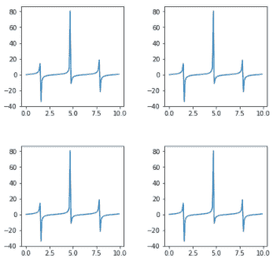
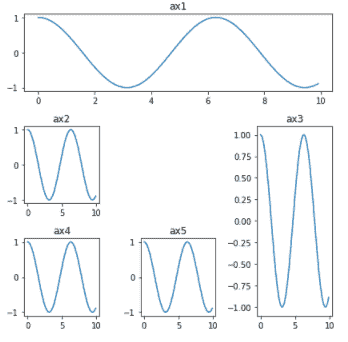

# 如何在 Matplotlib 中创建不同的子图大小？

> 原文:[https://www . geeksforgeeks . org/如何创建不同大小的子图-in-matplotlib/](https://www.geeksforgeeks.org/how-to-create-different-subplot-sizes-in-matplotlib/)

在本文中，我们将学习使用 [Matplotlib](https://www.geeksforgeeks.org/python-introduction-matplotlib/) 创建不同大小的支线剧情的不同方法。它提供了 3 种不同的方法，使用这些方法我们可以创建不同大小的不同子图。

**创建子剧情的可用方法:**

*   **网标**
*   **电网规格 _kw**
*   **子批次 2 网格**

**1。Gridspec :** GridSpec 模块中的 Gridspec 用于调整子图网格的几何图形。我们可以使用不同的参数来调整形状、大小、列数和行数。

**代码:**

## 蟒蛇 3

```
# importing required libraries
import matplotlib.pyplot as plt
from matplotlib import gridspec
import numpy as np

# create a figure
fig = plt.figure()

# to change size of subplot's
# set height of each subplot as 8
fig.set_figheight(8)

# set width of each subplot as 8
fig.set_figwidth(8)

# create grid for different subplots
spec = gridspec.GridSpec(ncols=2, nrows=2,
                         width_ratios=[2, 1], wspace=0.5,
                         hspace=0.5, height_ratios=[1, 2])

# initializing x,y axis value
x = np.arange(0, 10, 0.1)
y = np.cos(x)

# ax0 will take 0th position in
# geometry(Grid we created for subplots),
# as we defined the position as "spec[0]"
ax0 = fig.add_subplot(spec[0])
ax0.plot(x, y)

# ax1 will take 0th position in
# geometry(Grid we created for subplots),
# as we defined the position as "spec[1]"
ax1 = fig.add_subplot(spec[1])
ax1.plot(x, y)

# ax2 will take 0th position in
# geometry(Grid we created for subplots),
# as we defined the position as "spec[2]"
ax2 = fig.add_subplot(spec[2])
ax2.plot(x, y)

# ax3 will take 0th position in
# geometry(Grid we created for subplots),
# as we defined the position as "spec[3]"
ax3 = fig.add_subplot(spec[3])
ax3.plot(x, y)

# display the plots
plt.show()
```

**输出:**


**说明:**

> #为不同的子场景创建网格
> spec = gridspec。GridSpec(ncols=2，nrows=2，width _ ratings =[2，1]，wspace=0.5，hspace=0.5，height _ ratings =[1，2])

这里是格里德佩克。GridSpec()"将为子情节创建网格。我们可以使用不同的参数来调整网格和每个图的大小。

*   **ncol:**在网格中传递所需的列数。
*   **nrows :** 传递我们想要在 Grid 中制作支线剧情的行数。
*   **width _ ratings:**设置子剧情的宽度比(调整剧情宽度)。
*   **高度 _ 比率:**设置子剧情的高度比率(调整剧情高度)。
*   **wspace :** 给“wspace”一定的空间，垂直分隔各个支线剧情。
*   **hs space:**水平给“hs space”一定的空间来分隔支线剧情。

**2。gridspec_kw :** 是 Matplotlib 中**“PLT . subplots()”**方法内的字典。通过向字典传递不同的参数，我们可以调整每个子情节的形状和大小。

**代码:**

## 蟒蛇 3

```
# importing required libraries
import matplotlib.pyplot as plt
import numpy as np

# setting different parameters to adjust each grid
fig, ax = plt.subplots(nrows=2, ncols=2, figsize=(7, 7),
                       gridspec_kw={
                           'width_ratios': [3, 3],
                           'height_ratios': [3, 3],
                       'wspace': 0.4,
                       'hspace': 0.4})

# initializing x,y axis value
x = np.arange(0, 10, 0.1)
y = np.tan(x)

# ax[0][0] will take 0th position in
# geometry(Grid we created for subplots)
ax[0][0].plot(x, y)

# ax[0][0] will take 0th position in
# geometry(Grid we created for subplots)
ax[0][1].plot(x, y)

# ax[0][0] will take 0th position in
# geometry(Grid we created for subplots)
ax[1][0].plot(x, y)

# ax[0][0] will take 0th position in
# geometry(Grid we created for subplots)
ax[1][1].plot(x, y)

plt.show()
```

**输出:**



**说明:**

> #设置不同参数调整每个网格
> 图，ax = plt .子图(nrows=2，ncols=2，figsize=(7，7)，grid spec _ kw = { ' width _ ratings ':[3，3]，' height _ ratings ':[3，3]，' wspace' : 0.4，' hspace' : 0.4})

**“grid spec _ kw = { }”**是一个带有按键的字典，使用它我们可以改变每个网格的形状、大小和调整。

*   **n 显示:**网格中的行数
*   **ncols :** 网格中的列数
*   **宽度比:**设置每个子图的宽度大小
*   **高度比:**设置各子图的高度大小
*   **wspace :** 给“wspace”一定的空间，垂直分隔各个支线剧情。
*   **hs space:**水平给“hs space”一定的空间来分隔支线剧情。
*   **figsize :** 设置子剧情的大小。

**3。sublot 2 grid:**它提供了更多的灵活性，可以在任何位置创建网格。我们可以非常容易地横向和纵向扩展网格。

**代码:**

## 蟒蛇 3

```
# importing required library
import matplotlib.pyplot as plt
import numpy as np

# creating grid for subplots
fig = plt.figure()
fig.set_figheight(6)
fig.set_figwidth(6)

ax1 = plt.subplot2grid(shape=(3, 3), loc=(0, 0), colspan=3)
ax2 = plt.subplot2grid(shape=(3, 3), loc=(1, 0), colspan=1)
ax3 = plt.subplot2grid(shape=(3, 3), loc=(1, 2), rowspan=2)
ax4 = plt.subplot2grid((3, 3), (2, 0))
ax5 = plt.subplot2grid((3, 3), (2, 1), colspan=1)

# initializing x,y axis value
x = np.arange(0, 10, 0.1)
y = np.cos(x)

# plotting subplots
ax1.plot(x, y)
ax1.set_title('ax1')
ax2.plot(x, y)
ax2.set_title('ax2')
ax3.plot(x, y)
ax3.set_title('ax3')
ax4.plot(x, y)
ax4.set_title('ax4')
ax5.plot(x, y)
ax5.set_title('ax5')

# automatically adjust padding horizontally
# as well as vertically.
plt.tight_layout()

# display plot
plt.show()
```

**输出:**



**说明:**

> ax1 = PLT . sublot 2 grid(shape =(3，3)，loc=(0，0)，col span = 3)
> ax2 = PLT . sublot 2 grid(shape =(3，3)，loc=(1，0)，col span = 1)
> ax3 = PLT . sublot 2 grid(shape =(3，3)，loc=(1，2)，row span = 2)
> ax4 = PLT . sublot 2 grid((3，3)，(2，0))
> ax5 = pls

这里，形状表示行数和列数，loc 表示网格的几何位置。假设我们在 ax1 中使用 colspan = 3，这意味着这些子图将覆盖该行的所有 3 列。类似地，在 ax2 中，colspan=1 意味着它将在其位置覆盖 1 列空间。对于 ax3，rowspan=2 意味着它将覆盖 2 行的空间。如果我们给出不规则的输入，那么它会给出错误，所以我们给了 colspan 和 rowspan 适当的值。