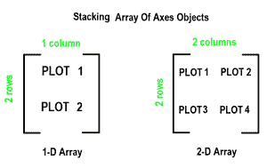
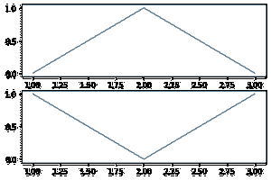
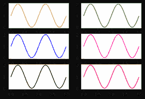

# 如何用 Python 在 Matplotlib 中创建多个支线剧情？

> 原文:[https://www . geeksforgeeks . org/如何在 python 中创建多个子情节/](https://www.geeksforgeeks.org/how-to-create-multiple-subplots-in-matplotlib-in-python/)

要创建多个地块，请使用[**matplotlib . pyplot . subplots**](https://www.geeksforgeeks.org/matplotlib-pyplot-subplots-in-python/)方法，该方法**返回图形以及轴对象或轴对象数组。nrows，ncols** 子图的属性()方法决定了子图网格的行数和列数。

默认情况下，它返回一个带有单个绘图的图形。对于每个轴对象，即地块，我们可以设置标题(通过 **set_title()** 设置)、x 标签(通过 **set_xlabel()** 设置)和 y 标签(通过 **set_ylabel()** 设置)。

让我们看看这是如何工作的

1.  当我们通过仅在一个方向上堆叠来调用子场景()方法时，它会返回一个轴的 1D 数组对象，即子场景。
2.  我们可以使用索引访问这些轴对象，就像我们访问数组的元素一样。要创建特定的子情节，请在相应的轴索引上调用 matplotlib.pyplot.plot()。为了更好地理解，请参考下图



**示例 1:** 1 维子剧情阵列

## 蟒蛇 3

```
# importing library
import matplotlib.pyplot as plt

# Some data to display
x = [1, 2, 3]
y = [0, 1, 0]
z = [1, 0, 1]

# Creating 2 subplots
fig, ax = plt.subplots(2)

# Accessing each axes object to plot the data through returned array
ax[0].plot(x, y)
ax[1].plot(x, z)
```

**输出:**



子情节 _ 图 1

**示例 2:** 两个方向的堆叠返回轴对象的 2D 数组。

## 蟒蛇 3

```
# importing library
import matplotlib.pyplot as plt
import numpy as np

# Data for plotting
x = np.arange(0.0, 2.0, 0.01)
y = 1 + np.sin(2 * np.pi * x)

# Creating 6 subplots and unpacking the output array immediately
fig, ((ax1, ax2), (ax3, ax4), (ax5, ax6)) = plt.subplots(3, 2)
ax1.plot(x, y, color="orange")
ax2.plot(x, y, color="green")
ax3.plot(x, y, color="blue")
ax4.plot(x, y, color="magenta")
ax5.plot(x, y, color="black")
ax6.plot(x, y, color="red")
```

**输出:**



支线剧情 _ 图 2