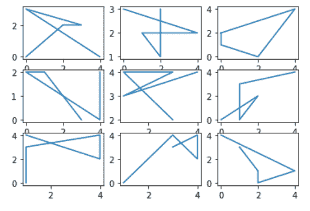
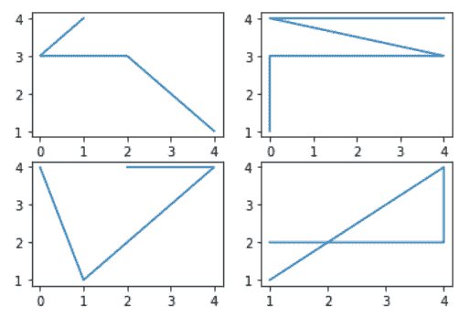
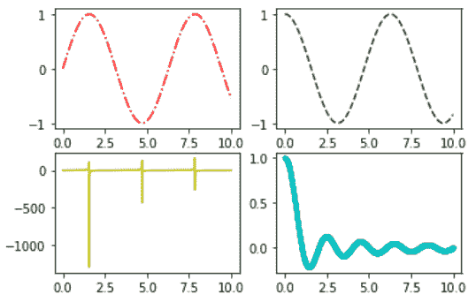

# 如何用 Python 在 Matplotlib 中创建支线剧情？

> 原文:[https://www . geeksforgeeks . org/如何用 python 创建 matplotlib 中的子情节/](https://www.geeksforgeeks.org/how-to-create-subplots-in-matplotlib-with-python/)

**先决条件:**T2【马特洛特利】T4

在本文中，我们将学习如何使用 Python 中的 Matplotlib 向图形图添加标记。为此，必须熟悉以下概念:

*   [**Matplotlib**](https://www.geeksforgeeks.org/python-introduction-matplotlib/)**:**Matplotlib 是一个巨大的 Python 可视化库，用于数组的 2D 图。Matplotlib 可能是一个多平台数据可视化库，构建在 NumPy 数组上，旨在与更广泛的 SciPy 堆栈一起工作。它是由约翰·亨特在 2002 年推出的。
*   **支线剧情:**[matplotlib . pyplot .支线剧情()](https://www.geeksforgeeks.org/matplotlib-pyplot-subplots-in-python/)方法提供了一种在单个图形上绘制多个剧情的方法。给定行数和列数，它返回一个元组(fig，ax)，给出一个带有轴数组 ax 的图。

### 方法

*   导入包
*   导入或创建一些数据
*   创建子图对象。
*   用它画一个图。

**例 1:**

## 蟒蛇 3

```
# importing packages
import matplotlib.pyplot as plt
import numpy as np

# making subplots objects
fig, ax = plt.subplots(3, 3)

# draw graph
for i in ax:
    for j in i:
        j.plot(np.random.randint(0, 5, 5), np.random.randint(0, 5, 5))

plt.show()
```

**输出:**



**例 2 :**

## 蟒蛇 3

```
# importing packages
import matplotlib.pyplot as plt
import numpy as np

# making subplots objects
fig, ax = plt.subplots(2, 2)

# draw graph
ax[0][0].plot(np.random.randint(0, 5, 5), np.random.randint(0, 5, 5))
ax[0][1].plot(np.random.randint(0, 5, 5), np.random.randint(0, 5, 5))
ax[1][0].plot(np.random.randint(0, 5, 5), np.random.randint(0, 5, 5))
ax[1][1].plot(np.random.randint(0, 5, 5), np.random.randint(0, 5, 5))

plt.show()
```

**输出:**



**例 3 :**

## 蟒蛇 3

```
# importing packages
import matplotlib.pyplot as plt
import numpy as np

# making subplots objects
fig, ax = plt.subplots(2, 2)

# create data
x = np.linspace(0, 10, 1000)

# draw graph
ax[0, 0].plot(x, np.sin(x), 'r-.')
ax[0, 1].plot(x, np.cos(x), 'g--')
ax[1, 0].plot(x, np.tan(x), 'y-')
ax[1, 1].plot(x, np.sinc(x), 'c.-')

plt.show()
```

**输出:**

