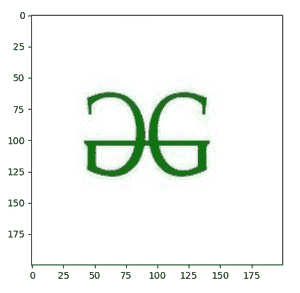
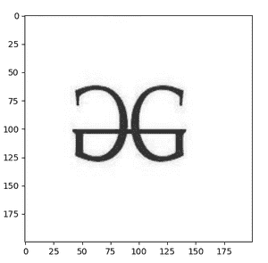

# 如何用 Matplotlib 在 Python 中显示 OpenCV 图像？

> 原文:[https://www . geesforgeks . org/how-display-an-opencv-image-in-python-with-matplotlib/](https://www.geeksforgeeks.org/how-to-display-an-opencv-image-in-python-with-matplotlib/)

*OpenCV* 模块是一个开源的计算机视觉和机器学习软件库。这是一个巨大的开源库，用于计算机视觉、机器学习和图像处理。 *OpenCV* 支持 Python、C++、Java 等多种编程语言。它可以处理图像和视频来识别物体、人脸，甚至是人类的笔迹。当它与各种库集成时，例如 *numpy* 这是一个高度优化的数值运算库，那么你的武器库中的武器数量就会增加，也就是说无论你在 *Numpy* 中能做什么运算都可以与 *OpenCV* 结合。

首先，让我们看看如何使用 OpenCV 显示图像:

现在有一个名为 cv2.imread()的函数，它将图像的路径作为参数。使用此功能，您将读取该特定图像，并使用 cv2.imshow()功能简单地显示它。

## 蟒蛇 3

```
# import required module
import cv2

# read the Image by giving path
image = cv2.imread('gfg.png')

# display that image
cv2.imshow('GFG', image)
```

**输出:**


使用 OpenCV 显示图像

现在让我们跳转到用 *Matplotlib* 模块显示图像。这是一个神奇的 Python 可视化库，用于 2D 数组图。 *Matplotlib* 模块是基于 *NumPy* 阵列构建的多平台数据可视化库，旨在与更广泛的 *SciPy* 堆栈一起工作。

我们正在对上面的代码进行细微的修改，以使用 *Matplotlib* 模块显示我们的图像。

## 蟒蛇 3

```
# import required module
import cv2
import matplotlib.pyplot as plt

# read image
image = cv2.imread('gfg.png')

# call imshow() using plt object
plt.imshow(image)

# display that image
plt.show()
```

**输出:**



用 Matplotlib 绘制图像

您也可以使用 *Matplotlib* 模块显示灰度 *OpenCV* 图像，因为您只需要将彩色图像转换为灰度图像。

## 蟒蛇 3

```
# import required modules
import cv2
import matplotlib.pyplot as plt

# read the image
image = cv2.imread('gfg.png')

# convert color image into grayscale image
img1 = cv2.cvtColor(image, cv2.COLOR_RGB2GRAY)

# plot that grayscale image with Matplotlib
# cmap stands for colormap
plt.imshow(img1, cmap='gray')

# display that image
plt.show()
```

**输出:**



使用 Matplotlib 显示灰度图像图

这就是我们如何使用 *Matplotlib* 模块在 python 中显示 *OpenCV* 图像。