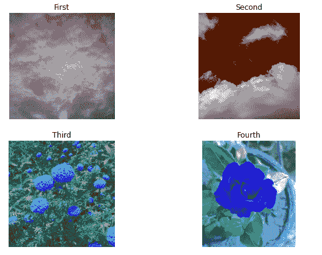

# 如何在 Matplotlib 中一图多图正确显示？

> 原文:[https://www . geesforgeks . org/如何在 matplotlib 中正确显示多图合一图像/](https://www.geeksforgeeks.org/how-to-display-multiple-images-in-one-figure-correctly-in-matplotlib/)

在一幅图中显示多幅图像最简单的方法是使用 Matplotlib 的[图()](https://www.geeksforgeeks.org/matplotlib-pyplot-figure-in-python/)、 [add_subplot()](https://www.geeksforgeeks.org/matplotlib-figure-figure-add_subplot-in-python/) 和 [imshow()](https://www.geeksforgeeks.org/matplotlib-pyplot-imshow-in-python/) 方法。使用的方法是首先通过调用 fig = PLT . fig()启动 fig 对象，然后通过调用 add_subplot()方法向 fig 中添加一个 axes 对象。然后将使用 imshow()方法显示图像。

> **语法:** add_subplot(行、列、I)

这里的行和列是图中的行和列的总数，I 是必须放置新的子剧情的位置。

**步骤:**

*   导入所需的库
*   创造一个人物
*   设置行和列变量的值
*   读取图像
*   添加子情节并逐一显示图像

**考虑以下用作输入的图像:**


图像 1


图像 2


图像 3


图像 4

**下面是实现:**

## 蟒蛇 3

```
# code for displaying multiple images in one figure

#import libraries
import cv2
from matplotlib import pyplot as plt

# create figure
fig = plt.figure(figsize=(10, 7))

# setting values to rows and column variables
rows = 2
columns = 2

# reading images
Image1 = cv2.imread('Image1.jpg')
Image2 = cv2.imread('Image2.jpg')
Image3 = cv2.imread('Image3.jpg')
Image4 = cv2.imread('Image4.jpg')

# Adds a subplot at the 1st position
fig.add_subplot(rows, columns, 1)

# showing image
plt.imshow(Image1)
plt.axis('off')
plt.title("First")

# Adds a subplot at the 2nd position
fig.add_subplot(rows, columns, 2)

# showing image
plt.imshow(Image2)
plt.axis('off')
plt.title("Second")

# Adds a subplot at the 3rd position
fig.add_subplot(rows, columns, 3)

# showing image
plt.imshow(Image3)
plt.axis('off')
plt.title("Third")

# Adds a subplot at the 4th position
fig.add_subplot(rows, columns, 4)

# showing image
plt.imshow(Image4)
plt.axis('off')
plt.title("Fourth")
```

**输出:**

