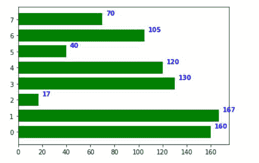
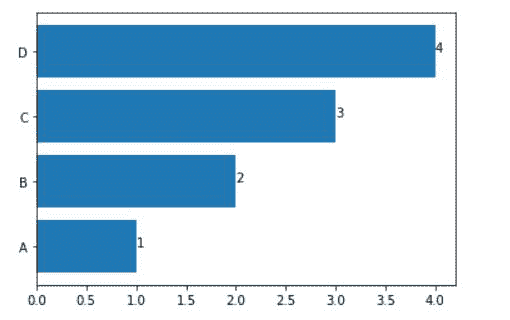

# 如何用 Matplotlib 显示条形图中各条的数值？

> 原文:[https://www . geeksforgeeks . org/如何使用-matplotlib/](https://www.geeksforgeeks.org/how-to-display-the-value-of-each-bar-in-a-bar-chart-using-matplotlib/) 显示条形图中每个条形图的价值

在本文中，我们将看到如何使用 [Matplotlib](https://www.geeksforgeeks.org/python-introduction-matplotlib/) 在酒吧聊天中显示每个酒吧的值。在 matplotlib 中，有两种不同的方法来显示条形图中每个条形图的值–

*   使用[matplotlib . axes . axes . text()](https://www.geeksforgeeks.org/matplotlib-axes-axes-text-in-python/)函数。
*   使用 [matplotlib.pyplot.text()](https://www.geeksforgeeks.org/matplotlib-pyplot-text-function-in-python/) 函数。

**示例 1:使用**[**matplotlib . axes . text()**](https://www.geeksforgeeks.org/matplotlib-axes-axes-text-in-python/)**功能:**

这个功能基本上是用来给图表中的位置添加一些文字。此函数返回字符串，这总是与语法“**一起用于索引，value in enumerate(iterable)** ”一起使用，iterable 作为访问每个索引的条值列表，value pair in iterable 因此它可以在每个条上添加文本。

## 蟒蛇 3

```py
import os
import numpy as np
import matplotlib.pyplot as plt

x = [0, 1, 2, 3, 4, 5, 6, 7]
y = [160, 167, 17, 130, 120, 40, 105, 70]
fig, ax = plt.subplots()
width = 0.75
ind = np.arange(len(y))

ax.barh(ind, y, width, color = "green")

for i, v in enumerate(y):
    ax.text(v + 3, i + .25, str(v), 
            color = 'blue', fontweight = 'bold')
plt.show()
```

**输出:**



**示例 2:使用** [**功能:**](https://www.geeksforgeeks.org/matplotlib-pyplot-text-function-in-python/)

调用 matplotlib.pyplot.barh(x，height)，用 x 作为条形图名称列表，用 height 作为条形图值列表，创建条形图。使用语法“**”作为 index，value in enumerate(iterable)** ”并以 iterable 作为 bar 值的列表来访问 iterable 中的每个 index，value 对。在每次迭代中，调用 matplotlib.pyplot.text(x，y，s)，其中 x 为值，y 为索引，s 为字符串(值)，用其大小标记每个条。

## 蟒蛇 3

```py
import matplotlib.pyplot as plt
x = ["A", "B", "C", "D"]
y = [1, 2, 3, 4]
plt.barh(x, y)

for index, value in enumerate(y):
    plt.text(value, index,
             str(value))

plt.show()
```

**输出:**

