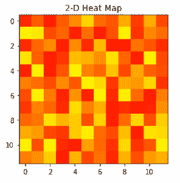
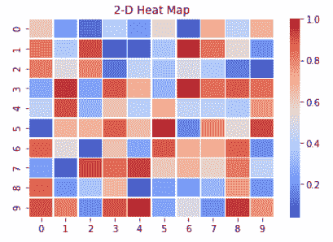
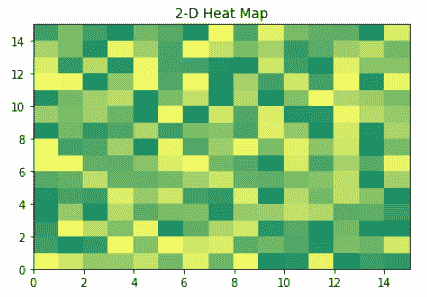

# 如何用 python 中的 Matplotlib 绘制 2D 热图？

> 原文:[https://www . geesforgeks . org/how-draw-2d-heat map-using-matplotlib-in-python/](https://www.geeksforgeeks.org/how-to-draw-2d-heatmap-using-matplotlib-in-python/)

二维热图是一种数据可视化工具，有助于以颜色的形式表示现象的严重程度。在 python 中，我们可以使用 Matplotlib 包绘制二维热图。绘制二维热图有不同的方法，其中一些将在下面讨论。

**方法一:使用 matplotlib.pyplot.imshow()函数**

> **语法*****:**matplotlib . pyplot . imshow(X，cmap =无，norm=无，aspect =无，插值=无，alpha =无，vmin =无，*
> *VMAX =无，原点=无，范围=无，形状= <弃用参数>，filternorm=1，filterrad=4.0，*
> *imlim= <弃用参数>，重采样=无*

## 蟒蛇 3

```py
# Program to plot 2-D Heat map
# using matplotlib.pyplot.imshow() method
import numpy as np
import matplotlib.pyplot as plt

data = np.random.random(( 12 , 12 ))
plt.imshow( data , cmap = 'autumn' , interpolation = 'nearest' )

plt.title( "2-D Heat Map" )
plt.show()
```

**输出:**



**方法二:使用海伯恩图书馆**

为此，我们使用 **seaborn.heatmap()函数**

> **语法*****:**seaborn . heat map(data，* vmin = None，vmax=None，cmap=None，center=None，robust=False，annot=None，*
> *fmt = . 2g’，annot_kws=None，线宽=0，linecolor='white '，cbar=True，cbar_kws=None，cbar_ax=None，*
> *square=False，xticklabels='auto '，yti*

## 蟒蛇 3

```py
# Program to plot 2-D Heat map
# using seaborn.heatmap() method
import numpy as np
import seaborn as sns
import matplotlib.pylab as plt

data_set = np.random.rand( 10 , 10 )
ax = sns.heatmap( data_set , linewidth = 0.5 , cmap = 'coolwarm' )

plt.title( "2-D Heat Map" )
plt.show()
```

**输出:**



**方法三:使用 matplotlib.pyplot.pcolormesh()函数**

> **语法*****:**matplotlib . pyplot . pcolormesh(* args，alpha=None，norm=None，cmap=None，vmin=None，vmax=None，*
> *底纹='flat '，抗锯齿=False，数据=None，**kwargs)*

## 蟒蛇 3

```py
# Program to plot 2-D Heat map
# using matplotlib.pyplot.pcolormesh() method
import matplotlib.pyplot as plt
import numpy as np

Z = np.random.rand( 15 , 15 )

plt.pcolormesh( Z , cmap = 'summer' )

plt.title( '2-D Heat Map' )
plt.show()
```

**输出:**

