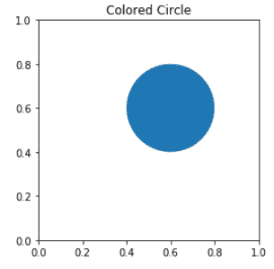
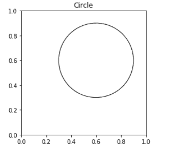
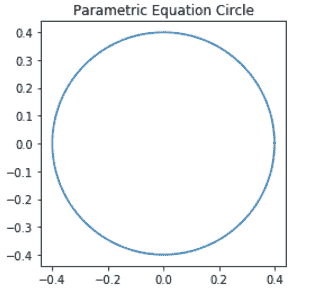
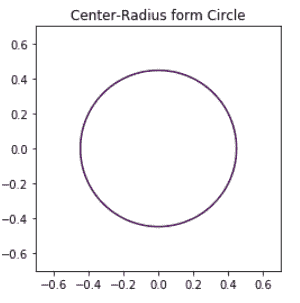
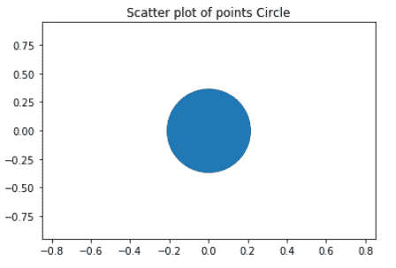

# 如何用 Python 中的 Matplotlib 画圆？

> 原文:[https://www . geeksforgeeks . org/如何使用 python 中的 matplotlib 绘制圆/](https://www.geeksforgeeks.org/how-to-draw-a-circle-using-matplotlib-in-python/)

圆是一种数学图形，它是由位于同一平面上且与给定点距离相等的所有点连接而成的。我们可以使用 Matplotlib 在 python 中绘制一个圆。使用 Matplotlib 在 python 中绘制圆有多种方法。

**方法一:使用 matplotlib.patches.Circle()函数。**

Matplotlib 有一个特殊的函数 matplotlib.patches.Circle()来绘制圆。

> **语法:**class matplotlib . patches . circle(xy，半径=5，**kwargs)

**示例 1:** 使用 matplotlib.patches.Circle()绘制彩色圆

## 蟒蛇 3

```py
# Demonstrating use of matplotlib.patches.Circle() function
# to plot a colored Circle

import matplotlib.pyplot as plt

figure, axes = plt.subplots()
Drawing_colored_circle = plt.Circle(( 0.6 , 0.6 ), 0.2 )

axes.set_aspect( 1 )
axes.add_artist( Drawing_colored_circle )
plt.title( 'Colored Circle' )
plt.show()
```

**输出:**



**示例 2:** 使用 matplotlib.patches.Circle()绘制未着色的圆

## 蟒蛇 3

```py
# Demonstrating use of matplotlib.patches.Circle() function
# to plot an un-colored Circle

import matplotlib.pyplot as plt

figure, axes = plt.subplots()
Drawing_uncolored_circle = plt.Circle( (0.6, 0.6 ),
                                      0.3 ,
                                      fill = False )

axes.set_aspect( 1 )
axes.add_artist( Drawing_uncolored_circle )
plt.title( 'Circle' )
plt.show()
```

**输出:**



**方法二:使用圆方程**

**示例 1:** 使用圆的参数方程绘制圆

## 蟒蛇 3

```py
# Program to plot a Circle
# using Parametric equation of a Circle

import numpy as np
import matplotlib.pyplot as plt

theta = np.linspace( 0 , 2 * np.pi , 150 )

radius = 0.4

a = radius * np.cos( theta )
b = radius * np.sin( theta )

figure, axes = plt.subplots( 1 )

axes.plot( a, b )
axes.set_aspect( 1 )

plt.title( 'Parametric Equation Circle' )
plt.show()
```

**输出:**



**示例 2:** 使用圆方程的中心半径形式

## 蟒蛇 3

```py
# Program to plot a Circle
# using Center-Radius form of circle equation

import numpy as np
import matplotlib.pyplot as plt

x = np.linspace( -0.7 , 0.7 , 150 )
y = np.linspace( -0.7 , 0.7 , 150 )

a, b = np.meshgrid( x , y )

C = a ** 2 + b ** 2 - 0.2

figure, axes = plt.subplots()

axes.contour( a , b , C , [0] )
axes.set_aspect( 1 )

plt.title( 'Center-Radius form Circle' )
plt.show()
```

**输出:**



**方法 3:使用点的散点图**

**示例:**

## 蟒蛇 3

```py
# Program to plot a Circle
# using Scatter plot of points

import matplotlib.pyplot as plt

plt.scatter( 0 , 0 , s = 7000 )
plt.title( 'Circle' )

plt.xlim( -0.85 , 0.85 )
plt.ylim( -0.95 , 0.95 )

plt.title( "Scatter plot of points Circle" )
plt.show()
```

**输出:**

