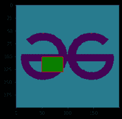

# 如何在 Matplotlib 中在图像上绘制矩形？

> 原文:[https://www . geesforgeks . org/matplotlib 中如何在图像上绘制矩形/](https://www.geeksforgeeks.org/how-to-draw-rectangle-on-image-in-matplotlib/)

**先决条件:**T2【马特洛特利

给定一张图片，这里的任务是用 matplotlib 绘制一个 python 程序，在上面画一个矩形。Matplotlib 自带矩形()函数，可以满足我们的需求。

> **语法:** *矩形(xy，宽度，高度，角度=0.0，**kwargs)*
> 
> ***参数:***
> 
> *   ***xy:** 左下角开始绘制矩形*
> *   ***宽度:**矩形的宽度*
> *   ***高度:**矩形的高度。*
> *   ***角度:**矩形的旋转角度。*

### 方法

*   导入必要的库。
*   插入并显示图像。
*   创建图的图形和轴
*   将面片添加到轴
*   显示图像

**示例 1:** 在图像上绘制一个矩形

## 蟒蛇 3

```py
import matplotlib.pyplot as plt
import matplotlib.patches as patches
from PIL import Image
import numpy as np

x = np.array(Image.open('geek.png'), dtype=np.uint8)
plt.imshow(x)

# Create figure and axes
fig, ax = plt.subplots(1)

# Display the image
ax.imshow(x)

# Create a Rectangle patch
rect = patches.Rectangle((50, 100), 40, 30, linewidth=1,
                         edgecolor='r', facecolor="none")

# Add the patch to the Axes
ax.add_patch(rect)
plt.show()
```

**输出:**


原象


带有矩形的图像

**示例 2:** 绘制一个实心矩形

## 蟒蛇 3

```py
import matplotlib.pyplot as plt
import matplotlib.patches as patches
from PIL import Image
import numpy as np

x = np.array(Image.open('geek.png'), dtype=np.uint8)
plt.imshow(x)

# Create figure and axes
fig, ax = plt.subplots(1)

# Display the image
ax.imshow(x)

# Create a Rectangle patch
rect = patches.Rectangle((50, 100), 40, 30, linewidth=1,
                         edgecolor='r', facecolor="g")

# Add the patch to the Axes
ax.add_patch(rect)
plt.show()
```

**输出:**


原象



带有矩形的图像