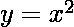
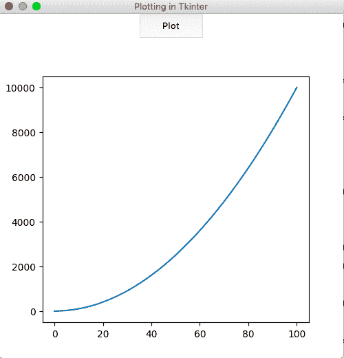

# 如何在 Tkinter GUI 中嵌入 Matplotlib 图表？

> 原文:[https://www . geesforgeks . org/how-embed-matplotlib-charts-in-tkinter-GUI/](https://www.geeksforgeeks.org/how-to-embed-matplotlib-charts-in-tkinter-gui/)

**先决条件:**[Tkinter 简介](https://www.geeksforgeeks.org/python-gui-tkinter/)**|**[Matplotlib 简介](https://www.geeksforgeeks.org/python-introduction-matplotlib/)

当从 Python shell 中使用 Matplotlib 时，绘图显示在默认窗口中。这些图可以嵌入到许多图形用户界面中，如 wx Tyson、pygtk 或 Tkinter。这些可用作输出图目标的各种选项被称为“*后端*”。 **matplotlib .后端**中有各种模块可供选择后端。一个这样的模块是**后端 _tkagg** ，它对于在 *Tkinter* 中嵌入地块很有用。

#### 创建 Tkinter 应用程序:

首先，让我们创建一个基本的 Tkit 应用程序，它有一个主窗口和一个按钮，可以用来显示图形。

## 蟒蛇 3

```py
# import all classes/methods
# from the tkinter module
from tkinter import *

# The main tkinter window
window = Tk()

# setting the title and 
window.title('Plotting in Tkinter')

# setting the dimensions of 
# the main window
window.geometry("500x500")

# button that would displays the plot
plot_button = Button(master = window,
                     height = 2,
                     width = 10,
                    text = "Plot")
# place the button
# into the window
plot_button.pack()

# run the gui
window.mainloop()
```

**输出:**


#### 嵌入绘图:

首先，我们需要使用 **Figure()** 类创建图形对象。然后，使用**图 CanvasTkAgg()** 类创建一个 *Tkinter* 画布(包含该图)。默认情况下，Matplotlib 图表底部有一个工具栏。然而，在使用*Tkit*时，这个工具栏需要使用 **NavigationToolbar2Tk()** 类单独嵌入画布中。
在下面的实现中，一个简单的图表用于:



被绘制出来。*绘图*功能绑定到一个按钮，按下该按钮时会显示图形。

## 蟒蛇 3

```py
from tkinter import * 
from matplotlib.figure import Figure
from matplotlib.backends.backend_tkagg import (FigureCanvasTkAgg, 
NavigationToolbar2Tk)

# plot function is created for 
# plotting the graph in 
# tkinter window
def plot():

    # the figure that will contain the plot
    fig = Figure(figsize = (5, 5),
                 dpi = 100)

    # list of squares
    y = [i**2 for i in range(101)]

    # adding the subplot
    plot1 = fig.add_subplot(111)

    # plotting the graph
    plot1.plot(y)

    # creating the Tkinter canvas
    # containing the Matplotlib figure
    canvas = FigureCanvasTkAgg(fig,
                               master = window)  
    canvas.draw()

    # placing the canvas on the Tkinter window
    canvas.get_tk_widget().pack()

    # creating the Matplotlib toolbar
    toolbar = NavigationToolbar2Tk(canvas,
                                   window)
    toolbar.update()

    # placing the toolbar on the Tkinter window
    canvas.get_tk_widget().pack()

# the main Tkinter window
window = Tk()

# setting the title 
window.title('Plotting in Tkinter')

# dimensions of the main window
window.geometry("500x500")

# button that displays the plot
plot_button = Button(master = window, 
                     command = plot,
                     height = 2, 
                     width = 10,
                     text = "Plot")

# place the button 
# in main window
plot_button.pack()

# run the gui
window.mainloop()
```

**输出:**

