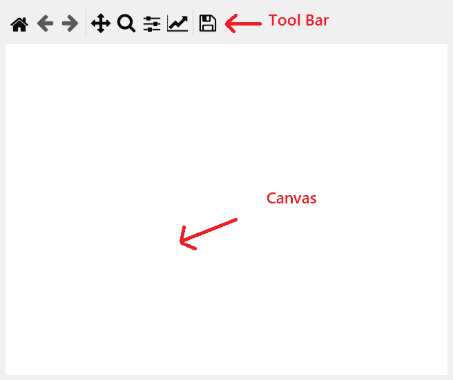

# 如何在 PyQt5 中嵌入 Matplotlib 图？

> 原文:[https://www . geesforgeks . org/how-embed-matplotlib-graph-in-pyqt 5/](https://www.geeksforgeeks.org/how-to-embed-matplotlib-graph-in-pyqt5/)

在本文中，我们将看到如何使用 matplotlib 在 [PyQt5](https://www.geeksforgeeks.org/python-introduction-to-pyqt5/) 窗口中绘制图形。

**[Matplotlib](https://www.geeksforgeeks.org/python-introduction-matplotlib/)** 是 Python 中一个惊人的可视化库，用于数组的 2D 图。Matplotlib 是一个多平台数据可视化库，构建在 NumPy 数组上，旨在与更广泛的 SciPy 堆栈一起工作。它是由约翰·亨特在 2002 年推出的。

**[PyQt5](https://www.geeksforgeeks.org/python-introduction-to-pyqt5/)** 是跨平台的 GUI 工具包，一套针对 Qt v5 的 Python 绑定。由于该库提供的工具和简单性，人们可以非常容易地开发交互式桌面应用程序。图形用户界面应用程序由前端和后端组成。

## 入门指南

为了在 PyQt5 中使用 Matplotlib 绘制图形，我们需要`FigureCanvasQTAgg and NavigationToolbar2QT`这些类似于正在嵌入的 PyQt5 小部件。

*   **NavigationToolbar2QT :** 它将为图形提供工具栏，可以借助下面给出的命令

    > 导入从 matplotlib.backends。后端 _qt5agg 导入导航工具栏 2QT 作为导航工具栏

*   **图 CanvasQTAgg :** 它将为图提供画布，可以借助下面给出的命令

    > 导入从 matplotlib.backends。后端 _qt5agg 导入图 CanvasQTAgg 作为图画布

以下是`FigureCanvasQTAgg and NavigationToolbar2QT`的样子–



下面是实现

```py
# importing various libraries
import sys
from PyQt5.QtWidgets import QDialog, QApplication, QPushButton, QVBoxLayout
from matplotlib.backends.backend_qt5agg import FigureCanvasQTAgg as FigureCanvas
from matplotlib.backends.backend_qt5agg import NavigationToolbar2QT as NavigationToolbar
import matplotlib.pyplot as plt
import random

# main window
# which inherits QDialog
class Window(QDialog):

    # constructor
    def __init__(self, parent=None):
        super(Window, self).__init__(parent)

        # a figure instance to plot on
        self.figure = plt.figure()

        # this is the Canvas Widget that 
        # displays the 'figure'it takes the
        # 'figure' instance as a parameter to __init__
        self.canvas = FigureCanvas(self.figure)

        # this is the Navigation widget
        # it takes the Canvas widget and a parent
        self.toolbar = NavigationToolbar(self.canvas, self)

        # Just some button connected to 'plot' method
        self.button = QPushButton('Plot')

        # adding action to the button
        self.button.clicked.connect(self.plot)

        # creating a Vertical Box layout
        layout = QVBoxLayout()

        # adding tool bar to the layout
        layout.addWidget(self.toolbar)

        # adding canvas to the layout
        layout.addWidget(self.canvas)

        # adding push button to the layout
        layout.addWidget(self.button)

        # setting layout to the main window
        self.setLayout(layout)

    # action called by thte push button
    def plot(self):

        # random data
        data = [random.random() for i in range(10)]

        # clearing old figure
        self.figure.clear()

        # create an axis
        ax = self.figure.add_subplot(111)

        # plot data
        ax.plot(data, '*-')

        # refresh canvas
        self.canvas.draw()

# driver code
if __name__ == '__main__':

    # creating apyqt5 application
    app = QApplication(sys.argv)

    # creating a window object
    main = Window()

    # showing the window
    main.show()

    # loop
    sys.exit(app.exec_())
```

**输出:**

<video class="wp-video-shortcode" id="video-430171-1" width="640" height="564" preload="metadata" controls=""><source type="video/mp4" src="https://media.geeksforgeeks.org/wp-content/uploads/20200606040205/python-2020-06-06-04-01-26.mp4?_=1">[https://media.geeksforgeeks.org/wp-content/uploads/20200606040205/python-2020-06-06-04-01-26.mp4](https://media.geeksforgeeks.org/wp-content/uploads/20200606040205/python-2020-06-06-04-01-26.mp4)</video>