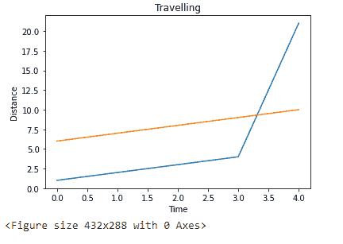
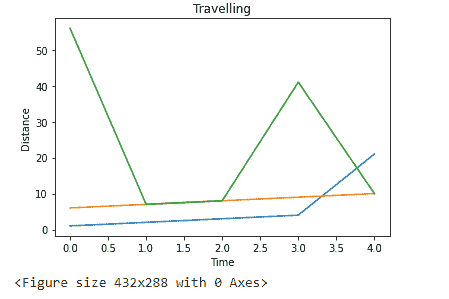

# 如何在 Python 中导出背景透明的 Matplotlib 图？

> 原文:[https://www . geeksforgeeks . org/如何导出-matplotlib-带透明背景的 python 绘图/](https://www.geeksforgeeks.org/how-to-export-matplotlib-plot-with-transparent-background-in-python/)

在本文中，我们将讨论如何在 Python 中导出具有透明背景的 Matplotlib 图。

在绘制完数据之后，如果我们想要导出图，那么我们必须使用 [savefig()](https://www.geeksforgeeks.org/matplotlib-pyplot-savefig-in-python/) 功能。

**语法**:

```
savefig('plot_name.png', transparent=True)
```

在哪里

*   plot_name 是根据数据绘制的图像名称
*   当设置为 true 时，透明用于获取透明背景

**示例 1:** Python 代码，用数据帧的两个数据点创建图并导出

## 蟒蛇 3

```
#import matplotlib
import matplotlib.pyplot as plt

#import pandas
import pandas as pd

# create a dataframe with 2 columns
data = pd.DataFrame({'data1': [1, 2, 3, 4, 21],
                     'data2': [6, 7, 8, 9, 10]})

# plot one by one
plt.plot(data['data1'])

plt.plot(data['data2'])

# set y label
plt.ylabel('Distance')

# set x label
plt.xlabel('Time')

# set title
plt.title('Travelling')

# display plot
plt.show()

# export it
plt.savefig('image.png', transparent=True)
```

**输出**:



**示例 2 :** 使用数据框的 3 个数据点创建绘图并将其导出的 Python 代码

## 蟒蛇 3

```
#import matplotlib
import matplotlib.pyplot as plt

#import pandas
import pandas as pd

# create a dataframe with 2 columns
data = pd.DataFrame({'data1': [1, 2, 3, 4, 21], 
                     'data2': [6, 7, 8, 9, 10],
                     'data3': [56, 7, 8, 41, 10]})

# plot one by one
plt.plot(data['data1'])
plt.plot(data['data2'])
plt.plot(data['data3'])

# set y label
plt.ylabel('Distance')

# set x label
plt.xlabel('Time')

# set title
plt.title('Travelling')

# display plot
plt.show()

# export it
plt.savefig('image.png', transparent=True)
```

**输出**:

