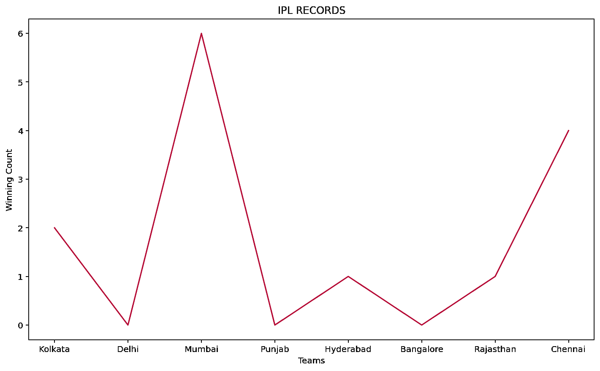
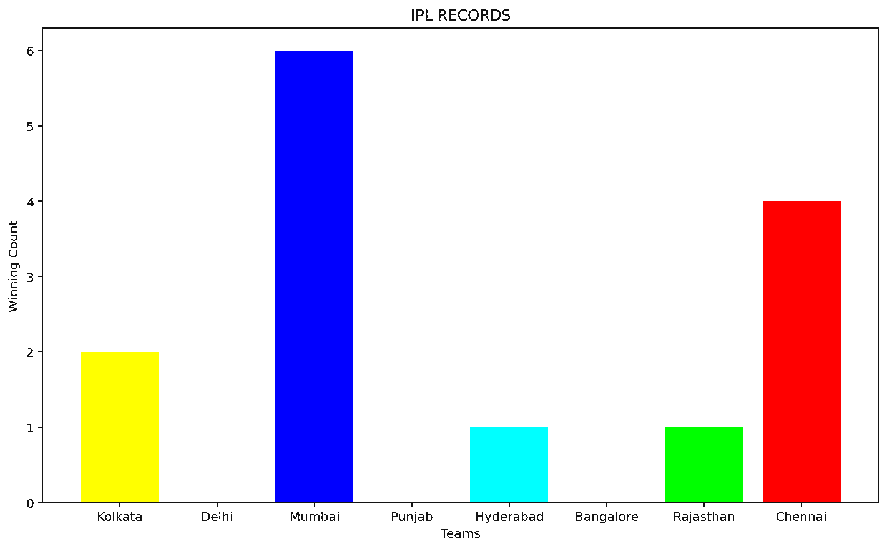

# 如何在 Python 中为 Matplotlib 图生成随机颜色？

> 原文:[https://www . geeksforgeeks . org/如何生成 matplotlib-plot-in-python/](https://www.geeksforgeeks.org/how-to-generate-a-random-color-for-a-matplotlib-plot-in-python/)

处理庞大的数据集需要可以用来存储、分析和操作数据集的库和方法。说到数据科学和分析，Python 是一个受欢迎的选择。数据科学家更喜欢 Python，因为它具有广泛的库支持，包含可用于处理数据集以创建图形和图表的功能。 [Matplotlib](https://www.geeksforgeeks.org/python-introduction-matplotlib/) 是 Python 中的数据可视化库。Matplotlib 的工作方式与 [Matlab](https://www.geeksforgeeks.org/applications-of-matlab/) 相似，并生成交互式图表。Matplotlib 提供了多种图表类型可供选择。可以使用内置的方法和属性显式设置图表属性。为了在 Python 中为 Matplotlib 图生成随机颜色，使用了 matplotlib.pyplot 和 Python 的随机库。以下是为 Matplotlib 图生成随机颜色的示例:

**第一次进场**

1.  数据集是用 teams 数组和 wincount 数组创建的。
2.  团队数组相对于 X 轴绘制，wincount 数组相对于 Y 轴绘制。Matplotlib 支持浮点值在 0-1 范围内的 RGB 或 RGBA。
3.  现在，范围在 0-1 之间的 RGB 或 RGBA 值决定了图表的颜色。
4.  在本例中，为了创建介于 0 和 1 之间的随机值。获得的红色“r”、绿色“g”和蓝色“b”值随后被传递到形成最终颜色的元组颜色中。
5.  该元组接下来被分配给 plot()方法的颜色属性。
6.  使用 matplotlib.pyplot 库的 xlabel()、ylabel()和 title()方法标记 X 轴和 Y 轴，并为图表提供标题。

**代码实现:**

## 蟒蛇 3

```py
import random as random
import matplotlib.pyplot as plt

teams = ['Kolkata', 'Delhi', 'Mumbai', 'Punjab',
         'Hyderabad', 'Bangalore', 'Rajasthan', 'Chennai']

wincount = [2, 0, 6, 0, 1, 0, 1, 4]

r = random.random()
b = random.random()
g = random.random()

color = (r, g, b)

plt.xlabel("Teams")
plt.ylabel("Winning Count")
plt.title("IPL RECORDS")
plt.plot(teams, wincount, c=color)
```

**输出:**



**第二次进场**

1.  在第二种方法中，展示了一个条形图。声明一个空列表来保存颜色元组。
2.  X 轴和 Y 轴被标记，并为图表设置标题。
3.  要为 n 条记录附加不同的颜色，需要执行 for 循环。
4.  numpy 库的 random.choice()方法用于创建大小为 3 且值介于 0 和 1 之间的元组。
5.  团队和 wincount 阵列相对于 X 轴和 Y 轴绘制。
6.  matplotlib.pyplot 的 bar()方法的颜色属性被分配给元组列表。从列表中为每个条选择随机元组。

**代码实现**

## 蟒蛇 3

```py
import random as random
import matplotlib.pyplot as plt
import numpy as np

l = []
teams = ['Kolkata', 'Delhi', 'Mumbai', 'Punjab',
         'Hyderabad', 'Bangalore', 'Rajasthan', 'Chennai']

wincount = [2, 0, 6, 0, 1, 0, 1, 4]

plt.xlabel("Teams")
plt.ylabel("Winning Count")
plt.title("IPL RECORDS")

for i in range(0, len(teams)+1):
    l.append(tuple(np.random.choice(range(0, 2), size=3)))

plt.bar(teams, wincount, color=l)
```

**输出:**



然而，使用随机颜色的缺点是，如果选择白色，特定的条或线将变得不可见。