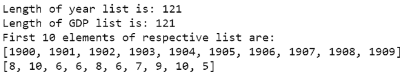
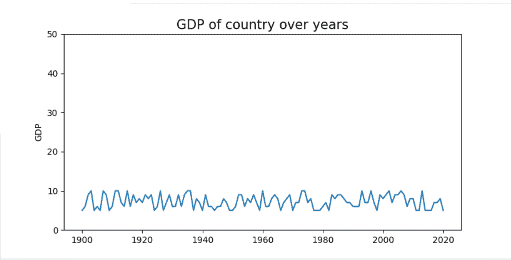
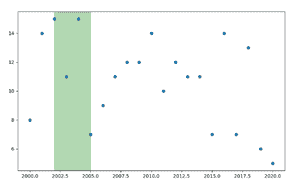
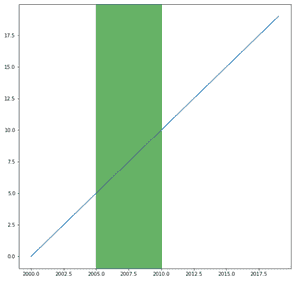

# 如何用 Matplotlib 在 Python 中突出时间序列图中的一个时间范围？

> 原文:[https://www . geeksforgeeks . org/如何突出显示时间序列中的时间范围-用 matplotlib 绘制 python 图/](https://www.geeksforgeeks.org/how-to-highlight-a-time-range-in-time-series-plot-in-python-with-matplotlib/)

时间序列图是包含在一段时间内测量的数据的图，例如，一个国家的国内生产总值、世界人口和许多其他数据。

有时我们想突出时间线的特定时期，以便观察者更容易阅读特定数据。我们可以使用 *matplotlib* 模块中的 [pyplot.axvspan()](https://www.geeksforgeeks.org/matplotlib-pyplot-axvspan-in-python/) 突出显示时间序列图中的时间范围。

**语法:**

> matplotlib.pyplot.axvspan(xmin、xmax、ymin=0、ymax=1、**kwargs)
> 
> **参数:**
> 
> *   **xmin:** 表示 X 轴上垂直矩形起始位置的数字。
> *   **xmin:** 表示垂直矩形在 X 轴上的结束位置的数字。
> *   **ymin:**y 轴上的垂直矩形起始位置，取 0 到 1 之间的值，0 为轴的底部，1 为轴的顶部
> *   **ymax:**y 轴上的垂直矩形结束位置，取 0 到 1 之间的值，0 为轴的底部，1 为轴的顶部。
> *   ****kwargs:** 改变矩形属性的其他可选参数，如改变颜色等。

**以下是一些描述如何在时间序列图中突出显示时间范围的示例:**

**例 1** :

让我们假设我们有一个国家，我们想画一幅它多年的国内生产总值图。首先，我们必须准备好数据，以便绘制图表。在 Y 轴上，我们将取国内生产总值，它是从 5 到 10 的随机整数。在 X 轴上，我们将从 1900 年到 2020 年。

我们会把一个国家的 GDP，在一定时期内突出出来。

## 蟒蛇 3

```
# import required modules
import random
import matplotlib.pyplot as plt

# create dataset
year = [i for i in range(1900,2021)]
GDP = []
for i in range(121):
    GDP.append(random.randint(5,10))

# display dataset   
print("Length of year list is: " + str(len(year)))
print("Length of GDP list is: " + str(len(GDP)))
print("First 10 elements of respective list are: ")
print(year[:10])
print(GDP[:10])
```

**输出:**



现在我们将绘制一张国内生产总值与年份的图表。我们已经相应地缩放了 Y 轴。

## 蟒蛇 3

```
# depict time series
fig, ax = plt.subplots(figsize=(5,5))
ymin, ymax = plt. ylim()
ax.plot(year,GDP)
plt.ylim(ymin * 50, ymax * 50)

# adjust label
ax.set_ylabel("GDP")

# assign title
ax.set_title("GDP of country over years" ,size=15)
plt.show()
```

**输出:**



国内生产总值与年份的图表

子图关键字返回图形，即图和轴数组(存储在 *ax* 中)，我们将使用它来突出显示图形。

我们将使用 *axvspan()* 方法，该方法在给定范围内的轴上添加一个垂直跨度(矩形)，然后我们可以更改矩形的颜色，然后降低其不透明度，使其看起来像是我们已经突出显示了它。

**注意:**记得降低不透明度，否则会在图上显示为纯色矩形。使用** *夸脱*使用的 *alpha* 参数用于降低不透明度。

## 蟒蛇 3

```
# depict illustration
fig, ax = plt.subplots(figsize=(5, 5))
ymin, ymax = plt. ylim()
ax.plot(year, GDP)
plt.ylim(ymin * 50, ymax * 50)

# adjust labels
ax.set_ylabel("GDP")

# assign title
ax.set_title("GDP of country over years", size=15)

# highlight a time range
ax.axvspan(1990, 2010, color="blue", alpha=0.3)
plt.show()
```


国内生产总值与年份的突出图表

**例 2** :

这是另一个程序，我们将突出显示散点图的 x 轴。

## 蟒蛇 3

```
# importing libraries
import matplotlib.pyplot as plt
import random

# creating the dataset
date = [i for i in range(2000, 2021)]
value = []
for i in range(21):
    value.append(random.randint(5, 15))

# Create a figure and a set of subplots
fig, ax = plt.subplots(figsize=(10, 6))

# Creating the scatter plot
ax.scatter(date, value)

# Highlighting for a certain period of time
ax.axvspan(2002, 2005, alpha=0.3, color="green")
plt.show()
```



在散点图上突出显示

**例 3** :

下面是另一个例子，我们强调了从 2005 年到 2010 年的时间范围

## 蟒蛇 3

```
# import required modules
import random
import matplotlib.pyplot as plt

# create dataset
x = [int(i) for i in range(2000,2020)]
y = [i for i in range(20)]

# depict illustration
fig, ax = plt.subplots(figsize=(10, 10))
ymin, ymax = plt. ylim()
ax.plot(x, y)

# highlight a time range
ax.axvspan(2005, 2010, color="green", alpha=0.6)
plt.show()
```

**输出:**

