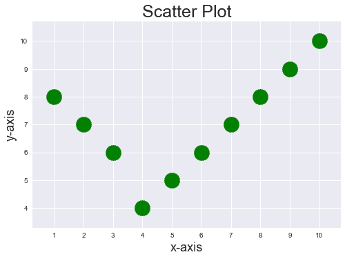
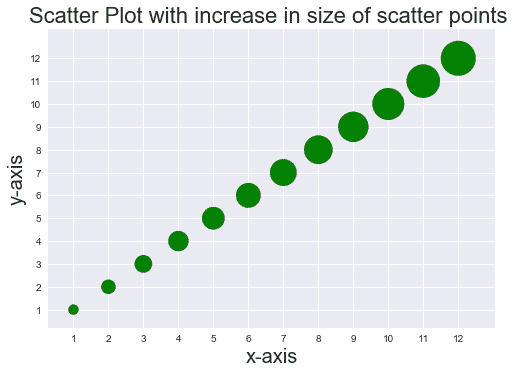
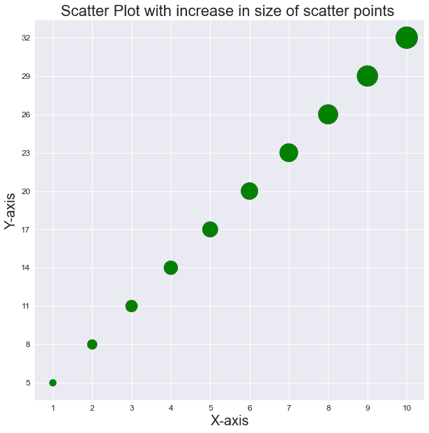

# 如何增加 Matplotlib 中分散点的大小？

> 原文:[https://www . geeksforgeeks . org/如何增加 matplotlib 中分散点的大小/](https://www.geeksforgeeks.org/how-to-increase-the-size-of-scatter-points-in-matplotlib/)

**先决条件:**T2【马特洛特利

散点图是 matplotlib 库中 x 轴和 y 轴之间的图上的数据点。图中的点看起来是分散的，因此该图被命名为“散点图”。如果不使用语法中的可选参数，散点图中的点默认较小。可选参数用于增加 matplotlib 中分散点的大小。下面讨论可以设置的各种方式。

> **语法:**
> 
> *matplotlib . pyplot . scatter(x _ axis _ data，y_axis_data，s =无，c =无，marker =无，cmap =无，vmin =无，vmax =无，alpha =无，线宽=无，edgecolors =无)*
> 
> ***参数:***
> 
> *   **x 轴数据-** 包含 x 轴数据的数组
> *   **y 轴数据-** 包含 y 轴数据的数组
> *   **s-** 标记大小(可以是标量或大小等于 x 或 y 的数组)
> *   **c-** 标记颜色序列的颜色
> *   **标记**–标记样式
> *   **cmap-** cmap 名称
> *   **线宽-** 标记边框的宽度
> *   **边缘颜色-** 标记边框颜色
> *   **α-**混合值，介于 0(透明)和 1(不透明)之间

### 方法

*   导入模块
*   创建数据
*   为 s 设置值
*   绘制散点图
*   显示图

参数 s 可以多种方式设置，可以是固定值，也可以是变量。当 s 设置为变量值时，散点图上的数据点大小不同。实现如下:

**示例 1:** 散点图中固定大小增加的数据点

## 蟒蛇 3

```py
import matplotlib.pyplot as plt
import numpy as np

plt.style.use('seaborn')

x = [1, 2, 3, 4, 5, 6, 7, 8, 9, 10]
y = [8, 7, 6, 4, 5, 6, 7, 8, 9, 10]

plt.xticks(np.arange(11))
plt.yticks(np.arange(11))

plt.scatter(x, y, s=500, c='g')

plt.title("Scatter Plot", fontsize=25)

plt.xlabel('x-axis', fontsize=18)
plt.ylabel('y-axis', fontsize=18)

plt.show()
```

**输出:**



**示例 2:** 大小可变的散点图中的数据点

## 蟒蛇 3

```py
import matplotlib.pyplot as plt
import numpy as np

plt.style.use('seaborn')

x = [1,2,3,4,5,6,7,8,9,10,11,12]
y = [1,2,3,4,5,6,7,8,9,10,11,12]
points_size = [100,200,300,400,500,600,700,800,900,1000,1100,1200]

plt.xticks(np.arange(13))
plt.yticks(np.arange(13))

plt.scatter(x,y,s=points_size,c='g')

plt.title("Scatter Plot with increase in size of scatter points ", fontsize=22)

plt.xlabel('x-axis',fontsize=20)
plt.ylabel('y-axis',fontsize=20)

plt.show()
```

**输出:**



**例 3:**

## 蟒蛇 3

```py
import matplotlib.pyplot as plt

plt.style.use('seaborn')
plt.figure(figsize=(10, 10))

x = [1, 2, 3, 4, 5, 6, 7, 8, 9, 10]
y = [3*i+2 for i in x]
size = [n*100 for n in range(1, len(x)+1)]
# print(size)

plt.scatter(x, y, s=size, c='g')
plt.title("Scatter Plot with increase in size of scatter points ", fontsize=22)

plt.xlabel('X-axis', fontsize=20)
plt.ylabel('Y-axis', fontsize=20)

plt.xticks(x, fontsize=12)
plt.yticks(y, fontsize=12)

plt.show()
```

**输出:**

