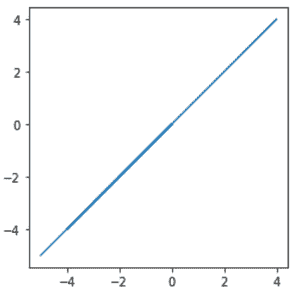

# 如何在 Matplotlib 中制作等轴方形图？

> 原文:[https://www . geeksforgeeks . org/如何在 matplotlib 中绘制等轴正方形图/](https://www.geeksforgeeks.org/how-to-make-a-square-plot-with-equal-axes-in-matplotlib/)

在本文中，我们将讨论如何使用 [*matplotlib*](https://www.geeksforgeeks.org/python-introduction-matplotlib/) 模块来说明等轴正方形图。我们可以使用[*matplotlib . axes . axes . set _ aspect()*](https://www.geeksforgeeks.org/matplotlib-axes-axes-set_aspect-in-python/)和[*matplotlib . pyplot . axis()*](https://www.geeksforgeeks.org/matplotlib-pyplot-axis-in-python/)的方法来描绘一个方形图。

### **使用** ***设定 _ 方面()*** **方法**

> **语法:**matplotlib . axes . set _ aspect()
> 
> **参数:**
> 
> *   **方面:**此参数接受以下值{'auto '，' equal'}或 num。
> *   **可调:**这定义了将调整哪个参数以满足所需的方面。
> *   **锚点:**此参数用于定义如果由于方面限制而有额外空间，轴将绘制在哪里。
> *   **共享:**此参数用于将设置应用于所有共享轴。

**例 1:**

我们可以使用*matplotlib . axes . axes . set _ aspect()*方法生成一个方形图。我们将分配*相等*作为*方面*参数，*框*作为*可调*参数。

## 蟒蛇 3

```
# import required module
# import required modules
import numpy as np
import matplotlib.pyplot as plt

# adjust coordinates
x = y = [i for i in range(0, 6)]

# depict illustration
fig = plt.figure()
ax = fig.add_subplot()
plt.plot(x, y)

# square plot
ax.set_aspect('equal', adjustable='box')
plt.show()
```

**输出:**



**例 2** :

当两个战斧的射程相等时，上面的例子可能会产生一个方形图。为了在整体情况下生成方形图，我们需要使用附带的顺序物理设置视点比例:

```
axes.set_aspect(1./axes.get_data_ratio())
```

## 蟒蛇 3

```
# import required modules
import numpy as np
import matplotlib.pyplot as plt

# adjust coordinates
x = y = [i for i in range(0, 6)]

# depict illustration
fig = plt.figure()
ax = fig.add_subplot()
plt.plot(x, y)

# square plot
ax.set_aspect(1.0/ax.get_data_ratio(), adjustable='box')
plt.show()
```