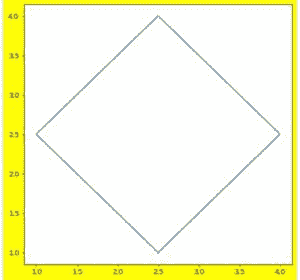
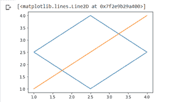
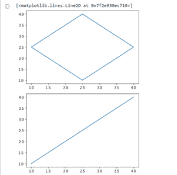
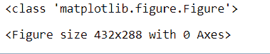

# 如何在 Matplotlib 中修改已有图形实例？

> 原文:[https://www . geeksforgeeks . org/如何修改现有图形-实例-in-matplotlib/](https://www.geeksforgeeks.org/how-to-modify-existing-figure-instance-in-matplotlib/)

在 Python 中**matplotlib . pyplot . figure()**用于修改现有的 Figure 实例或制作新的 Figure 实例。通常，它用于改变现有地块的基本属性。如果它被用来改变已经形成的地块的属性，它会引用相关地块。它返回 figure 实例，并将其传递给后端的 new_figure_manager，后者又允许将自定义 Figure 类挂钩到 pyplot 接口中。

> **语法:**matplotlib . pyplot . figure(num =无，figsize =无，dpi =无，facecolor =无，edgecolor =无，
> frameon=True，figure class =<class ' matplotlib . figure . figure '>，clear=False，**kwargs)
> 
> **参数**
> 
> **num** :是人物的唯一标识。如果图实例已经存在，并且具有相同的值，则返回该实例，否则将创建一个新实例并为其分配随机数。如果值是数字，那么它作为一个唯一的 id，如果是字符串，它也作为图像标签。此参数是可选的。
> 
> **figsize** :是一个参数，取一个元组或者 2 个浮点数的列表，分别提到图形的宽度和高度。默认情况下，它被设置为[6.4，4.8]
> 
> **dpi** :顾名思义，它采用每英寸点数作为浮点值。默认值为 100。
> 
> **facecolor** :用于设置人物的背景颜色。默认值为“白色”。
> 
> **边框颜色**:用于设置图形的边框颜色。默认值为“白色”。
> 
> **图形类**:接受图形的子类，可选用于引用任何自定义图形实例。
> 
> **清除**:用于清除相应实例上的任何现有图形。
> 
> **返回:**实例。关闭()
> 
> 建议使用。close()方法在使用 figure 后使用一次清理不必要的内存。要关闭图形实例，请编写。

**示例 1:** 使用图形提取图形实例()

下面提到的例子展示了如何使用图方法来标记任何图，并使用这个相同的标签作为参考点来获取图实例。资产报表确认了两个实例指向同一个参考点的事实。

## 蟒蛇 3

```
import matplotlib.pyplot as plt

# Figure instance with label => label
fig = plt.figure( num = 'label' )

fig.get_label()

# This will fetch Figure instance fig only
fig2 = plt.figure( num = 'label' )
assert fig == fig2
```

**示例 2:** 使用自定义高度、宽度和背景绘制图形

这个例子讲述了如何使用自定义尺寸和自定义 dpi 绘制图表。这里的背景也从白色变成了黄色。高度设置为 10，宽度设置为 7。

## 蟒蛇 3

```
import matplotlib.pyplot as plt

# plotting a yellow background
# graph with dpi => 50
plt.figure(num='label',
           facecolor='yellow',
           figsize=[10, 7],
           dpi=50)

plt.plot([2.5, 1, 2.5, 4, 2.5],
         [1, 2.5, 4, 2.5, 1])
```

**输出**T2】



黄色背景

**示例 3:** 清除图表的示例

这里的第一个代码是展示如果在一个实例上绘制两个不同的图而不使用 clear，代码会是什么样子。理想的情况是，它将把两者绘制在一个图形上。

## 蟒蛇 3

```
import matplotlib.pyplot as plt

plt.plot([2.5, 1, 2.5, 4, 2.5],
         [1, 2.5, 4, 2.5, 1])

plt.plot([1, 2, 3, 4], [1, 2, 3, 4])
```

**输出**



两者都标了出来

现在执行相同的代码，但是在实现第二个图之前清除第一个图。

## 蟒蛇 3

```
import matplotlib.pyplot as plt

plt.plot([2.5, 1, 2.5, 4, 2.5],
         [1, 2.5, 4, 2.5, 1])

# This will clear the first plot
plt.figure(clear=True)

# This will make a new plot on a
# different instance
plt.plot([1, 2, 3, 4], [1, 2, 3, 4])
```

**输出**



两块不同的空地

**例 4:** 检查返回类型

figure()返回一个 Figure 实例，下一个示例只是验证了这个事实。

## 蟒蛇 3

```
import matplotlib.pyplot as plt

# the type comes out as Figure Instance.
print(type(plt.figure()))
```

**输出:**

