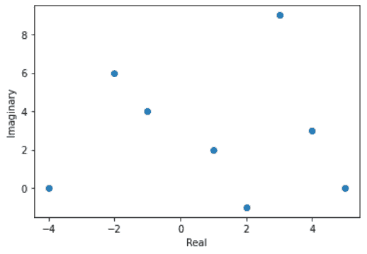
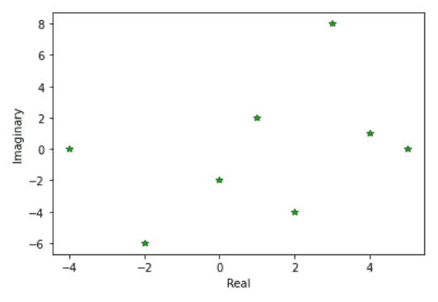
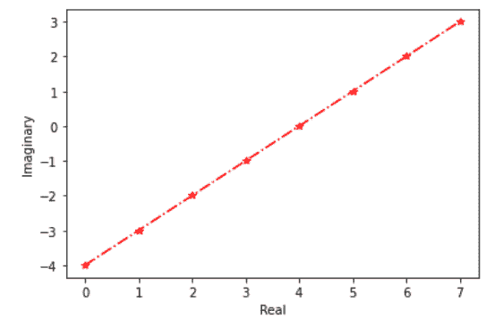

# 如何用 Matplotlib 在 Python 中绘制复数？

> 原文:[https://www . geeksforgeeks . org/如何使用 matplotlib 绘制 python 中的复数/](https://www.geeksforgeeks.org/how-to-plot-a-complex-number-in-python-using-matplotlib/)

在本文中，我们将学习如何使用 Matplotlib 在 Python 中绘制复数。让我们讨论一些概念:

*   [**Matplotlib**](https://www.geeksforgeeks.org/python-introduction-matplotlib/)**:**Matplotlib 是 Python 中一个惊人的可视化库，用于数组的 2D 图。Matplotlib 是一个多平台数据可视化库，构建在 [NumPy](https://www.geeksforgeeks.org/python-numpy/) 数组上，旨在与更广泛的 SciPy 堆栈一起工作。它是由约翰·亨特在 2002 年推出的。
*   **复数:**复数是可以用 a + bi 的形式表示的数，其中 A 和 b 是实数，I 代表虚数单位，满足公式 I2 = 1。因为没有实数满足这个方程，所以我被称为虚数。
*   **Python 中的复数:**一个复数用“x + yi”表示。Python 使用函数复数(x，y)将实数 x 和 y 转换为复数。实部可以使用功能**实部()**访问，虚部可以用 **imag()** 表示。

**进场:**

1.  导入库。
2.  创建复数数据
3.  从复数数据中提取实部和虚部
4.  绘制提取的数据。

**示例:**

为了绘制复数，我们必须提取它的实部和虚部，为了提取和创建数据，我们将使用一些方法，这些方法将在下面的示例中解释:

**示例 1:(实数和虚数上有复数的简单图)**

## 蟒蛇 3

```
# import library
import matplotlib.pyplot as plt

# create data of complex numbers
data = [1+2j, -1+4j, 4+3j, -4, 2-1j, 3+9j, -2+6j, 5]

# extract real part
x = [ele.real for ele in data]
# extract imaginary part
y = [ele.imag for ele in data]

# plot the complex numbers
plt.scatter(x, y)
plt.ylabel('Imaginary')
plt.xlabel('Real')
plt.show()
```

**输出:**



**例 2:(使用 numpy 提取实部和虚部)**

## 蟒蛇 3

```
# import libraries
import matplotlib.pyplot as plt
import numpy as np

# create data of complex numbers
data = np.array([1+2j, 2-4j, -2j, -4, 4+1j, 3+8j, -2-6j, 5])

# extract real part using numpy array
x = data.real
# extract imaginary part using numpy array
y = data.imag

# plot the complex numbers
plt.plot(x, y, 'g*')
plt.ylabel('Imaginary')
plt.xlabel('Real')
plt.show()
```

**输出:**



**示例 3:(使用 numpy 创建复数数据并提取实部和虚部)**

## 蟒蛇 3

```
# import libraries
import matplotlib.pyplot as plt
import numpy as np

# create data of complex numbers using numpy
data = np.arange(8) + 1j*np.arange(-4, 4)

# extract real part using numpy
x = data.real
# extract imaginary part using numpy
y = data.imag

# plot the complex numbers
plt.plot(x, y, '-.r*')
plt.ylabel('Imaginary')
plt.xlabel('Real')
plt.show()
```

**输出:**

