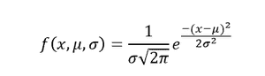
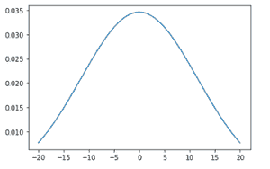

# 如何用 Python 中的 Matplotlib 绘制正态分布？

> 原文:[https://www . geeksforgeeks . org/如何用 python 中的 matplotlib 绘制正态分布图/](https://www.geeksforgeeks.org/how-to-plot-a-normal-distribution-with-matplotlib-in-python/)

**先决条件:**

*   [Matplotlib](https://www.geeksforgeeks.org/python-introduction-matplotlib/)
*   num py
*   [轨道](https://www.geeksforgeeks.org/data-analysis-with-scipy/)轨道
*   [统计](https://www.geeksforgeeks.org/statistical-functions-in-python-set-2-measure-of-spread/)

**正态分布** 是统计学中使用的概率函数，讲述数据值是如何分布的。它是统计学中最重要的概率分布函数，因为它在实际场景中具有优势。比如人口的身高，鞋码，智商水平，擀一个模具，等等很多。

正态或高斯分布的概率密度函数由下式给出:



概率密度函数

其中，x 是变量，μ是平均值，σ是标准差

### 需要的模块

*   ***Matplotlib*** 是 python 的数据可视化库，广泛用于数据可视化的目的。
*   ***Numpy*** 是一个通用的数组处理包。它提供了一个高性能的多维数组对象，以及使用这些数组的工具。它是使用 Python 进行科学计算的基本包。
*   ***【Scipy】***是一个 python 库，对求解很多数学方程和算法都很有用。
*   ***【统计】*** 模块提供数值数据的数理统计计算功能。

### 使用的功能

*   计算数据的平均值

**语法:**

```
mean(data)
```

*   计算数据的标准偏差

**语法:**

```
stdev(data)
```

*   要计算使用 norm.pdf 的数据的正态概率密度，它是指正态概率密度函数，它是 scipy 库中的一个模块，使用上述概率密度函数来计算值。

**语法:**

> 标准. pdf(数据、锁定、缩放)

这里，loc 参数也称为平均值，而 scale 参数也称为标准差。

### 方法

*   导入模块
*   创建数据
*   计算平均值和偏差
*   计算正态概率密度
*   使用以上计算值绘图
*   显示图

下面是实现。

## 蟒蛇 3

```
import numpy as np
import matplotlib.pyplot as plt
from scipy.stats import norm
import statistics

# Plot between -10 and 10 with .001 steps.
x_axis = np.arange(-20, 20, 0.01)

# Calculating mean and standard deviation
mean = statistics.mean(x_axis)
sd = statistics.stdev(x_axis)

plt.plot(x_axis, norm.pdf(x_axis, mean, sd))
plt.show()
```

**输出:**



以上代码的输出