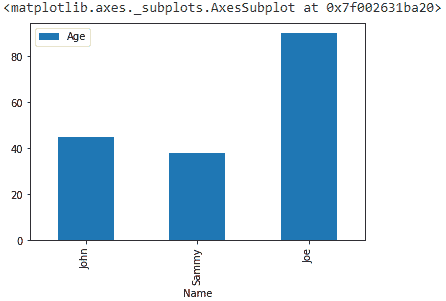

# 如何用 Matplotlib 绘制熊猫数据框？

> 原文:[https://www . geeksforgeeks . org/如何绘制熊猫-dataframe-with-matplotlib/](https://www.geeksforgeeks.org/how-to-plot-a-pandas-dataframe-with-matplotlib/)

**先决条件:**

*   [熊猫](https://www.geeksforgeeks.org/pandas-tutorial/)
*   [Matplotlib](https://www.geeksforgeeks.org/python-introduction-matplotlib/)

数据可视化是任何分析中最重要的部分。 [Matplotlib](https://www.geeksforgeeks.org/python-introduction-matplotlib/) 是一个神奇的 python 库，可以用来绘制熊猫的数据帧。根据需要，有多种方法可以生成图。

## **分类数据之间的比较**

[条形图](https://www.geeksforgeeks.org/bar-plot-in-matplotlib/)就是这样一个例子。将使用 plot()函数绘制条形图。

**语法:**

> *matplotlib . pyplot . plot(\ * args、scalex=True、scaley=True、data=None、\*\*kwargs)*

**示例:**

## 蟒蛇 3

```
# importing pandas library
import pandas as pd
# importing matplotlib library
import matplotlib.pyplot as plt

# creating dataframe
df = pd.DataFrame({
    'Name': ['John', 'Sammy', 'Joe'],
    'Age': [45, 38, 90]
})

# plotting a bar graph
df.plot(x="Name", y="Age", kind="bar")
```

**输出:**



## 可视化**连续数据**

[直方图](https://www.geeksforgeeks.org/plotting-histogram-in-python-using-matplotlib/)是将数据表示为被划分为紧密相关的区间的示例。为此，将使用 hist()函数。

**语法:**

> *matplotlib . pyplot . hist(x，bins =无，范围=无，密度=假，权重=无，累积=假，底部=无，histtype='bar '，align='mid '，方位='vertical '，rwidth =无，log =假，颜色=无，标签=无，堆叠=假，\*，数据=无，\*\*kwargs)*

**示例:**

## 蟒蛇 3

```
# importing pandas library
import pandas as pd
# importing matplotlib library
import matplotlib.pyplot as plt

# creating dataframe
df = pd.DataFrame({
    'Age': [45, 38, 90, 60, 40, 50, 2, 32, 8, 15, 27, 69, 73, 55]
})

# plotting a histogram
plt.hist(df["Age"])
plt.show()
```

**输出:**


## **用于数据分发**

[饼图](https://www.geeksforgeeks.org/plot-a-pie-chart-in-python-using-matplotlib/)是表示作为整体一部分的数据的好方法。要绘制饼图，将使用 pie()函数。

**语法:**

> *matplotlib.pyplot.pie(数据，分解=无，标签=无，颜色=无，自动扫描=无，阴影=假)*

**示例:**

## 蟒蛇 3

```
# importing pandas library
import pandas as pd
# importing matplotlib library
import matplotlib.pyplot as plt

# creating dataframe
df = pd.DataFrame({
    'Object': ['Bulb', 'Lamp', 'Table', 'Pen', 'Notebook'],
    'Price': [45, 38, 90, 60, 40]
})

# plotting a pie chart
plt.pie(df["Price"], labels=df["Object"])
plt.show()
```