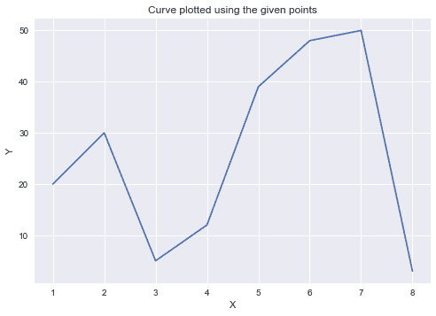
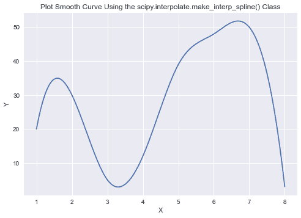

# 如何在 Matplotlib 中绘制平滑曲线？

> 原文:[https://www . geeksforgeeks . org/如何绘制平滑的 matplotlib 曲线/](https://www.geeksforgeeks.org/how-to-plot-a-smooth-curve-in-matplotlib/)

**先决条件:** [**马特洛特利布介绍**](https://www.geeksforgeeks.org/python-introduction-matplotlib/)

很多时候，我们从非常分散的数据列表中生成线图，这使得图表看起来像连接点的直线，或者非常密集，这导致数据点彼此非常接近，因此图看起来很混乱。

matplotlib.pyplot.plot()函数默认情况下通过用直线连接数据中的两个相邻点来生成曲线，因此 matplotlib.pyplot.plot()函数不会为小范围的数据点生成平滑曲线。

**示例:**

## 计算机编程语言

```
import numpy as np
import matplotlib.pyplot as plt

# Dataset
x = np.array([ 1,  2,  3,  4,  5,  6,  7, 8 ])
y = np.array([ 20, 30, 5, 12, 39, 48, 50, 3 ])

# Plotting the Graph
plt.plot(x, y)
plt.title("Curve plotted using the given points")
plt.xlabel("X")
plt.ylabel("Y")
plt.show()
```

**输出:**



请注意，该图一点也不平滑，因为底层数据没有遵循平滑线。为了绘制一条平滑的曲线，我们首先将一条样条曲线拟合到该曲线上，并使用该曲线来找到 x 值的 y 值，x 值由一个极小的间隙隔开。我们可以用极小的间隙画出这些点，从而得到一条平滑的曲线。

### 我们可以使用以下方法为此数据集创建平滑曲线:

**1。带 PyPlot 的平滑样条曲线:**

它通过首先使用 scipy . INTERPOL . make _ interp _ spline()确定样条曲线的系数来绘制平滑的样条曲线。我们使用给定的数据点来估计样条曲线的系数，然后使用这些系数来确定非常接近的 x 值的 y 值，以使曲线看起来平滑。这里我们将使用 np.linspace()方法，该方法返回在指定间隔内计算的均匀间隔样本。可选参数 num 是在开始和停止范围内生成的样本数。默认值为 50，并且必须是非负数。我们希望该参数具有足够高的值，以生成平滑的曲线。让我们沿着 X 轴在最小值和最大值之间取 500 个等距样本来绘制曲线。

> **语法:**
> 
> numpy.linspace(开始，停止，num = 50，endpoint = True，retstep = False，dtype =无，axis = 0)
> 
> x _ Y _ Spline = scipy . INTERPOL . make _ interp _ Spline(x，Y)

**示例:**

## 计算机编程语言

```
import numpy as np
import numpy as np
from scipy.interpolate import make_interp_spline
import matplotlib.pyplot as plt

# Dataset
x = np.array([1, 2, 3, 4, 5, 6, 7, 8])
y = np.array([20, 30, 5, 12, 39, 48, 50, 3])

X_Y_Spline = make_interp_spline(x, y)

# Returns evenly spaced numbers
# over a specified interval.
X_ = np.linspace(x.min(), x.max(), 500)
Y_ = X_Y_Spline(X_)

# Plotting the Graph
plt.plot(X_, Y_)
plt.title("Plot Smooth Curve Using the scipy.interpolate.make_interp_spline() Class")
plt.xlabel("X")
plt.ylabel("Y")
plt.show()
```

**输出:**



**2。使用三次插值的样条曲线**

它使用 scipy . INTERPOL . interp 1d 类生成一条三次插值曲线，然后我们使用该曲线来确定平滑曲线的密集 x 值的 y 值。这里我们还将使用 np.linspace()方法，该方法返回在指定间隔内计算的均匀间隔样本。让我们沿着 X 轴在最小值和最大值之间取 500 个等距样本来绘制曲线。根据您希望线条弯曲的程度，您可以修改第三个(num)参数的值。

> **语法:**
> 
> numpy.linspace(开始，停止，num=50，endpoint=True，retstep=False，dtype =无，axis=0)
> 
> cubic _ interfloation _ model = scipy . INTERPOL . interp 1d(x，y，kind="cubic ")

**示例:**

## 计算机编程语言

```
import numpy as np
from scipy.interpolate import interp1d
import matplotlib.pyplot as plt

# Dataset
x=np.array([1, 2, 3, 4, 5, 6, 7, 8])
y=np.array([20, 30, 5, 12, 39, 48, 50, 3])

cubic_interploation_model = interp1d(x, y, kind = "cubic")

# Plotting the Graph
X_=np.linspace(x.min(), x.max(), 500)
Y_=cubic_interploation_model(X_)

plt.plot(X_, Y_)
plt.title("Plot Smooth Curve Using the scipy.interpolate.interp1d Class")
plt.xlabel("X")
plt.ylabel("Y")
plt.show()
```

**输出:**

