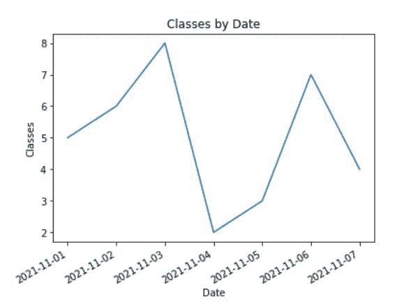
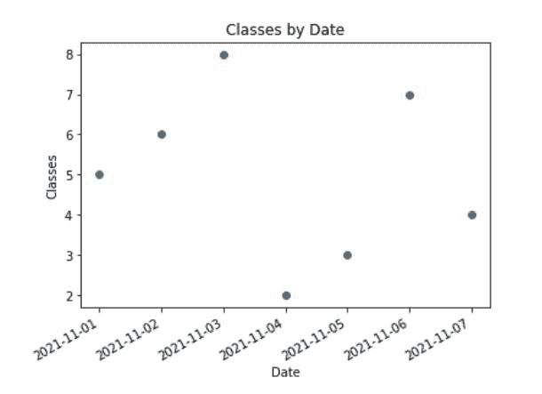
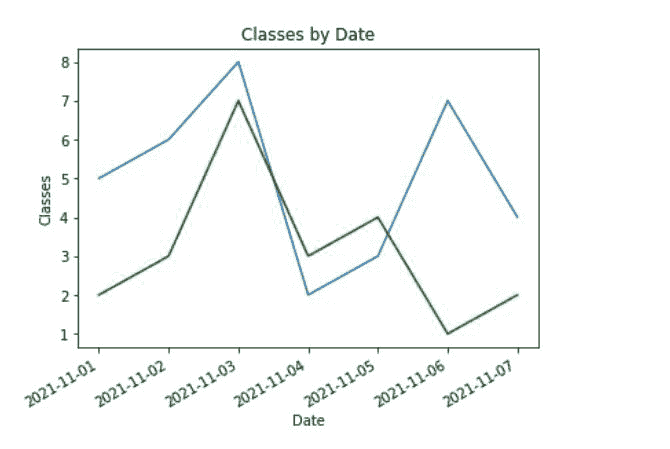
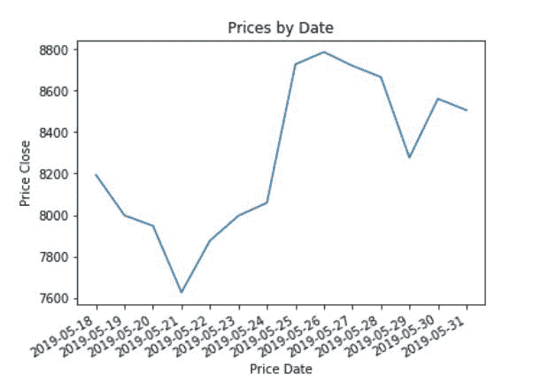

# 如何在 Matplotlib 中绘制时间序列？

> 原文:[https://www . geeksforgeeks . org/如何绘制 matplotlib 中的时间序列/](https://www.geeksforgeeks.org/how-to-plot-a-time-series-in-matplotlib/)

时间序列数据是以某个时间为标志的数据。图上的每个点都代表时间和数量的度量。当数据按时间顺序由一条直线连接起来，形成一连串的波峰和波谷时，时间序列图也被称为发热图。图表的 x 轴用于表示时间间隔。y 线定位被监控的参数值。

我们将使用下面提到的语法绘制一个时间序列图:

**语法:**

```
plt.plot(dataframe.X, dataframe.Y)
```

在哪里

*   x 变量属于日期时间。给定 dataframe 中的 datetime()类。
*   y 变量属于与日期相对应的值

我们也可以使用[xtpicks()](https://www.geeksforgeeks.org/matplotlib-pyplot-xticks-in-python/)函数来旋转坐标轴

**语法**:

```
plt.xticks(rotation, ha)
```

在哪里

*   旋转描述您想要旋转的度数
*   ha 描述了像右、左、上、下这样的位置

## **接近**

*   我们的图需要有两个轴，即 X 轴和 Y 轴。我们将从绘制图表的数据框开始。
*   我们可以制作自己的数据框，也可以使用一些公开的数据框。在 X 轴上，我们应该有一个日期时间变量。在 Y 轴上，我们可以有我们想要分析的关于时间的变量。
*   [plt.plot()](https://www.geeksforgeeks.org/matplotlib-pyplot-plot-function-in-python/) 方法用于绘制 matlplotlib 中的图形。
*   为了提供标签和标题以使我们的图表有意义，我们可以使用类似–[PLT . title()](https://www.geeksforgeeks.org/matplotlib-pyplot-title-in-python/)、 [plt.xlabel()](https://www.geeksforgeeks.org/matplotlib-pyplot-xlabels-in-python/) 、 [plt.ylabel()](https://www.geeksforgeeks.org/matplotlib-pyplot-ylabel-in-python/) 的方法

**例 1:**

假设我们有一个数据框架，包含一周的天数和即将到来的一周每天的课数。从 2021 年 1 月 11 日到 2021 年 7 月 11 日，我们将休假 7 天

## 蟒蛇 3

```
# import modules
import pandas as pd
import matplotlib.pyplot as plt
import datetime
import numpy as np

# create dataframe

dataframe = pd.DataFrame({'date_of_week': np.array([datetime.datetime(2021, 11, i+1)
                                                    for i in range(7)]),
                          'classes': [5, 6, 8, 2, 3, 7, 4]})

# Plotting the time series of given dataframe
plt.plot(dataframe.date_of_week, dataframe.classes)

# Giving title to the chart using plt.title
plt.title('Classes by Date')

# rotating the x-axis tick labels at 30degree 
# towards right
plt.xticks(rotation=30, ha='right')

# Providing x and y label to the chart
plt.xlabel('Date')
plt.ylabel('Classes')
```

**输出**:



我们还可以在 matplotlib 的帮助下，借助时间序列创建散点图。

**示例 2:给定数据帧的时间序列图**

## 蟒蛇 3

```
#import modules
import pandas as pd
import matplotlib.pyplot as plt
import datetime
import numpy as np

# Let say we have a dataframe of the days of
# the week and number of classes in each day of the upcoming week.
# Taking 7 days from 1-11-2021 to 7-11-2021

dataframe = pd.DataFrame({'date_of_week': np.array([datetime.datetime(2021, 11, i+1)
                                                    for i in range(7)]),
                          'classes': [5, 6, 8, 2, 3, 7, 4]})

# To draw scatter time series plot of the given dataframe
plt.plot_date(dataframe.date_of_week, dataframe.classes)

# rotating the x-axis tick labels at 30degree towards right
plt.xticks(rotation=30, ha='right')

# Giving title to the chart using plt.title
plt.title('Classes by Date')

# Providing x and y label to the chart
plt.xlabel('Date')
plt.ylabel('Classes')
```

**输出**:



同样，我们可以绘制两个数据帧的时间序列并进行比较。假设我们有两个学院——“XYZ”和“美国广播公司”。现在我们需要用 matplotlib 的时间序列图来比较这两个。

**例 3:**

## 蟒蛇 3

```
# Initialising required libraries
import pandas as pd
import matplotlib.pyplot as plt
import datetime
import numpy as np

# ABC colllege classes by date- from 01-11-2021 to 07-11-2021
abc = pd.DataFrame({'date_of_week': np.array([datetime.datetime(2021, 11, i+1)
                                              for i in range(7)]), 
                    'classes': [5, 6, 8, 2, 3, 7, 4]})

# XYZ colllege classes by date - from 01-11-2021 to 07-11-2021
xyz = pd.DataFrame({'date_of_week': np.array([datetime.datetime(2021, 11, i+1)
                                              for i in range(7)]), 
                    'classes': [2, 3, 7, 3, 4, 1, 2]})

# plotting the time series of ABC college dataframe
plt.plot(abc.date_of_week, abc.classes)

# plotting the time series of XYZ college dataframe
plt.plot(xyz.date_of_week, xyz.classes, color='green')

# Giving title to the graph
plt.title('Classes by Date')

# rotating the x-axis tick labels at 30degree 
# towards right
plt.xticks(rotation=30, ha='right')

# Giving x and y label to the graph
plt.xlabel('Date')
plt.ylabel('Classes')
```

**输出:**



同样，我们可以从数据集中绘制时间序列图。这里是[到数据集的链接](https://github.com/CoreyMSchafer/code_snippets/blob/master/Python/Matplotlib/08-TimeSeries/data.csv)

**例 4:**

## 蟒蛇 3

```
# Initialising required libraries
import pandas as pd
import matplotlib.pyplot as plt
import datetime
import numpy as np

# Loading the dataset
data = pd.read_csv("C:/Users/aparn/Desktop/data.csv")

# X axis is price_date
price_date = data['Date']

# Y axis is price closing
price_close = data['Close']

# Plotting the timeseries graph of given dataset
plt.plot(price_date, price_close)

# Giving title to the graph
plt.title('Prices by Date')

# rotating the x-axis tick labels at 30degree 
# towards right
plt.xticks(rotation=30, ha='right')

# Giving x and y label to the graph
plt.xlabel('Price Date')
plt.ylabel('Price Close')
```

**输出:**

