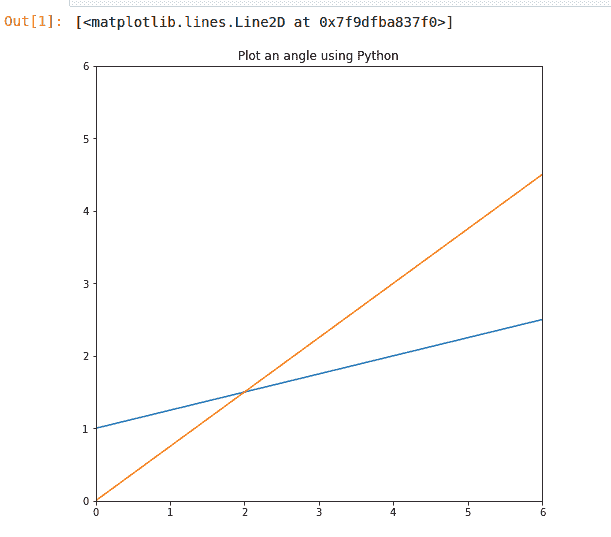
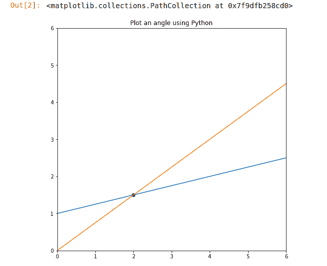
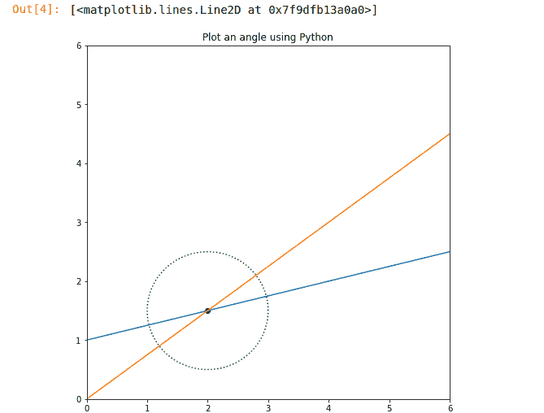
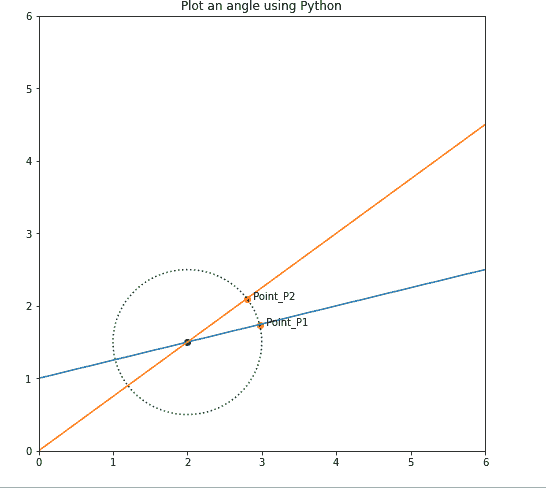
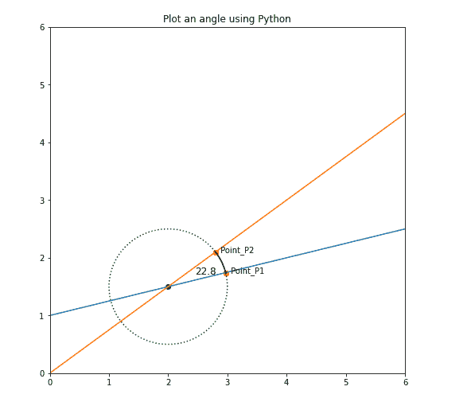

# 如何用 Matplotlib 在 Python 中绘制一个角度？

> 原文:[https://www . geeksforgeeks . org/如何使用-matplotlib 绘制 python 中的角度/](https://www.geeksforgeeks.org/how-to-plot-an-angle-in-python-using-matplotlib/)

在本文中，我们将学习如何在 Python 中绘制角度。我们知道，要画一个角度，必须有两条相交的线，这样，在相交的点上，这两条线之间就可以形成一个角度。在本文中，我们在两条相交的直线上画出一个角度。因此，让我们首先讨论一些概念:

*   [**NumPy**](https://www.geeksforgeeks.org/numpy-in-python-set-1-introduction/) 是一个通用的数组处理包。它提供了一个高性能多维数组对象和使用这些数组的工具。
*   [**Matplotlib**](https://www.geeksforgeeks.org/python-introduction-matplotlib/) 是 **Python** 中一个惊人的可视化库，用于数组的 2D 图。 **Matplotlib** 是一个基于 NumPy 数组构建的多平台数据可视化库，旨在与更广泛的 SciPy 堆栈协同工作。它是由约翰·亨特在 2002 年推出的。

在这种情况下，matplotlib 用于以图形方式绘制角度，它最适合 NumPy，而 Numpy 是用于执行高级数学**的数字 Python。**

### 所需步骤

1.  绘制两条相交线。
2.  找到用颜色标记的交点。
3.  画一个圆，使两条线的交点与圆心相同。
4.  将它标记为圆将与直线相交的点，并在我们找到它们之间角度的地方画出这两个点。
5.  计算角度并绘制角度图。

### 逐步实施

**1。绘制两条相交线**

*   在本文中，前两行代码显示导入了 Python 的 matplotlib 和 NumPy Framework，我们将在进一步的代码中使用内置函数。
*   然后，取斜率和截距，画出两条直线。之后，行间距(l)返回相对于间隔均匀分布的空格数。
*   之后，plt.figure()用于创建我们绘制角度的区域，其尺寸在代码中给出。
*   之后，为了绘制直线，我们必须定义轴。这里:X 轴:0-6，Y 轴:0-6
*   使用 plt.title()将标题提供给图形框。

之后，绘制两条线，如下图所示:

## 蟒蛇 3

```py
# import packages
import matplotlib.pyplot as plt
import numpy as np

# slope  and intercepts
a1, b1 = (1/4), 1.0
a2, b2 = (3/4), 0.0

# The numpy.linspace() function returns
# number spaces evenly w.r.t interval
l = np.linspace(-6, 6, 100)

# use to create new figure
plt.figure(figsize=(8, 8))

# plotting
plt.xlim(0, 6)
plt.ylim(0, 6)
plt.title('Plot an angle using Python')
plt.plot(l, l*a1+b1)
plt.plot(l, l*a2+b2)
plt.show()
```

**输出:**



**2。找到交点并用颜色标记**

这里 x0、y0 表示两条直线的交点。绘制的两条直线写成:

```py
y1 = a1*x + b1
y2 = a2*x + b2.
```

在求解上述方程时，我们得到，

```py
x0 = (b2-b1) / (a1-a2)   -(i)
y0 =a1*x0 + b1             -(ii)
```

从上面的等式(I)和(ii)中，我们将得到两条直线的交点，然后，使用 plot .散点图()函数将颜色=“midnight blue”分配给交点。

## 蟒蛇 3

```py
# import packages
import matplotlib.pyplot as plt
import numpy as np

# slope  and intercepts
a1, b1 = (1/4), 1.0
a2, b2 = (3/4), 0.0

# The numpy.linspace() function returns
# number spaces evenly w.r.t interval
l = np.linspace(-6, 6, 100)

# use to create new figure
plt.figure(figsize=(8, 8))

# plotting
plt.xlim(0, 6)
plt.ylim(0, 6)
plt.title('Plot an angle using Python')
plt.plot(l, l*a1+b1)
plt.plot(l, l*a2+b2)

# intersection point
x0 = (b2-b1)/(a1-a2)
y0 = a1*x0 + b1
plt.scatter(x0, y0, color='midnightblue')
```

**输出:**



**3。绘制一个圆，使两条线的交点与** **圆心**相同

这里我们用圆的参数方程画一个圆。圆的参数方程是:

```py
x1= r*cos(theta)
x2=r*sin(theta)
```

如果我们希望圆不在原点，那么我们使用:

```py
x1= r*cos(theta) + h
x2=r*sin(theta) + k
```

这里 h 和 k 是圆心的坐标。因此，我们使用上面的等式，其中 h =x0，k =y0，如图所示。此外，这里我们为圆圈“蓝色”提供颜色，其样式标记为“点状”。

## 蟒蛇 3

```py
# import packages
import matplotlib.pyplot as plt
import numpy as np

# slope  and intercepts
a1, b1 = (1/4), 1.0
a2, b2 = (3/4), 0.0

# The numpy.linspace() function returns
# number spaces evenly w.r.t interval
l = np.linspace(-6, 6, 100)

# use to create new figure
plt.figure(figsize=(8, 8))

# plotting
plt.xlim(0, 6)
plt.ylim(0, 6)
plt.title('Plot an angle using Python')
plt.plot(l, l*a1+b1)
plt.plot(l, l*a2+b2)

# intersection point
x0 = (b2-b1)/(a1-a2)
y0 = a1*x0 + b1
plt.scatter(x0, y0, color='midnightblue')

# circle for angle
theta = np.linspace(0, 2*np.pi, 100)
r = 1.0
x1 = r * np.cos(theta) + x0
x2 = r * np.sin(theta) + y0
plt.plot(x1, x2, color='green', linestyle='dotted')
```

**输出:**



**4。将其标记为** **圆与直线相交的点，并绘制出这两个点，我们可以在这两个点之间找到** **角**

现在，让我们找到圆与两条直线相交的点。阅读下面的评论，了解如何打分。之后，在圆将与两条直线相交的地方提供颜色，即“深红色”。在此之后，名称被提供给点，如点 _P1，点 _P2，在这里我们找到它们之间的角度，并将其标记为黑色，如输出所示。

## 蟒蛇 3

```py
# import packages
import matplotlib.pyplot as plt
import numpy as np

# slope  and intercepts
a1, b1 = (1/4), 1.0
a2, b2 = (3/4), 0.0

# The numpy.linspace() function returns
# number spaces evenly w.r.t interval
l = np.linspace(-6, 6, 100)

# use to create new figure
plt.figure(figsize=(8, 8))

# plotting
plt.xlim(0, 6)
plt.ylim(0, 6)
plt.title('Plot an angle using Python')
plt.plot(l, l*a1+b1)
plt.plot(l, l*a2+b2)

# intersection point
x0 = (b2-b1)/(a1-a2)
y0 = a1*x0 + b1
plt.scatter(x0, y0, color='midnightblue')

# circle for angle
theta = np.linspace(0, 2*np.pi, 100)
r = 1.0
x1 = r * np.cos(theta) + x0
x2 = r * np.sin(theta) + y0
plt.plot(x1, x2, color='green', linestyle='dotted')

# intersection points
x_points = []
y_points = []

# Code for Intersecting points of circle with Straight Lines
def intersection_points(slope, intercept, x0, y0, radius):
    a = 1 + slope**2
    b = -2.0*x0 + 2*slope*(intercept - y0)
    c = x0**2 + (intercept-y0)**2 - radius**2

    # solving the quadratic equation:
    delta = b**2 - 4.0*a*c  # b^2 - 4ac
    x1 = (-b + np.sqrt(delta)) / (2.0 * a)
    x2 = (-b - np.sqrt(delta)) / (2.0 * a)

    x_points.append(x1)
    x_points.append(x2)

    y1 = slope*x1 + intercept
    y2 = slope*x2 + intercept

    y_points.append(y1)
    y_points.append(y2)

    return None

# Finding the intersection points for line1 with circle
intersection_points(a1, b1, x0, y0, r)

# Finding the intersection points for line1 with circle
intersection_points(a2, b2, x0, y0, r)

# Here we plot Two points in order to find angle between them
plt.scatter(x_points[0], y_points[0], color='crimson')
plt.scatter(x_points[2], y_points[2], color='crimson')

# Naming the points.
plt.text(x_points[0], y_points[0], '  Point_P1', color='black')
plt.text(x_points[2], y_points[2], '  Point_P2', color='black')
```

**输出:**



**5。计算角度和绘图角度**

在下面的代码中，计算了 P1 点和 P2 点之间的角度，最后，如输出所示绘制了该角度。

## 蟒蛇 3

```py
# import packages
import matplotlib.pyplot as plt
import numpy as np

# slope  and intercepts
a1, b1 = (1/4), 1.0
a2, b2 = (3/4), 0.0

# The numpy.linspace() function returns
# number spaces evenly w.r.t interval
l = np.linspace(-6, 6, 100)

# use to create new figure
plt.figure(figsize=(8, 8))

# plotting
plt.xlim(0, 6)
plt.ylim(0, 6)
plt.title('Plot an angle using Python')
plt.plot(l, l*a1+b1)
plt.plot(l, l*a2+b2)

# intersection point
x0 = (b2-b1)/(a1-a2)
y0 = a1*x0 + b1
plt.scatter(x0, y0, color='midnightblue')

# circle for angle
theta = np.linspace(0, 2*np.pi, 100)
r = 1.0
x1 = r * np.cos(theta) + x0
x2 = r * np.sin(theta) + y0
plt.plot(x1, x2, color='green', linestyle='dotted')

# intersection points
x_points = []
y_points = []

# Code for Intersecting points of circle with Straight Lines
def intersection_points(slope, intercept, x0, y0, radius):
    a = 1 + slope**2
    b = -2.0*x0 + 2*slope*(intercept - y0)
    c = x0**2 + (intercept-y0)**2 - radius**2

    # solving the quadratic equation:
    delta = b**2 - 4.0*a*c  # b^2 - 4ac
    x1 = (-b + np.sqrt(delta)) / (2.0 * a)
    x2 = (-b - np.sqrt(delta)) / (2.0 * a)

    x_points.append(x1)
    x_points.append(x2)

    y1 = slope*x1 + intercept
    y2 = slope*x2 + intercept

    y_points.append(y1)
    y_points.append(y2)

    return None

# Finding the intersection points for line1 with circle
intersection_points(a1, b1, x0, y0, r)

# Finding the intersection points for line1 with circle
intersection_points(a2, b2, x0, y0, r)

# Here we plot Two ponts in order to find angle between them
plt.scatter(x_points[0], y_points[0], color='crimson')
plt.scatter(x_points[2], y_points[2], color='crimson')

# Naming the points.
plt.text(x_points[0], y_points[0], '  Point_P1', color='black')
plt.text(x_points[2], y_points[2], '  Point_P2', color='black')

# plot angle value

def get_angle(x, y, x0, y0, radius):

    base = x - x0
    hypotenuse = radius

    # calculating the angle for a intersection point
    # which is equal to the cosine inverse of (base / hypotenuse)
    theta = np.arccos(base / hypotenuse)

    if y-y0 < 0:
        theta = 2*np.pi - theta

    print('theta=', theta, ',theta in degree=', np.rad2deg(theta), '\n')

    return theta

theta_list = []

for i in range(len(x_points)):

    x = x_points[i]
    y = y_points[i]

    print('intersection point p{}'.format(i))
    theta_list.append(get_angle(x, y, x0, y0, r))

    # angle for intersection point1 ( here point p1 is taken)
p1 = theta_list[0]

# angle for intersection point2 ( here point p4 is taken)
p2 = theta_list[2]

# all the angles between the two intersection points
theta = np.linspace(p1, p2, 100)

# calculate the x and y points for
# each angle between the two intersection points
x1 = r * np.cos(theta) + x0
x2 = r * np.sin(theta) + y0

# plot the angle
plt.plot(x1, x2, color='black')

# Code to print the angle at the midpoint of the arc.
mid_angle = (p1 + p2) / 2.0

x_mid_angle = (r-0.5) * np.cos(mid_angle) + x0
y_mid_angle = (r-0.5) * np.sin(mid_angle) + y0

angle_in_degree = round(np.rad2deg(abs(p1-p2)), 1)

plt.text(x_mid_angle, y_mid_angle, angle_in_degree, fontsize=12)

# plotting the intersection points
plt.scatter(x_points[0], y_points[0], color='red')
plt.scatter(x_points[2], y_points[2], color='red')
plt.show()
```

**输出:**

