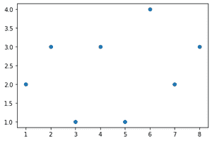
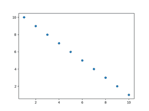
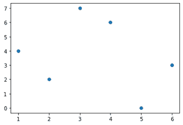

# 如何在 Matplotlib 中绘制 X，Y 坐标列表？

> 原文:[https://www . geeksforgeeks . org/如何绘制 x-y-坐标列表-in-matplotlib/](https://www.geeksforgeeks.org/how-to-plot-list-of-x-y-coordinates-in-matplotlib/)

**先决条件:**

*   [Matplotlib](https://matplotlib.org/users/installing.html)
*   num py

Matplotlib 是一个全面的库，用于在 Python 中创建静态、动画和交互式可视化。要绘制任何数据，最基本的步骤是从创建或加载数据开始，本文讨论了将数据绘制为列表的所有传递方式。将数据作为列表传递时，需要记住的一件重要事情是保持 X、Y 列表的大小相同，否则会引发 ValueError。

本文中显示的示例使用散点图，同样的方法可以应用于任何其他类型的图形。

### **方法 1:** 幼稚方法

在这种方法中，坐标只是作为两个列表传递。

**接近**

*   导入模块
*   创建一个 X 坐标列表
*   为 Y 坐标创建一个列表
*   传递这两个列表来绘制函数

**示例:**

## 蟒蛇 3

```
import matplotlib.pyplot as plt

x = [1, 2, 3, 4, 5, 6, 7, 8]
y = [2, 3, 1, 3, 1, 4, 2, 3]

plt.scatter(x, y)
plt.show()
```

**输出:**



### 方法 2:使用 numpy 数组

**使用的功能:**排列()

> **语法:**名词短语(开始、结束、步骤)
> 
> **参数:**
> 
> *   **开始:**开始值
> *   **结束:**结束值
> *   **步长:**步长，默认为 1。

**接近**

*   导入模块
*   为坐标创建 numpy 数组
*   将这些数组传递给绘图

**示例:**

## 蟒蛇 3

```
# importing Matplotlib and Numpy Packages
import numpy as np
import matplotlib.pyplot as plt

# generating two arrays from 10 to 1 and from 1 to 10
x = np.arange(1, 11, 1)  
y = np.arange(10, 0, -1)  

# plot our list in X,Y coordinates
plt.scatter(x, y)
plt.show()
```

**输出:**



### 方法 3:列表列表

创建要绘制的所有点的列表也是达到我们要求的方法之一。创建这样的列表后，它不能直接传递给绘图，首先需要转置以获得 x 和 y 坐标。

**接近**

*   导入模块
*   创建坐标列表
*   转置
*   将坐标传递给绘图

**例**

## 蟒蛇 3

```
# importing Matplotlib and Numpy Packages
import numpy as np
import matplotlib.pyplot as plt

# The data are given as list of lists (2d list)
data = np.array([
    [1, 4],
    [2, 2],
    [3, 7],
    [4, 6],
    [5, 0],
    [6, 3]
])
# Taking transpose
x, y = data.T

# plot our list in X,Y coordinates
plt.scatter(x, y)
plt.show()
```

**输出:**

