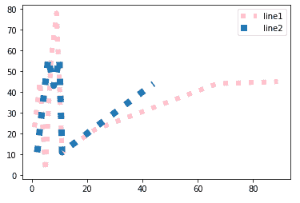
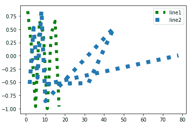

# 如何使用 Matplotlib 绘制两条虚线并设置标记？

> 原文:[https://www . geeksforgeeks . org/如何使用 matplotlib 绘制双点划线和设置标记/](https://www.geeksforgeeks.org/how-to-plot-two-dotted-lines-and-set-marker-using-matplotlib/)

在本文中，我们将使用 python 编程语言中 matplotlib 包的各种函数绘制两条虚线并设置标记。

我们可以使用 [pyplot.plot](https://www.geeksforgeeks.org/matplotlib-pyplot-plot-function-in-python/) 和线型参数函数来绘制虚线。

```py
matplotlib.pyplot.plot(array1,array2,linestyle='dotted')
```

**注:**

*   要设置标记，我们必须使用标签参数。
*   要显示标签，我们必须使用图例方法。

**例 1** :

在本例中，我们创建了四个列表(数据点)，其中两个列表。首先，我们通过提及标签来绘制具有虚线样式的两个数据点的第一条线，然后通过提及标签并使用 legend()函数显示标签来绘制具有虚线样式的两个数据点的第二条线。

## 蟒蛇 3

```py
# import matplotlib
import matplotlib.pyplot as plt

# create array 1 for first line
firstarray1 = [1, 3, 5, 7, 9, 11, 23, 45, 67, 89]

# create array 2 for first line
secondarray1 = [23, 45, 2, 56, 78, 11, 22, 33, 44, 45]

# create array 1 for second line
firstarray2 = [2, 4, 6, 8, 10, 11, 22, 33, 44]

# create array 2 for second line
secondarray2 = [11, 34, 56, 43, 56, 11, 22, 33, 44]

# plot the line1
plt.plot(firstarray1, secondarray1, linestyle='dotted',
         label='line1', linewidth=6, color="pink")

# plot the line2
plt.plot(firstarray2, secondarray2, linestyle='dotted',
         label='line2', linewidth=8)

plt.legend()

# display
plt.show()
```

**输出:**



**例 2:**

在本例中，我们创建了四个列表(数据点，然后使用一个[函数绘制第一条线，通过提及标签使用虚线样式的 NumPy 模块，然后使用](https://www.geeksforgeeks.org/numpy-sin-python/) [cos](https://www.geeksforgeeks.org/numpy-cos-python/) 函数绘制第二条线，通过提及标签使用两个数据点使用虚线样式的 NumPy 模块。

## 蟒蛇 3

```py
# import matplotlib
import matplotlib.pyplot as plt

# import numpy module
import numpy

# create array 1 for first line
firstarray1 = [1, 3, 5, 7, 9, 11, 13, 15, 17]

# create array 2 for first line
secondarray1 = [23, 45, 2, 56, 78, 45, 67, 23, 11]

# create array 1 for second line
firstarray2 = [2, 4, 6, 8, 10, 45, 32, 11, 78]

# create array 2 for second line
secondarray2 = [11, 34, 56, 43, 56]

# plot the line1 with sin function
plt.plot(firstarray1, numpy.sin(firstarray1),
         linestyle='dotted', label='line1', 
         linewidth=6, color="green")

# plot the line2 with cos function
plt.plot(firstarray2, numpy.cos(secondarray1),
         linestyle='dotted', label='line2', linewidth=8)

plt.legend()

# display
plt.show()
```

**输出:**

