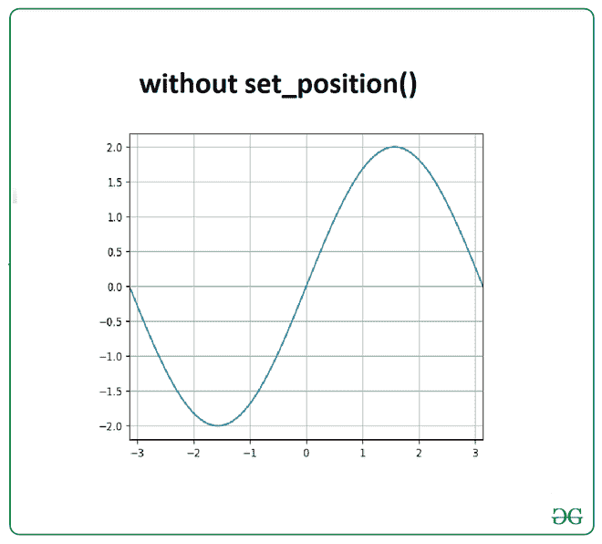
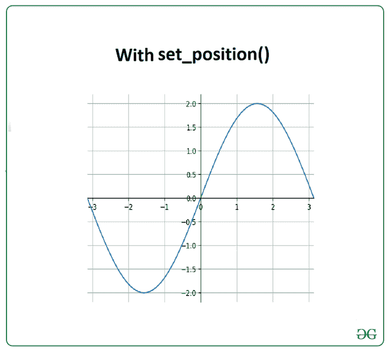

# 如何用 Matplotlib 将原点放在图的中心？

> 原文:[https://www . geesforgeks . org/如何用 matplotlib 将原点放在图形中心/](https://www.geeksforgeeks.org/how-to-put-the-origin-in-the-center-of-the-figure-with-matplotlib/)

在本文中，我们将讨论如何使用 [*matplotlib*](https://www.geeksforgeeks.org/python-introduction-matplotlib/) 模块将原点放在图形中心。为了将原点放在图形的中心，我们使用了来自 *matplotlib* 模块的刺模块。基本上，脊线是连接轴刻度线并记录数据区域边界的线。在这个模块下，我们使用 [*set_position()*](https://www.geeksforgeeks.org/matplotlib-axes-axes-set_position-in-python/) 方法来设置脊椎的位置，这有助于将原点设置在中心。

但是，我们可以不使用 *set_position()* 方法，将原点放在图的中心。下图是在不使用 *set_position()* 方法的情况下制作的。

**例 1:**

## 蟒蛇 3

```
# import required modules
import numpy as np
import matplotlib.pyplot as plt

# assign coordinates
x = np.linspace(-np.pi, np.pi, 100)
y = 2*np.sin(x)

# depict illustration
plt.xlim(-np.pi, np.pi)
plt.plot(x, y)
plt.grid(True)
plt.show()
```

**输出:**



下图是使用 *set_position()* 方法制作的，该方法有助于将原点置于中心。

**例 2:**

## 蟒蛇 3

```
# import required modules
import numpy as np
import matplotlib.pyplot as plt

# assign coordinates
x = np.linspace(-np.pi, np.pi, 100)
y = 2*np.sin(x)

# use set_position
ax = plt.gca()
ax.spines['top'].set_color('none')
ax.spines['left'].set_position('zero')
ax.spines['right'].set_color('none')
ax.spines['bottom'].set_position('zero')

# depict illustration
plt.xlim(-np.pi, np.pi)
plt.plot(x, y)
plt.grid(True)
plt.show()
```

**输出:**

