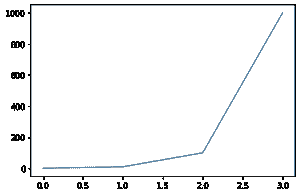
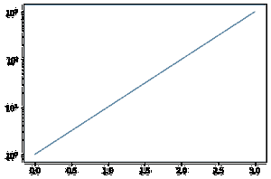

# 如何用 Matplotlib 将 y 轴放入对数刻度？

> 原文:[https://www . geeksforgeeks . org/如何用 matplotlib 将 y 轴放入对数刻度/](https://www.geeksforgeeks.org/how-to-put-the-y-axis-in-logarithmic-scale-with-matplotlib/)

默认情况下，使用 Matplotlib 的所有图中的“轴”都是线性的，[**Matplotlib . pyplot**](https://www.geeksforgeeks.org/pyplot-in-matplotlib/)库的 **yscale()** 方法可用于将 y 轴比例更改为对数。

yscale()方法将单个值作为一个参数，该参数是刻度的转换类型，为了将 y 轴转换为对数刻度，我们将“log”关键字或 matplotlib.scale.LogScale 类传递给 yscale 方法。

> **语法 ：** matplotlib.pyplot.yscale（value， **kwargs）
> 
> **参数:**
> 
> *   *值= {“线性”、“对数”、“符号对数”、“logit”……}*
> *   *****kwargs =** 根据规模(matplotlib.scale.LinearScale、LogScale、SymmetricalLogScale、LogitScale)* 接受不同的关键字参数
> 
> **返回:**将 y 轴转换为给定的比例类型。(这里我们使用“对数”刻度类型)

**线性比例示例:**

## 蟒蛇 3

```py
import matplotlib.pyplot as plt

data = [10**i for i in range(4)]
plt.plot(data)
```

**输出:**



线性标尺

**对数刻度示例:**

## 蟒蛇 3

```py
import matplotlib.pyplot as plt

data = [10**i for i in range(4)]

# convert y-axis to Logarithmic scale
plt.yscale("log")  
plt.plot(data)
```

**输出:**



对数 y 轴