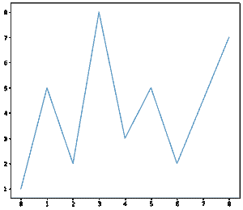
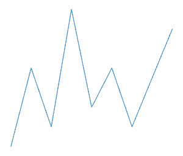

# 如何在 Python 中移除 Matplotlib 图形中的框架？

> 原文:[https://www . geesforgeks . org/如何从 python 图中移除框架/](https://www.geeksforgeeks.org/how-to-remove-the-frame-from-a-matplotlib-figure-in-python/)

[Matplotlib](https://www.geeksforgeeks.org/python-introduction-matplotlib/) 图形中的帧是一个对象，其中给定的数据使用独立的轴来表示。这些轴表示左侧、底部、右侧和顶部，可以通过棘(线)和记号进行可视化。

要删除 Matplotlib 中的框架(图中的方框)，我们按照以下步骤操作。在这里，我们首先将通过导入 Matplotlib 库在 Matplotlib 中绘制一个 2D 图形。

> **语法:** plt.tick_params(轴='x '，其中='both '，底端=False，顶端=False，labelbottom=False)

**进场:**

*   选择要应用的轴。并选择应用参数的刻度。通常可以是“大”、“小”或“两者都有”。
*   获取当前的 Axex 并选择刺的可见性为假。

## 蟒蛇 3

```
# Importing the Library

import matplotlib.pyplot as plt
# Defining X-axis and Y-axis data Points
x = [0, 1, 2, 3, 4, 5, 6, 8]
y = [1, 5, 2, 8, 3, 5, 2, 7]

# Defining the Width and height of the Figure
plt.figure(figsize=(8, 7))
plt.plot(x, y)
plt.show()
```

**输出:**



给定的输出包含带有尖刺和记号的帧。通过移除框架，我们实际上移除了图形周围包含轴(左、下、右、上)的框。
要去除黑线表示的刺，我们可以按照以下步骤操作:

## 蟒蛇 3

```
plt.figure(figsize=(4, 3))

plt.plot(x, y)

# Selecting the axis-X making the bottom and top axes False.
plt.tick_params(axis='x', which='both', bottom=False,
                top=False, labelbottom=False)

# Selecting the axis-Y making the right and left axes False
plt.tick_params(axis='y', which='both', right=False,
                left=False, labelleft=False)

# Iterating over all the axes in the figure
# and make the Spines Visibility as False
for pos in ['right', 'top', 'bottom', 'left']:
    plt.gca().spines[pos].set_visible(False)
plt.show()
```

**输出:**

