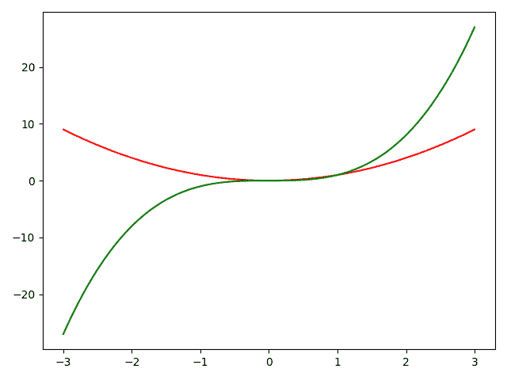

# 如何移除 Matplotlib 中的图例？

> 原文:[https://www . geesforgeks . org/如何移除 matplotlib 中的图例/](https://www.geeksforgeeks.org/how-to-remove-the-legend-in-matplotlib/)

**Matplotlib** 是 **Python** 中最流行的数据可视化库之一。使用这个 **matplotlib 库**，如果我们想要可视化一个以上的变量，我们可能想要解释每个变量代表什么。为此，matplotlib 库中有一个名为 **legend()** 的函数。这个图例是图表上描述每个变量代表什么的一个小区域。

**为了移除传说，有四种方法。它们是:**

*   使用[。拆下](https://www.geeksforgeeks.org/matplotlib-axes-axes-remove-in-python/)()
*   使用。set_visible()
*   修复所需轴对象的图例属性=无
*   使用标签=_nolegend_

**方法一:使用** [**。**](https://www.geeksforgeeks.org/matplotlib-axes-axes-remove-in-python/) 移除()

**例 1:** 通过使用 **ax.get_legend()。remove()** 方法，图例可以从 matplotlib 中的图中移除。

## 蟒蛇 3

```py
import numpy as np
import matplotlib.pyplot as plt

x = np.linspace(-3, 3, 100)
y1 = np.power(x, 2)
y2 = np.power(x, 3)

fig, ax = plt.subplots()

ax.plot(x, y1, c = 'r',label = 'x^2')
ax.plot(x, y2, c = 'g',label = 'x^3')

leg = plt.legend()

ax.get_legend().remove()

plt.show()
```

**输出:**



我们可以看到上图没有图例。

**例 2:多个支线剧情:**

在有多个子剧情的情况下，我们可以提到需要移除图例的子剧情对象。这里，我们写了 **axs[1]。get_legend()。remove()** 这意味着我们正在删除第二个子剧情的图例。

## 蟒蛇 3

```py
import numpy as np
import matplotlib.pyplot as plt

x = np.linspace(-3, 3, 100)
y1 = np.power(x, 2)
y2 = np.power(x, 3)

fig, axs = plt.subplots(2, 1)

axs[0].plot(x, y1, c = 'r',label = 'x^2')
axs[1].plot(x, y2, c = 'g',label = 'x^3')

axs[0].legend(loc = 'upper left')
axs[1].legend(loc = 'upper left')

axs[1].get_legend().remove()

plt.show()
```