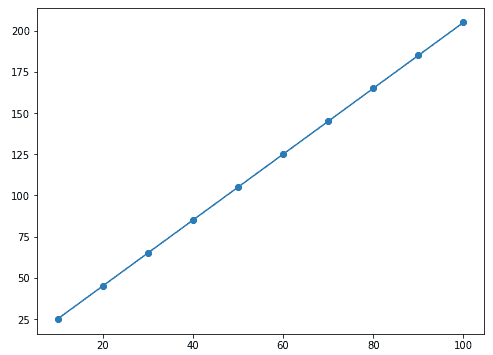

# 如何从 Matplotlib 图中移除刻度？

> 原文:[https://www . geeksforgeeks . org/如何从 matplotlib-plots 中移除壁虱/](https://www.geeksforgeeks.org/how-to-remove-ticks-from-matplotlib-plots/)

Matplotlib 是一个 Python 库，它为我们提供了各种函数，我们可以使用这些函数绘制数据并以图形方式可视化它。但通常使用 Matplotlib 库绘制图形时，我们会在绘图中得到记号，这些记号默认标记在 x 轴和 y 轴上的绘图两侧。有些情况下，我们不想在我们的情节中显示这些记号。Matplotlib.pyplot 库为我们提供了一种 **tick_params()** 方法，使用该方法我们可以手动移除这些 tick。

**tick_params()** 函数接受一些采用布尔值的属性，这些属性值可用于移除图中的刻度和标签。默认情况下，此属性中的值设置为“真”，

**我们用一个例子来理解一下:**

## 计算机编程语言

```
# importing matplotlib library
import matplotlib.pyplot as plt

# making points to be plotted on x-axis and y-axis
X_axis = [i for i in range (10, 110, 10)]
Y_axis = [2*j+5 for j in range (10, 110, 10)]

# printing points to be plotted on the x and y-axis
print("Points on x-axis are: ",X_axis)
print("Points on y-axis are: ",Y_axis)

# Creating a default plot
plt.figure(figsize=(8,6))
plt.plot(X_axis,Y_axis)
plt.scatter(X_axis,Y_axis)
plt.show()
```

**输出:**

> x 轴上的点是:[10，20，30，40，50，60，70，80，90，100]
> 
> y 轴上的点是:[25，45，65，85，105，125，145，165，185，205]



使用 matplotlib 制作的默认绘图，包括刻度

通过查看上面的图像，我们可以观察到默认情况下 Matplotlib 会在 x 轴和 y 轴上标记记号。

**案例 1.1:当我们想要移除单个轴(此处为 y 轴)上的刻度时:**

要移除 y 轴上的刻度，tick_params()方法的左侧有一个名为**的属性，我们可以将其值设置为**假**，并将其作为参数传递到 tick_params()函数中。它删除 y 轴上的刻度。**

## **计算机编程语言**

```
# importing matplotlib library
import matplotlib.pyplot as plt

# making points to be plotted on x-axis and y-axis
X_axis = [i for i in range (10, 110, 10)]
Y_axis = [2*j+5 for j in range (10, 110, 10)]

# printing points to be plotted on the x and y-axis
print("Points on x-axis are: ", X_axis)
print("Points on y-axis are: ", Y_axis)

plt.figure(figsize = ( 8, 6))
plt.tick_params(left = False)
plt.plot(X_axis, Y_axis)
plt.scatter(X_axis, Y_axis)
plt.show()
```