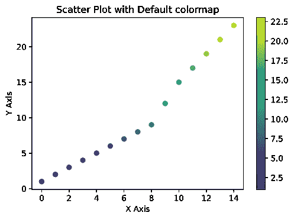
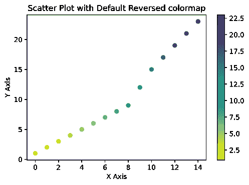
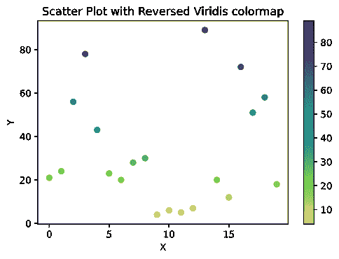
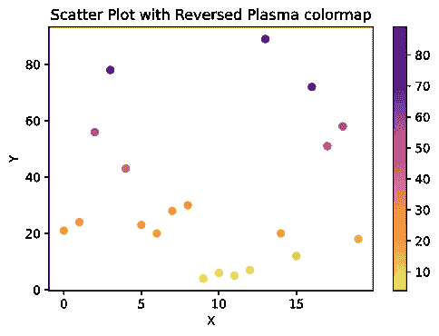

# 如何在 Python 中使用 Matplotlib 反转一个 Colormap？

> 原文:[https://www . geesforgeks . org/how-to-reverse-a-color map-using-matplotlib-in-python/](https://www.geeksforgeeks.org/how-to-reverse-a-colormap-using-matplotlib-in-python/)

**先决条件:**T2【马特洛特利

Matplotlib 有许多内置的彩色地图。颜色映射只是将整数数据/数字映射成颜色的字典。颜色图用于区分或区分特定图中的数据。使用颜色图的原因是，通过与数值相比具有不同颜色的图，人类更容易区分数据与其他数据。

根据用途和要求，彩色地图分为以下四类:

*   连续的
*   分歧
*   定性的
*   多方面的

在本文中，我们将使用 Matplotlib 库来反转颜色图。

反转色彩映射意味着反转绘图的色彩映射。例如，如果图中较高的值显示为深蓝色，较低的值显示为黄色，则在反转颜色映射后，图中较高的值显示为黄色，较低的值显示为深蓝色。

**我们可以借助两种方法反转图的颜色图:**

1.  通过使用 reversed()函数来反转颜色映射。
2.  通过在 colormap 名称的末尾使用“_r”。

### **分步方法:**

*   导入必要的库。
*   创建或导入数据集进行绘图。
*   我们可以通过使用上面讨论的两种方法来反转绘图的颜色图。
*   通过使用第一种方法:
    *   首先，我们必须使用 cm . get _ cmap(“name _ of _ cmap”)获取 colormap，并将其存储在名为“orig_map”的变量中。
    *   然后我们必须反转原始的颜色映射，因为我们使用 reversed()函数来反转颜色映射，我们将编写 orig_map.reversed()，由此我们将得到 reversed 的颜色映射，并将其存储在一个名为“reversed”的变量中。
    *   现在，通过将值传递给绘图来制作散点图，颜色为 *c* ，cmap =反转以获得反转的颜色图。
*   通过使用第二种方法:
    *   与第一种方法相比，这种方法简单得多，在这种方法中，制作散点图并通过将值传递给绘图，颜色的 *c* 只需通过添加**_ r**cmap =*name of map _ r*来传递颜色图的名称，即可获得反转的颜色图。
*   现在使用 xlabel()和 ylabel()函数为 X 轴和 Y 轴命名，使用 colorbar()函数为值到颜色的映射可视化 colorbar，使用 matplotlib 提供的 title()函数为图命名。
*   现在使用 matplotlib 库提供的 show()函数来可视化该图。

在本文中，颜色图的反转是通过制作散点图来完成的。让我们做一些例子来更好地理解这个话题。

**示例 1:使用 matplotlib 库使用默认颜色映射进行散点图，而不反转。**

## 计算机编程语言

```
# importing the necessary libraries
import matplotlib.pyplot as plt
import numpy as np 

# creating the array to plot
x=np.arange(15)
y=[1, 2, 3, 4, 5, 6, 7, 8, 9, 12,
   15, 17, 19, 21, 23]

# making the scatter plot for x and y values
# giving color to the plot with respect to y
plt.scatter(x, y, c = y)

# naming the x axis and
# y axis using xlabel() and ylabel() function 
plt.xlabel("X Axis")
plt.ylabel("Y Axis")

# visualizing the mapping from values to colors
plt.colorbar()

# giving title to the plot using plt.title() function
plt.title("Scatter Plot with Default colormap")

# visualizing the plot
plt.show()
```

**输出:**



这是默认颜色图的散点图。在本例中，虽然绘图没有通过 cmap="viridis "参数，因为散点图使用 viridis 颜色图作为默认颜色图。现在让我们反转颜色图，看看它看起来有多好。

**示例 2:通过使用反转()函数反转颜色图来绘制散点图。**

## 计算机编程语言

```
# importing the necessary libraries
import matplotlib.pyplot as plt
import numpy as np 

# creating the array to plot
x=np.arange(15)
y=[1, 2, 3, 4, 5, 6, 7,
   8, 9, 12, 15, 17, 19, 21, 23]

# getting the original colormap using cm.get_cmap() function
orig_map=plt.cm.get_cmap('viridis')

# reversing the original colormap using reversed() function
reversed_map = orig_map.reversed()

# making the scatter plot on x and y  
# giving color to the plot with respect
# to y and passing cmap=reversed_map to reverse the colormap
plt.scatter(x, y, c = y, cmap = reversed_map)

# giving name to X and Y axis
plt.xlabel("X Axis")
plt.ylabel("Y Axis")

# visualizing the mapping from values to colors
plt.colorbar()

# giving title to the plot
plt.title("Scatter Plot with Default colormap")

# visualizing the plot using show() function
plt.show()
```

**输出:**



在示例 1 中，较高的值用黄色显示，较低的值用紫色显示，而在示例 2 中，我们可以观察到在反转颜色映射后，较高的值用紫色显示，较低的值用黄色显示。

让我们看看如何使用第二种方法来反转颜色映射，即在颜色映射名称的末尾使用 _r。

**示例 3:通过使用 _r 函数反转颜色图来绘制散点图。**

## 计算机编程语言

```
# importing the necessary libraries
import numpy as np
import matplotlib.pyplot as plt 

# creating the array to plot
x=np.arange(20)
y=[ 21, 24, 56, 78, 43, 23, 20, 28, 30,
   4, 6, 5, 7, 89, 20, 12, 72, 51, 58, 18]

# making the scatter plot on x and y values and giving color w.r.t y
# passing cmap in cmap add _r at the end of colormap name to reverse the colormap
plt.scatter(x, y, c = y, cmap = 'viridis_r')

# giving name to X and Y axis
plt.xlabel("X")
plt.ylabel("Y")

# visualizing the mapping from values to colors
plt.colorbar()

# giving title to the plot
plt.title("Scatter Plot with Reversed Viridis colormap")

# visualizing the plot using show() function
plt.show()
```

**输出:**



**示例 4:使用 Matplotlib 的反向等离子体色图的散点图。**

## 计算机编程语言

```
# importing the necessary libraries
import numpy as np
import matplotlib.pyplot as plt 

# creating the array to plot
x=np.arange(20)
y=[21, 24, 56, 78, 43, 23, 20,
   28, 30, 4, 6, 5, 7, 89, 20, 12, 72,
   51, 58, 18]

# making the scatter plot on x and y values and giving color w.r.t y
# passing cmap in cmap add _r at
# the end of colormap name to reverse the colormap
plt.scatter( x, y,c = y, cmap = 'plasma_r')

# giving name to X and Y axis
plt.xlabel("X")
plt.ylabel("Y")

# visualizing the mapping from values to colors
plt.colorbar()

# giving title to the plot
plt.title("Scatter Plot with Reversed Plasma colormap")

# visualizing the plot using show() function
plt.show()
```

**输出:**

 

在上面的例子中，第一张图显示了没有反转颜色图的图，而第二张图显示了反转颜色图的图。在第一个图中，较高的值显示为黄色，而较低的值显示为深蓝色，而在反转颜色映射后的第二个图中，较高的值显示为深蓝色，较低的值显示为黄色。matplotlib 库中有许多自定义的彩色地图，如火海、cividis、岩浆、等离子等。