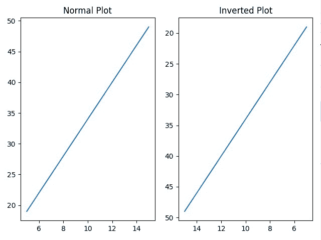
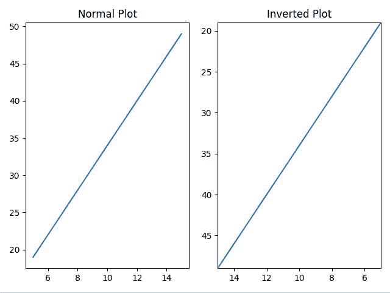

# 如何在 Matplotlib 中反转轴？

> 原文:[https://www . geesforgeks . org/如何反转 matplotlib 中的轴/](https://www.geeksforgeeks.org/how-to-reverse-axes-in-matplotlib/)

在 [Matplotlib](https://www.geeksforgeeks.org/python-introduction-matplotlib/) 中，我们可以使用多种方法反转图形的轴。最常见的方法是对轴对象使用 invert_xaxis()和 invert_yaxis()。除此之外，我们还可以对 [pyplot](https://www.geeksforgeeks.org/pyplot-in-matplotlib/) 对象使用 xlim()和 ylim()，以及 axis()方法。

**方法 1:** 使用 invert_xaxis()和 invert_yaxis()方法

要反转 X 轴和 Y 轴，可以使用 invert_xaxis()和 invert_yaxis()函数。我们可以使用上述方法反转任意一个轴或两个轴。

**代码:**

## 蟒蛇 3

```py
# importing numpy and matplotlib
import numpy as np
import matplotlib.pyplot as plt

# creating an x sequence
x = np.linspace(5, 15, 35)

# equation of a straight line
y = 3*x+4

# creating graph space for two graphs
graph, (plot1, plot2) = plt.subplots(1, 2)

# plot1 graph for normal axes
plot1.plot(x, y)
plot1.set_title("Normal Plot")

# plot2 graph for inverted axes
plot2.plot(x, y)
plot2.set_title("Inverted Plot")
plot2.invert_xaxis()
plot2.invert_yaxis()

# display the graph
graph.tight_layout()
plt.show()
```

**输出:**



正常绘图和反转绘图(两个轴反转)

**方法二:使用 xlim()和 ylim()方法**

xlim()和 ylim()也可用于反转曲线图的轴。它们通常用于分别设置或获取 X 轴和 Y 轴的限制。但是如果我们把轴上的最小值作为上限，把轴上的最大值作为下限，我们就可以得到一个还原的轴。

**代码:**

## 蟒蛇 3

```py
# importing numpy and matplotlib
import numpy as np
import matplotlib.pyplot as plt

# creating an x sequence
x = np.linspace(5, 15, 35)

# equation of a straight line
y = 3*x+4

# creating graph space for two graphs
graph, (plot1, plot2) = plt.subplots(1, 2)

# plot1 graph for normal axes
plot1.plot(x, y)
plot1.set_title("Normal Plot")

# plot2 graph for inverted axes
plot2.plot(x, y)
plot2.set_title("Inverted Plot")
plt.xlim(max(x), min(x))
plt.ylim(max(y), min(y))

# display the graph
graph.tight_layout()
plt.show()
```

**输出:**



正常绘图和反转绘图(两个轴反转)

**方法三:使用轴()方法**

与 xlim()和 ylim()类似，axis()方法也用于设置 X 轴和 Y 轴的最小值和最大值。所以，如果我们通过轴上的最小值作为上限，轴上的最大值作为下限，我们可以得到一个还原的轴。

**代码:**

## 蟒蛇 3

```py
# importing numpy and matplotlib
import numpy as np
import matplotlib.pyplot as plt

# creating an x sequence
x = np.linspace(5, 15, 35)

# equation of a straight line
y = 3*x+4

# creating graph space for two graphs
graph, (plot1, plot2) = plt.subplots(1, 2)

# plot1 graph for normal axes
plot1.plot(x, y)
plot1.set_title("Normal Plot")

# plot2 graph for inverted axes
plot2.plot(x, y)
plot2.set_title("Inverted Plot")
plt.axis([max(x), min(x), max(y), min(y)])

# display the graph
graph.tight_layout()
plt.show()
```

**输出:**

