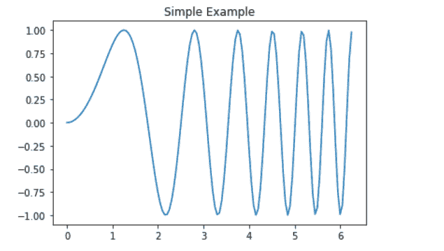
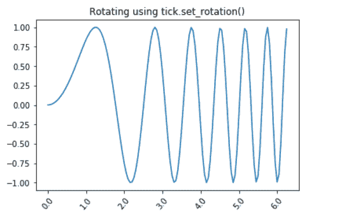
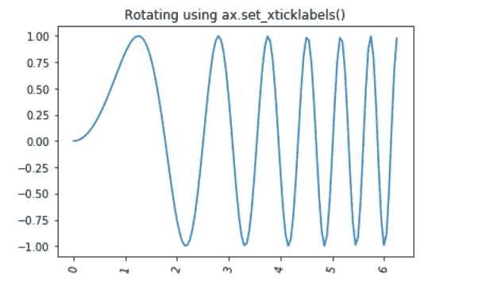
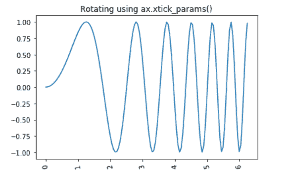

# 如何在 Matplotlib 中旋转 X 轴刻度标签文本？

> 原文:[https://www . geesforgeks . org/如何旋转-x 轴-tick-label-text-in-matplotlib/](https://www.geeksforgeeks.org/how-to-rotate-x-axis-tick-label-text-in-matplotlib/)

Matplotlib 是一个令人惊讶的，也是 Python 中最广泛使用的数组图数据可视化库之一。它是一个多平台数据可视化库，构建在 NumPy 阵列上，旨在与更广泛的 SciPy 堆栈一起工作。它很受欢迎，因为它有定制选项，我们可以从它的对象层次结构中调整任何元素。

### **旋转 X 轴标签**

要旋转 X 轴标签，matplotlib 提供了各种方法，即在图形级别更改标签，或在轴级别更改标签，或使用内置函数单独更改标签。下面列出了一些方法:

**让我们创建一个简单的线图，我们将在进一步的示例中对其进行修改:**

## 蟒蛇 3

```py
# Import libraries
import matplotlib.pyplot as plt
import numpy as np

# Creating dataset
x = np.arange(0, np.pi*2, 0.05)
y = np.sin(x**2)

# Creating plot
plt.plot(x, y)

# Setting title
plt.title('Simple Example')

# Show plot
plt.show()
```

**输出:**



**示例 1:** 在本例中，我们将使用***PLT . xtpicks()在图形级别上旋转 X 轴标签。***

> ***语法:**matplotlib . pyplot . xtpicks(ticks =无，标签=无，**kwargs)*
> 
> ***参数:**该方法接受以下描述的参数:*
> 
> *   ***刻度:**此参数是 xtick 位置的列表。和可选参数。如果一个空列表作为参数被传递，那么它将移除所有的文本信号*
> *   ***标签:**该参数包含放置在给定刻度位置的标签。它是一个可选参数。*
> *   *****kwargs:** 此参数是用于控制标签外观的文本属性。*

## 蟒蛇 3

```py
# Import libraries
import matplotlib.pyplot as plt
import numpy as np

# Creating dataset
x = np.arange(0, np.pi*2, 0.05)
y = np.sin(x**2)

# Creating plot
plt.plot(x, y)

# Rotating X-axis labels
plt.xticks(rotation = 25)

# Setting title
plt.title('Rotating using plt.xticks()')

# Show plot
plt.show()
```

**输出:**


**示例 2:** 在本例中，我们将使用 ***tick.set_rotation()在轴级别上旋转 X 轴标签。***

> **S*****yntax:**axes . get _ xtpicks(self，minor=False)*
> 
> ***参数:**该方法接受以下参数。*
> 
> *   ***次要:**该参数用于设置主要刻度还是设置次要刻度*
> 
> ***返回值:**这个方法返回一个文本值列表。*

## 蟒蛇 3

```py
# Import libraries
import matplotlib.pyplot as plt
import numpy as np

# Creating dataset
x = np.arange(0, np.pi*2, 0.05)
y = np.sin(x**2)

# Creating Figure
fig, ax = plt.subplots() 

# Creating plot
ax.plot(x, y)

# Rotating X-axis labels
ax.set_xticklabels(ax.get_xticks(), rotation = 50)

# Setting title
plt.title('Rotating using tick.set_rotation()')

# Show plot
plt.show()
```

**输出:**



**示例 3:** 在本例中，我们将使用内置的 *ax.set_xticklabels()* 功能来单独旋转 X 轴标签。

## 蟒蛇 3

```py
# Import libraries
import matplotlib.pyplot as plt
import numpy as np

# Creating dataset
x = np.arange(0, np.pi*2, 0.05)
y = np.sin(x**2)

# Creating Figure
fig, ax = plt.subplots() 

# Creating plot
ax.plot(x, y)

# Rotating X-axis labels
for tick in ax.get_xticklabels():
    tick.set_rotation(75)

# Setting title
plt.title('Rotating using ax.set_xticklabels()')

# Show plot
plt.show()
```

**输出:**



**示例 4:** 在本例中，我们将使用内置的 *ax.xtick_params()* 功能来单独旋转 X 轴标签。

> **语法:**matplotlib . pyplot . tick _ params(axis = ' both '，**kwargs)

## 蟒蛇 3

```py
# Import libraries
import matplotlib.pyplot as plt
import numpy as np

# Creating dataset
x = np.arange(0, np.pi*2, 0.05)
y = np.sin(x**2)

# Creating Figure
fig, ax = plt.subplots() 

# Creating plot
ax.plot(x, y)

# Rotating X-axis labels
ax.tick_params(axis='x', labelrotation = 100)

# Setting title
plt.title('Rotating using ax.xtick_params()')

# Show plot
plt.show()
```

**输出:**

