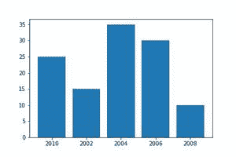
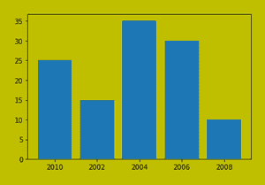

# 如何使用 Matplotlib 将绘图保存到文件中？

> 原文:[https://www . geeksforgeeks . org/如何使用-matplotlib/](https://www.geeksforgeeks.org/how-to-save-a-plot-to-a-file-using-matplotlib/) 保存绘图到文件

[Matplotlib](https://www.geeksforgeeks.org/python-introduction-matplotlib/) 是一个广泛使用的 python 库，用于绘制图形、曲线图、图表等。show()方法用于将图形显示为输出，但不要将其保存在任何文件中。要将生成的图形保存在存储磁盘上的文件中，请使用 savefig()方法。

**保存图()**:保存当前图。

> **语法:** pyplot.savefig(fname，dpi=None，facecolor='w '，edgecolor='w '，方位= '纵向'，papertype=None，format=None，transparent=False，bbox_inches=None，pad_inches=0.1，frameon=None，metadata=None)
> 
> **参数:**
> 
> *   **fname** :带扩展名的输出文件的路径或名称。如果未提供扩展名，绘图将保存为 png 文件。支持的文件格式:eps，jpeg，jpg，pdf，pgf，png，ps，raw，rgba，svg，svgz，tif，tiff。
> *   **dpi** :图的每英寸分辨率点数
> *   **面色**:图的面色
> *   **边缘颜色**:图的边缘颜色
> *   **方位**:横向或纵向
> *   **格式**:文件格式，如‘png’、‘pdf’、‘SVG’等。
> *   **透明**:如果为真，那么轴的面片都是透明的

**步骤:**

1.  绘制图表
2.  使用 pyplot.savefig()方法将生成的图保存在文件中

**示例:**

## 蟒蛇 3

```
import matplotlib.pyplot as plt

# Creating data
year = ['2010', '2002', '2004', '2006', '2008']
production = [25, 15, 35, 30, 10]

# Plotting barchart
plt.bar(year, production)

# Saving the figure.
plt.savefig("output.jpg")

# Saving figure by changing parameter values
plt.savefig("output1", facecolor='y', bbox_inches="tight",
            pad_inches=0.3, transparent=True)
```

**输出:**

 