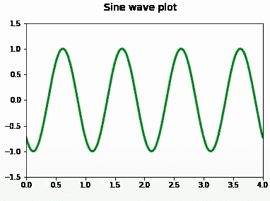
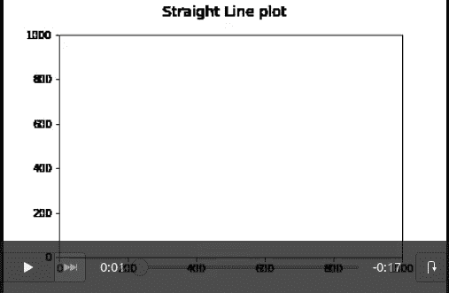

# 如何保存 Matplotlib 动画？

> 原文:[https://www . geesforgeks . org/how-save-matplotlib-animation/](https://www.geeksforgeeks.org/how-to-save-matplotlib-animation/)

在本文中，我们将学习如何保存 Matplotlib 动画。借助 matplotlib 制作的动画图形可以保存为 Python 中的视频。因为我们可以使用 matplotlib 库创建迷人的动画。如果你想学习创建动画，这里有一个[链接](https://www.geeksforgeeks.org/using-matplotlib-for-animations/)到使用 matplotlib 创建动画的文章。在本文中，我们将学习如何在 matplotlib 中保存动画。要保存动画，我们可以使用**动画.保存()**或**动画. to_html5_video()** 。

Animation.to_html5_video()将动画作为 html5 视频标记返回。它将动画保存为 h264 编码的视频，可以直接显示在笔记本上。

**例 1:**

## 蟒蛇 3

```
# importing required libraries
from matplotlib import pyplot as plt
import numpy as np
import matplotlib.animation as animation
from IPython import display

# initializing a figure
fig = plt.figure()

# labeling the x-axis and y-axis
axis = plt.axes(xlim=(0, 4),  ylim=(-1.5, 1.5))

# initializing a line variable
line, = axis.plot([], [], lw=3)

def animate(frame_number):
    x = np.linspace(0, 4, 1000)

    # plots a sine graph
    y = np.sin(2 * np.pi * (x - 0.01 * frame_number))
    line.set_data(x, y)
    line.set_color('green')
    return line,

anim = animation.FuncAnimation(fig, animate, frames=100, 
                               interval=20, blit=True)
fig.suptitle('Sine wave plot', fontsize=14)

# converting to an html5 video
video = anim.to_html5_video()

# embedding for the video
html = display.HTML(video)

# draw the animation
display.display(html)
plt.close()
```

**输出:**



为了使用 Animation.save()方法保存动画，我们需要提供 writer 参数。以下是一些常见的作家可以用来写动画:

> 枕套作者:依靠枕套库。当您想要以 gif 格式保存动画时，这是首选。
> 
> FFMpegWriter:基于管道的 ffmpeg 编写器。
> 
> ImageMagickWriter:基于管道的动画 gif。
> 
> 基于管道的 avconv 编写器。

**例 2:**

## 蟒蛇 3

```
# importing required libraries
from matplotlib import pyplot as plt
import numpy as np
import matplotlib.animation as animation
from IPython import display

# initializing a figure
fig = plt.figure()

# labeling the x-axis and y-axis
axis = plt.axes(xlim=(0, 1000),  ylim=(0, 1000))

# lists storing x and y values
x, y = [], []

line, = axis.plot(0, 0)

def animate(frame_number):
    x.append(frame_number)
    y.append(frame_number)
    line.set_xdata(x)
    line.set_ydata(y)
    return line,

anim = animation.FuncAnimation(fig, animate, frames=1000, 
                               interval=20, blit=True)
fig.suptitle('Straight Line plot', fontsize=14)

# saving to m4 using ffmpeg writer
writervideo = animation.FFMpegWriter(fps=60)
anim.save('increasingStraightLine.mp4', writer=writervideo)
plt.close()
```

**输出:**

