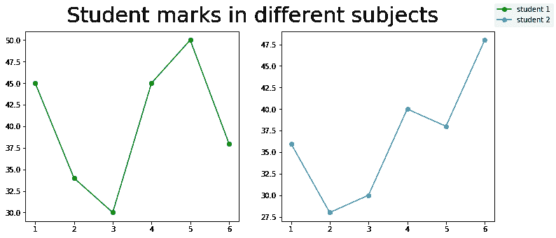
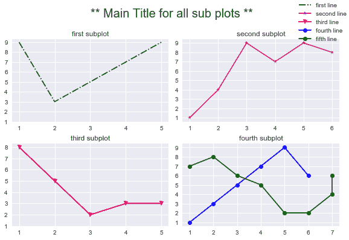

# 如何为 Matplotlib 中的所有支线剧情设置单一主标题？

> 原文:[https://www . geesforgeks . org/如何在 matplotlib 中为所有子情节设置单个主标题/](https://www.geeksforgeeks.org/how-to-set-a-single-main-title-for-all-the-subplots-in-matplotlib/)

**先决条件:**T2【马特洛特利

matplotlib 库中的一个标题描述了绘制图形的主要主题。使用 [title()](https://www.geeksforgeeks.org/matplotlib-pyplot-title-in-python/#:~:text=pyplot.-,title(),the%20title%20using%20various%20attributes.&text=Parameters%3A,string%20of%20the%20visualization%20depicted.) 方法可以很容易地为一个地块设置标题。通过使用此功能，只能设置单个标题情节，而不能为所有子情节设置单个标题。因此，要为所有支线剧情设置一个主标题，需要使用 [suptitle()](https://www.geeksforgeeks.org/matplotlib-figure-figure-suptitle-in-python/) 方法。

> ***语法:** suptitle(self，t，**kwargs)*
> 
> ***参数:**该方法接受下面讨论的以下参数:*
> 
> *   ***t :** 此参数为标题文本。*
> *   ***x:** 该参数是图坐标中文本的 x 位置。*
> *   ***y:** 这个参数是文字在图坐标中的 y 位置。*
> *   ***水平对齐，ha :** 此参数是文本相对于(x，y)的水平对齐。*
> *   ***垂直对齐，va :** 此参数是文本相对于(x，y)的垂直对齐。*
> *   ***字体大小，大小:**这个参数是文字的字体大小。*
> *   ***字体粗细，粗细:**此参数为文字的字体粗细。*
> 
> ***返回:**这个方法返回标题的**文本**实例。*

### 方法

*   导入模块
*   创建要打印的数据
*   使用 suptitle()设置图形标题
*   绘制图表
*   显示图

下面给出了使用给定方法的实现:

**例 1:**

## 蟒蛇 3

```py
import matplotlib.pyplot as plt
import numpy as np

fig, (ax1, ax2) = plt.subplots(1, 2, figsize=(12, 5))

x1 = [1, 2, 3, 4, 5, 6]
y1 = [45, 34, 30, 45, 50, 38]
y2 = [36, 28, 30, 40, 38, 48]

labels = ["student 1", "student 2"]

fig.suptitle(' Student marks in different subjects ', fontsize=30)

# Creating the sub-plots.
l1 = ax1.plot(x1, y1, 'o-', color='g')
l2 = ax2.plot(x1, y2, 'o-')

fig.legend([l1, l2], labels=labels,
           loc="upper right")
plt.subplots_adjust(right=0.9)

plt.show()
```

**输出:**



**例 2:**

## 蟒蛇 3

```py
import matplotlib.pyplot as plt
import numpy as np

fig, ax = plt.subplots(2, 2)
fig.suptitle('** Main Title for all sub plots **', fontsize=20)
plt.style.use('seaborn')

labels = ['first line', 'second line',
          'third line', 'fourth line', 'fifth line']

ax[0, 0].plot([1, 2, 3, 4, 5], [9, 3, 5, 7, 9], '-.', color='g')
ax[0, 0].set_title('first subplot')
ax[0, 0].set_yticks(np.arange(1, 10))

ax[0, 1].plot([1, 2, 3, 4, 5, 6], [1, 4, 9, 7, 9, 8], '-*', color='m')
ax[0, 1].set_title('second subplot')
ax[0, 1].set_yticks(np.arange(1, 10))

ax[1, 0].plot([1, 2, 3, 4, 5], [8, 5, 2, 3, 3], '-v', color='r')
ax[1, 0].set_title('third subplot')
ax[1, 0].set_yticks(np.arange(1, 9))

ax[1, 1].plot([1, 2, 3, 4, 5, 6], [1, 3, 5, 7, 9, 6], 'o-', color='b')
ax[1, 1].plot([1, 2, 3, 4, 5, 6, 7, 7], [
              7, 8, 6, 5, 2, 2, 4, 6], 'o-', color='g')
ax[1, 1].set_title('fourth subplot')
ax[1, 1].set_yticks(np.arange(1, 10))

fig.tight_layout()
fig.legend(ax, labels=labels, loc="upper right", borderaxespad=0.1)
fig.subplots_adjust(top=0.85)

plt.show()
```

**输出:**

