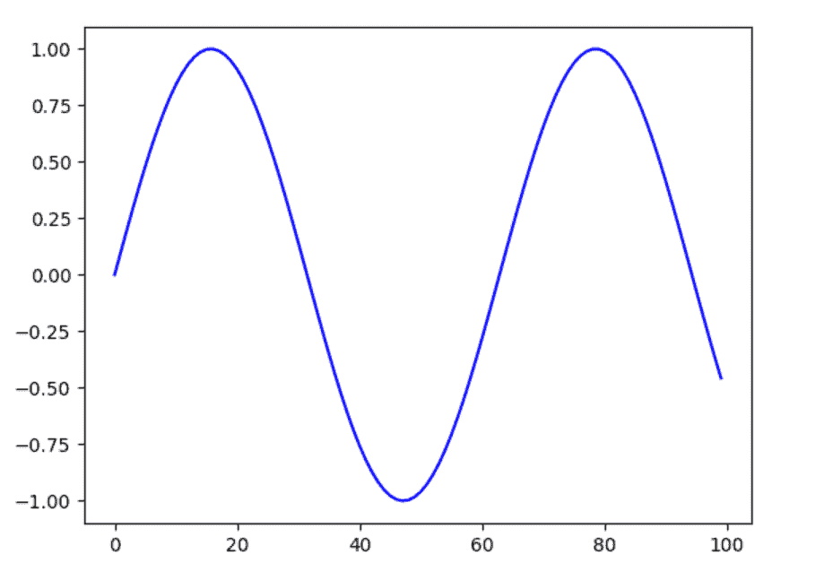
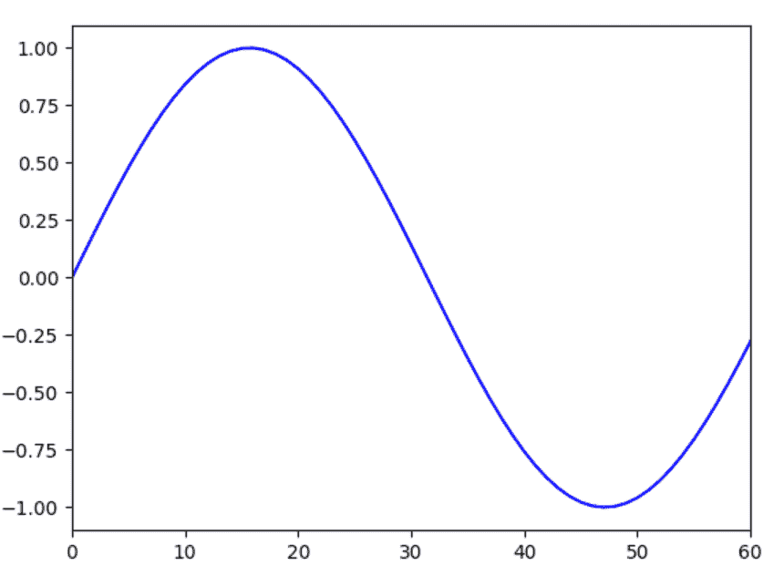
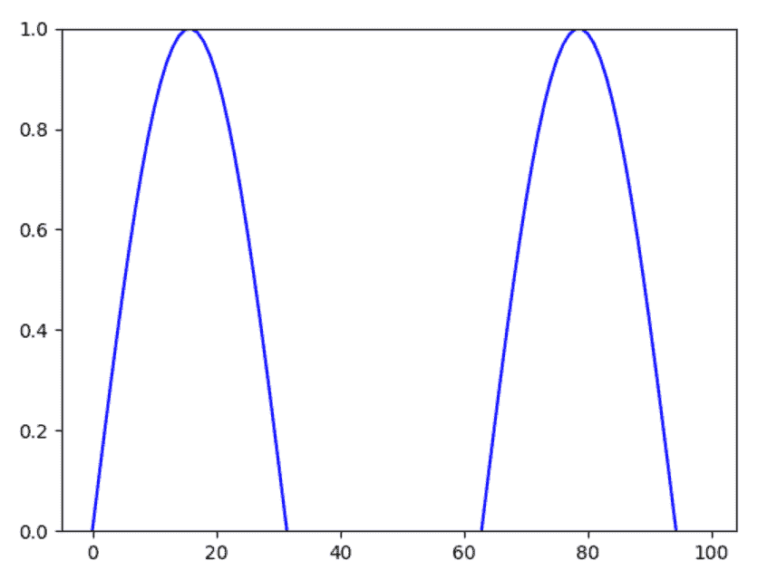
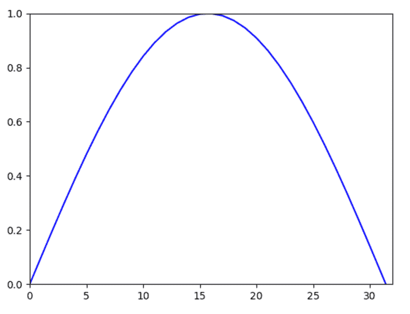

# 如何在 Matplotlib 中设置轴范围？

> 原文:[https://www . geesforgeks . org/如何设置 matplotlib 中的轴范围/](https://www.geeksforgeeks.org/how-to-set-axis-ranges-in-matplotlib/)

Matplotlib 通过查找轴上的极值(即最小值和最大值)来设置轴的默认范围。然而，为了更好地查看数据，有时会使用 pyplot 模块根据 Matplotlib 中的要求设置图形的轴范围。以下是在 Matplotlib 中设置轴范围的方法:

**语法:**

```py
For setting range of x-axis:
matplotlib.pyplot.xlim(limit_range)
For setting range of y-axis: 
 matplotlib.pyplot.ylim(limit_range)
```

**例 1:**

让我们在不设置轴范围的情况下绘制正弦波函数:

## 计算机编程语言

```py
# import packages
import matplotlib.pyplot as plt
import numpy as np

# return values between 0 and 10 with 
# even space of 0.1
x = np.arange(0, 10, 0.1)

# generate value of sine function for 
# given x values
y = np.sin(x)

# plot graph of sine function
plt.plot(y, color='blue')

# display plot
plt.show()
```

**输出:**



现在，我们将把图的 x 轴范围设置为[0，60]。以下是限制 x 轴范围的代码:

**例 2:**

## 计算机编程语言

```py
# import packages
import matplotlib.pyplot as plt
import numpy as np

# return values between 0 and 10 with 
# even space of 0.1
x = np.arange(0, 10, 0.1)

# generate value of sine function for 
# given x values
y = np.sin(x)

# plot graph of sine function
plt.plot(y, color='blue')

# Set the range of x-axis
plt.xlim(0, 60)

# display plot
plt.show()
```

**输出:**



现在，我们将图的 y 轴范围设置为[0，1]。以下是限制 y 轴范围的代码:

**例 3:**

## 计算机编程语言

```py
# import packages
import matplotlib.pyplot as plt
import numpy as np

# return values between 0 and 10 with 
# even space of 0.1
x = np.arange(0, 10, 0.1)

# generate value of sine function for 
# given x values
y = np.sin(x)

# plot graph of sine function
plt.plot(y, color='blue')

# Set the range of y-axis
plt.ylim(0, 1)

# display plot
plt.show()
```

**输出:**



我们也可以同时为图的两个轴设置范围。现在，我们将 x 轴范围设置为[0，32]，y 轴范围设置为[0，1]。以下是限制 x 轴和 y 轴范围的代码:

**例 4:**

## 计算机编程语言

```py
# import packages
import matplotlib.pyplot as plt
import numpy as np

# return values between 0 and 10 with 
# even space of 0.1
x = np.arange(0, 10, 0.1)

# generate value of sine function for
# given x values
y = np.sin(x)

# plot graph of sine function
plt.plot(y, color='blue')

# Set the range of x-axis
plt.xlim(0, 32)
# Set the range of y-axis
plt.ylim(0, 1)

# display plot
plt.show()
```

**输出:**

