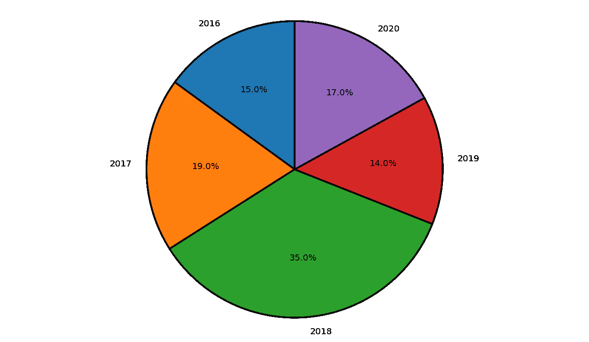
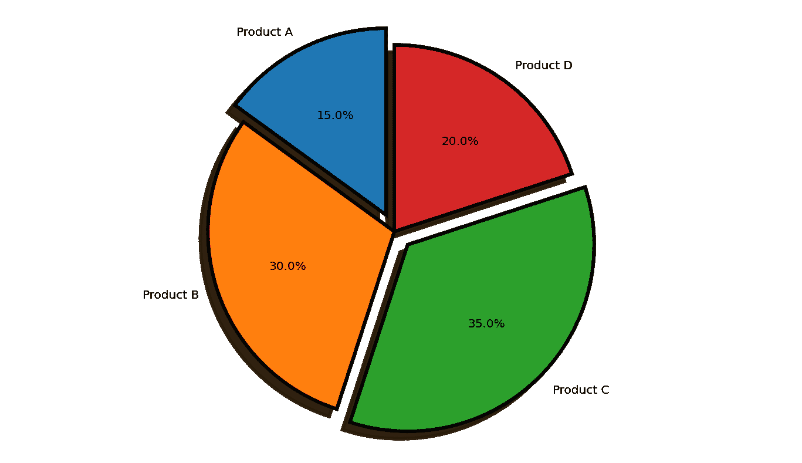

# 如何在 Matplotlib 饼图中为楔形设置边框？

> 原文:[https://www . geeksforgeeks . org/如何为 matplotlib 饼图中的楔形设置边框/](https://www.geeksforgeeks.org/how-to-set-border-for-wedges-in-matplotlib-pie-chart/)

饼图可用于数据的相对比较。Python 提供了几个可以使用的数据可视化库。Matplotlib 库提供了不同类型的图形以及构建方法和属性来操作图形。可以使用 [matplotlib.pyplot](https://www.geeksforgeeks.org/pyplot-in-matplotlib/) 的 pie()方法的 wedgeprops 属性为饼图中的楔形区指定边框。下面给出了两个为饼图的楔形区设置边框的例子。

> **语法:**楔形符:[dict | None]
> 
> **参数:**
> 
> **格言:**是属性及其值。示例:{ '线宽':2}或{'edgecolor':'black'}
> 
> **默认值:**无

**例 1:**

首先导入 matplotlib 包的 pyplot 模块。年份和利润数组被初始化。接下来，用给定的数据绘制图表。“自动切割”属性用于指定楔形文字与圆心的距离。startangle 属性用于决定图表的绘制方向。默认情况下，startangle 为 0，这意味着图表从正 X 轴开始。这里的开始角度设置为 90 度，这意味着图表旋转了 90 度，图表从正 Y 轴开始。wedgeprops 属性用于设置每个楔子的属性。edgecolor 设置为黑色，线宽设置为 2。抗锯齿设置为“真”，以防止图像出现锯齿效果。

**下面是实现:**

## 蟒蛇 3

```py
import matplotlib.pyplot as plt

years = [2016, 2017, 2018, 2019, 2020]
profit = [15, 19, 35, 14, 17]

# Plotting the pie chart
plt.pie(profit, labels = years, autopct = '%1.1f%%',
        startangle = 90, 
        wedgeprops = {"edgecolor" : "black",
                      'linewidth': 2,
                      'antialiased': True})

# Equal aspect ratio ensures
# that pie is drawn as a circle.
plt.axis('equal')

# Display the graph onto the screen
plt.show()
```

**输出:**



**例 2:**

首先导入 matplotlib 包的 pyplot 模块。产品和库存数组被初始化。分解是一种可选的类似阵列的结构，用于分隔饼图的某些部分。接下来，用给定的数据绘制图表。“自动切割”属性用于指定楔形文字与圆心的距离。阴影属性是为分割部分生成的阴影。startangle 属性用于决定图表的绘制方向。默认情况下，startangle 为 0，这意味着图表从正 X 轴开始。这里的开始角度设置为 90 度，这意味着图表旋转了 90 度，图表从正 Y 轴开始。wedgeprops 属性用于设置每个楔子的属性。edgecolor 设置为黑色，线宽设置为 3。抗锯齿设置为 true，以防止图像出现锯齿效果。

**下面是实现:**

## 蟒蛇 3

```py
import matplotlib.pyplot as plt

# the slices are ordered and
# plotted counter-clockwise:
product = 'Product A', 'Product B',
            'Product C', 'Product D'

stock = [15, 30, 35, 20]
explode = (0.1, 0, 0.1, 0) 

plt.pie(stock, explode = explode,
        labels = product, autopct = '%1.1f%%',
        shadow = True, startangle = 90,
        wedgeprops= {"edgecolor":"black",
                     'linewidth': 3,
                     'antialiased': True})

# Equal aspect ratio ensures that
# pie is drawn as a circle.
plt.axis('equal')  

plt.show()
```

**输出:**

