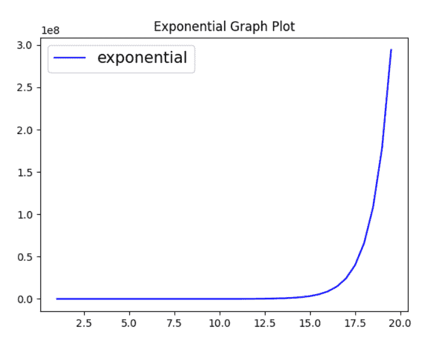
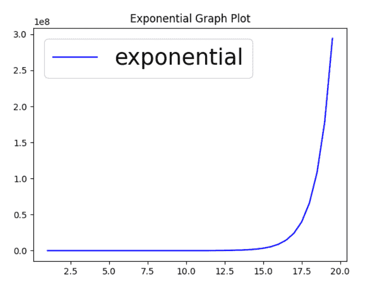

# 如何设置 Matplotlib 轴图例的字体大小？

> 原文:[https://www . geeksforgeeks . org/如何设置 matplotlib-axis-legend 的字体大小/](https://www.geeksforgeeks.org/how-to-set-font-size-of-matplotlib-axis-legend/)

**先决条件:**T2【马特洛特利

在本文中，我们将看到如何使用 Python 设置 matplotlib 轴图例的字体大小。为此，我们将使用 rcParams()方法来增加/减少字体大小。为此，我们必须重写 matplotlib . rcparams[' legend . font size ']方法。

> **语法:**matplotlib . rcparams[' legend . fontsize ']= font _ size _ value

### **示例 1:将图例的**地块大小设置为 15

## 蟒蛇 3

```py
# import required modules
import numpy
from matplotlib import pyplot
import matplotlib

# assign value to x axis
x_axis = numpy.arange(1, 20, 0.5)

# get the value of log10
y_axis_log10 = numpy.exp(x_axis)

# plot the graph
pyplot.plot(x_axis, y_axis_log10, c="blue",
            label="exponential")

# title of the graph/plot
pyplot.title("Exponential Graph Plot")

# to set the font size of the legend
matplotlib.rcParams['legend.fontsize'] = 15

pyplot.legend(loc='best')

pyplot.show()
```

**输出:**



### **例 2:将图例的**地块大小设置为 25

## 蟒蛇 3

```py
# import required modules
import numpy
from matplotlib import pyplot
import matplotlib

# assign value to x axis
x_axis = numpy.arange(1, 20, 0.5)

# get the value of log10
y_axis_log10 = numpy.exp(x_axis)

# plot the graph
pyplot.plot(x_axis, y_axis_log10, c="blue", label="exponential")

# Title of the graph/ploy
pyplot.title("Exponential Graph Plot")

# to set the font size of the legend
matplotlib.rcParams['legend.fontsize'] = 25

pyplot.legend(loc='best')

pyplot.show()
```

**输出:**

