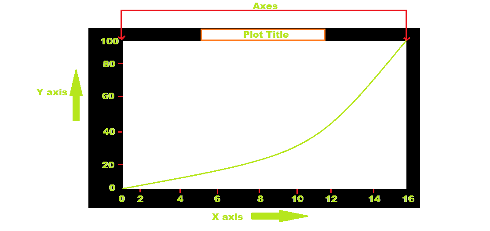
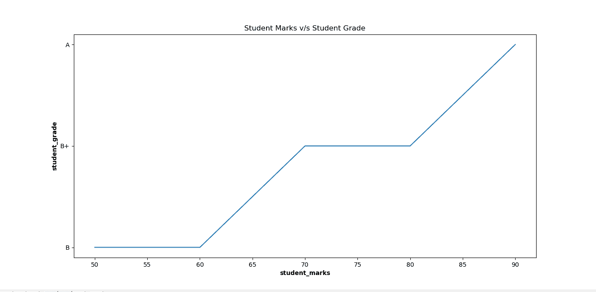

# 如何在 Matplotlib 中设置地块背景色？

> 原文:[https://www . geeksforgeeks . org/如何设置绘图-背景色-in-matplotlib/](https://www.geeksforgeeks.org/how-to-set-plot-background-color-in-matplotlib/)

**先决条件:**

*   [Matplotlib](https://www.geeksforgeeks.org/python-introduction-matplotlib/)
*   num py

从下图可以推断，一个图由 X 轴、Y 轴、图标题和轴组成。默认情况下，绘图的颜色为白色。如果我们必须设置绘图的背景颜色，使我们的绘图看起来很漂亮，我们必须使 axes 对象，在绘制图形后使用 axes()属性。



**进场:**

*   导入模块
*   加载或创建数据
*   画一个规则的图形
*   创建轴对象
*   将属性 set_facecolor()设置为所需的颜色。该属性接受颜色的名称或颜色代码

根据给定的例子更好地理解。

**示例:**默认颜色图

## 计算机编程语言

```
# importing library
import matplotlib.pyplot as plt

# giving values for x and y to plot
student_marks = [50, 60, 70, 80, 90]
student_grade = ['B', 'B', 'B+', 'B+', 'A']

plt.plot(student_marks, student_grade)

# Giving x label using xlabel() method
# with bold setting
plt.xlabel("student_marks", fontweight='bold')

# Giving y label using xlabel() method
# with bold setting
plt.ylabel("student_grade", fontweight='bold')

# Giving title to the plot
plt.title("Student Marks v/s Student Grade")

# Showing the plot using plt.show()
plt.show()
```

**输出:**



**示例 2 :** 将背景颜色设置为黄色

## 计算机编程语言

```
# importing library
import matplotlib.pyplot as plt

# giving values for x and y to plot
student_marks = [50, 60, 70, 80, 90]
student_grade = ['B', 'B', 'B+', 'B+', 'A']
plt.plot(student_marks, student_grade)

# Giving x label using xlabel() method
# with bold setting
plt.xlabel("student_marks", fontweight='bold')
ax = plt.axes()

# Setting the background color of the plot 
# using set_facecolor() method
ax.set_facecolor("yellow")

# Giving y label using xlabel() method 
# with bold setting
plt.ylabel("student_grade", fontweight='bold')

# Giving title to the plot
plt.title("Student Marks v/s Student Grade")

# Showing the plot using plt.show()
plt.show()
```