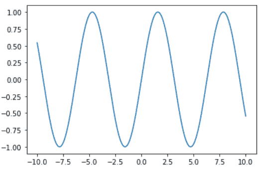
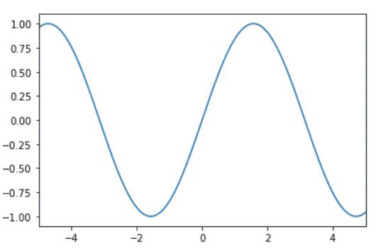
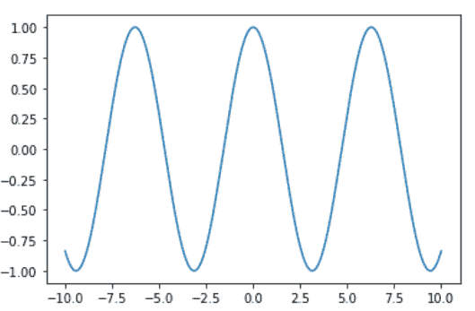
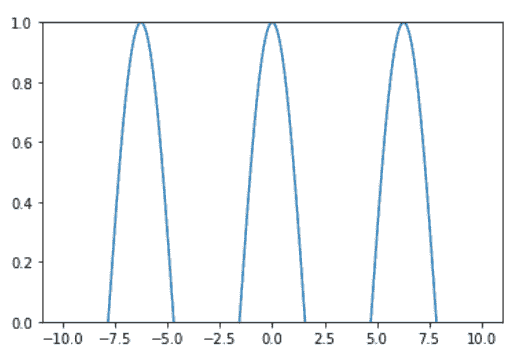
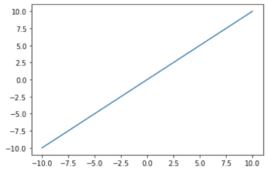

# 如何用 Python 设置 Matplotlib 中的 X 和 Y 极限？

> 原文:[https://www . geeksforgeeks . org/如何用 python 设置 matplotlib 中的 x 和 y 限制/](https://www.geeksforgeeks.org/how-to-set-the-x-and-the-y-limit-in-matplotlib-with-python/)

**先决条件:**T2【马特洛特利

在本文中，我们将学习如何用 Python 在 matplotlib 中设置 X 极限和 Y 极限。在此之前，需要熟悉一些概念:

*   **Python :** Python 是一种高级的、通用的、非常流行的编程语言。它被用于网络开发、机器学习应用以及软件行业的所有前沿技术。
*   **Matplotlib :** Matplotlib 是 Python 支持的一个可视化库，用于数组的 2D 图。Matplotlib 是一个多平台数据可视化库，构建在 NumPy 数组上，旨在与更广泛的 SciPy 堆栈一起工作。它是由约翰·亨特在 2002 年推出的。
*   **xlim() :** 是 matplotlib 库 pyplot 模块中的一个函数，用于获取或设置当前轴的 x-极限。
*   **ylim() :** 是 matplotlib 库 pyplot 模块中的一个函数，用于获取或设置当前轴的 y 轴极限。

## 方法

*   导入库
*   加载或创建数据
*   绘制图表
*   请使用 xlim() / ylim()或两者都使用。

让我们借助一些例子来讨论这些步骤:

**例 1:** (使用 xlim()方法)

## 蟒蛇 3

```
# import packages
import matplotlib.pyplot as plt
import numpy as np

# create data
x = np.linspace(-10, 10, 1000)
y = np.sin(x)

# plot the graph
plt.plot(x, y)

# limit x by -5 to 5
plt.xlim(-5, 5)
```

**输出:**



**简单剧情**



**X 限定地块**

**例 2:** (使用 ylim()方法)

## 蟒蛇 3

```
# import packages
import matplotlib.pyplot as plt
import numpy as np

# create data
x = np.linspace(-10, 10, 1000)
y = np.cos(x)

# plot the graph
plt.plot(x, y)

# limit y by 0 to 1
plt.ylim(0, 1)
```

**输出:**



**简单剧情**



**Y 限定地块**

**示例 3:** (同时使用 xlim()和 ylim()方法)

## 蟒蛇 3

```
# import packages
import matplotlib.pyplot as plt
import numpy as np

# create data
x = np.linspace(-10, 10, 20)
y = x

# plot the graph
plt.plot(x, y)

# limited to show positive axes
plt.xlim(0)
plt.ylim(0)
```

**输出:**



**简单剧情**


**X、Y 限定地块**