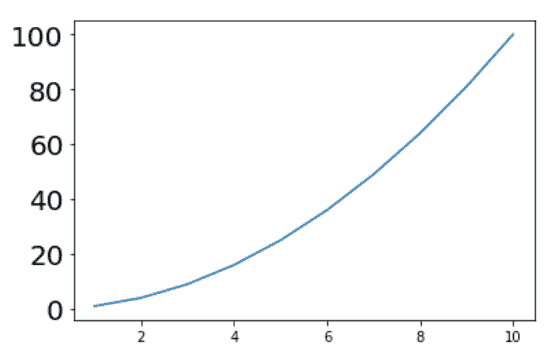
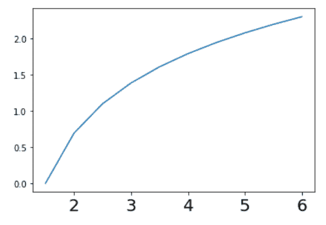
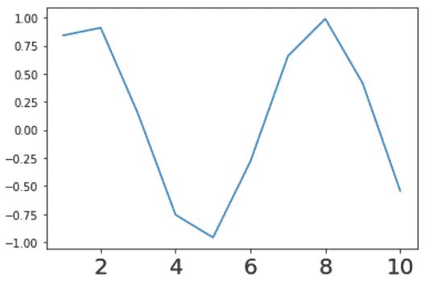

# 如何在 Matplotlib 中设置刻度标签字号？

> 原文:[https://www . geesforgeks . org/how-set-tick-labels-font-size-in-matplotlib/](https://www.geeksforgeeks.org/how-to-set-tick-labels-font-size-in-matplotlib/)

**先决条件:**T2【马特洛特利

在本文中，我们将学习如何在 matplotlib 中更改(增加/减少)绘图刻度标签的字体大小。为此，必须理解以下概念:

*   [**Matplotlib**](https://www.geeksforgeeks.org/python-introduction-matplotlib/#:~:text=Matplotlib%20is%20an%20amazing%20visualization,Hunter%20in%20the%20year%202002.)**:**Matplotlib 是 Python 中一个惊人的可视化库，用于数组的 2D 图。Matplotlib 是一个多平台数据可视化库，构建在 NumPy 数组上，旨在与更广泛的 SciPy 堆栈一起工作。它是由约翰·亨特在 2002 年推出的。
*   **刻度标签:**刻度是表示轴上数据点的标记。Matplotlib 的默认刻度定位器和格式化程序被设计成在许多常见情况下都足够了。记号的位置和标签经常被明确提及以适应特定的要求。
*   **字体大小:**字体大小或文字大小是屏幕上显示或页面上打印的字符有多大。

**方法:**要改变刻度标签的字体大小，应该遵循下面给出的一些基本步骤:

1.  导入库。
2.  创建或导入数据。
3.  使用 matplotlib 绘制数据图。
4.  更改刻度标签的字体大小。(这可以通过不同的方法实现)

为了改变刻度标签的字体大小，可以采用与上述步骤相反的三种不同方法中的任何一种。这三种方法是:

*   PLT . xts/PLT . yts 中的 fontsize()
*   ax . set _ yticklabels/ax . set _ xticklabels()中的 fontsize
*   标签尺寸(英寸)

让我们借助示例逐一讨论这些方法的实现:

**示例 1:** (使用 plt.xticks/plt.yticks)

## 蟒蛇 3

```py
# importing libraries
import matplotlib.pyplot as plt

# creating data
x = list(range(1, 11, 1))
y = [s*s for s in x]

# ploting data
plt.plot(x, y)

# changing the fontsize of yticks
plt.yticks(fontsize=20)

# showing the plot
plt.show()
```

**输出:**



**示例 2:** (使用 ax . set _ yticklabels/ax . set _ xticklabels)

## 蟒蛇 3

```py
# importing libraries
import matplotlib.pyplot as plt
import numpy as np

# create data
x = list(range(1, 11, 1))
y = np.log(x)

# make objects of subplots
fig, ax = plt.subplots()

# plot the data
ax.plot(x, y)

# change the fontsize
ax.set_xticklabels(x, fontsize=20)

# show the plot
plt.show()
```

**输出:**



**示例 3:** (使用 ax.tick_params)

## 蟒蛇 3

```py
# importing libraries
import matplotlib.pyplot as plt
import numpy as np

# create data
x = list(range(1, 11, 1))
y = np.sin(x)

# make objects of subplots
fig, ax = plt.subplots(1, 1)

# plot the data
ax.plot(x, y)

# change the fontsize
ax.tick_params(axis='x', labelsize=20)

# show the plot
plt.show()
```

**输出:**

