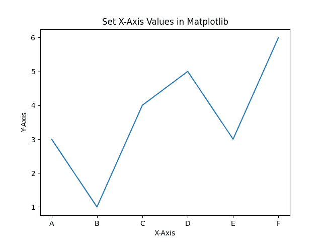
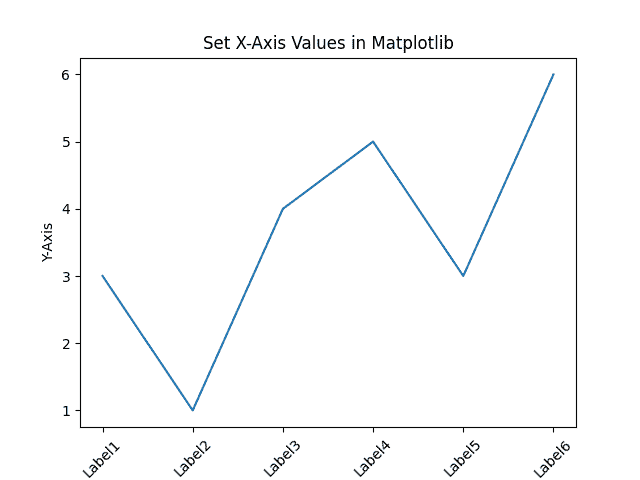

# 如何在 Python 的 Matplotlib 中设置 X 轴值？

> 原文:[https://www . geeksforgeeks . org/如何设置-x 轴-值-in-matplotlib-in-python/](https://www.geeksforgeeks.org/how-to-set-x-axis-values-in-matplotlib-in-python/)

在本文中，我们将研究用 python 编程语言在 matplotlib 中设置 x 轴值的方法。

Matplotlib 库 pyplot 模块中的[XT picks()](https://www.geeksforgeeks.org/matplotlib-pyplot-xticks-in-python/)功能用于设置 x 轴值。

**语法:**

```
matplotlib.pyplot.xticks(ticks=None, labels=None, **kwargs)
```

函数接受以下参数:

<figure class="table">

| 因素 | 描述 |
| --- | --- |
| 滴答声 | 

*   List of coordinates.
*   optional
*   An empty list will remove all xticks.

 |
| 标签 | 

*   List of palace labels at a given scale position.

 |
| **克瓦格斯 | 用于控制标签外观的文本属性。 |

</figure>

**返回:**xtpicks()函数返回以下值:

*   位置:坐标位置列表。
*   标签:xlabel 文本位置列表。

**示例#1 :**

在这个例子中，我们将使用 python 编程语言中的 xtick()函数在 Matplotlib 中设置 X 轴值。

## 蟒蛇 3

```
# Python program to set x-axis values in matplotlib

import matplotlib.pyplot as plt

# x-axis and y-axis values for ploting
x = [1, 2, 3, 4, 5, 6]
y = [3, 1, 4, 5, 3, 6]

# labels for x-asix
labels = ['A', 'B', 'C', 'D', 'E', 'F']

# Plotting x-axis and y-axis
plt.plot(x, y)

# naming of x-axis and y-axis
plt.xlabel("X-Axis")
plt.ylabel("Y-Axis")

# naming the title of the plot
plt.title("Set X-Axis Values in Matplotlib")

# setting x-axis values
plt.xticks(x, labels)

plt.show()
```

**输出:**



**例 2:**

在本例中，我们将使用 rotation 参数来接受以度为单位的旋转值，它将按指定的度顺时针方向旋转标签。

## 蟒蛇 3

```
# Python program to set x-axis values in matplotlib

import matplotlib.pyplot as plt

# x-axis and y-axis values for ploting
x = [1, 2, 3, 4, 5, 6]
y = [3, 1, 4, 5, 3, 6]

# labels for x-asix
labels = ['Label1', 'Label2', 'Label3', 'Label4', 'Label5', 'Label6']

# Plotting x-axis and y-axis
plt.plot(x, y)

# naming of x-axis and y-axis
plt.xlabel("X-Axis")
plt.ylabel("Y-Axis")

# naming the title of the plot
plt.title("Set X-Axis Values in Matplotlib")

# setting x-axis values and specifing rotation
# for the labels in degrees
plt.xticks(x, labels, rotation=45)

plt.show()
```

**输出:**

