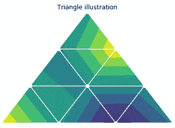
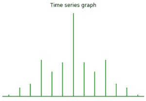
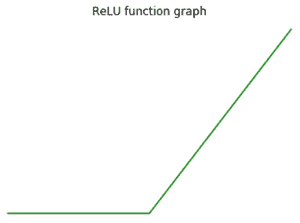

# 如何在 Matplotlib 中关闭支线剧情的轴？

> 原文:[https://www . geeksforgeeks . org/如何在 matplotlib/](https://www.geeksforgeeks.org/how-to-turn-off-the-axes-for-subplots-in-matplotlib/) 中关闭子剧情轴

在本文中，我们将讨论如何使用 *matplotlib* 模块关闭子剧情的轴。我们可以使用以下方法关闭支线剧情和剧情的轴:

**方法 1:** 使用 matplotlib.axes.Axes.axis()

要关闭支线剧情的轴，我们这里将[*matplotlib . axes . axes . axis()*](https://www.geeksforgeeks.org/matplotlib-axes-axes-axis-in-python/)方法。

## 蟒蛇 3

```py
# import required modules
import matplotlib.pyplot as plt
import matplotlib.tri as mtri
import numpy as np

# assign data   
x = np.asarray([0, 1, 2, 3, 0.5,
                1.5, 2.5, 1, 2,
                1.5])

y = np.asarray([0, 0, 0, 0, 1.0,
                1.0, 1.0, 2, 2,
                3.0])

triangles = [[0, 1, 4], [1, 5, 4],
            [2, 6, 5], [4, 5, 7],
            [5, 6, 8], [5, 8, 7],
            [7, 8, 9], [1, 2, 5],
            [2, 3, 6]]

# depict illustration
triang = mtri.Triangulation(x, y, triangles)
z = np.cos(1.5 * x) * np.cos(1.5 * y)

fig, axs = plt.subplots()
axs.tricontourf(triang, z)
axs.triplot(triang, 'go-', color ='white')

# turn off the axes
axs.set_axis_off()

# assign title
axs.set_title('Triangle illustration')

plt.show()
```

**输出:**



这里，我们使用*轴(“关闭”)*语句关闭轴。

**方法 2:** 使用 matplotlib . axes . axes . set _ axis _ off()

我们使用[*matplotlib . axes . axes . set _ axis _ off()*](https://www.geeksforgeeks.org/matplotlib-axes-axes-set_axis_off-in-python/)关闭 x 轴和 y 轴，同时影响轴线、刻度、标签、网络和轴标记。

## 蟒蛇 3

```py
# import required modules
import matplotlib.pyplot as plt
import numpy as np

# time series data
geeksx = np.array([24.40, 110.25, 20.05,
                22.00, 61.90, 7.80,
                15.00])

geeksy = np.array([24.40, 110.25, 20.05,
                22.00, 61.90, 7.80,
                15.00])

# depict illustration   
fig, ax = plt.subplots()
ax.xcorr(geeksx, geeksy, maxlags = 6,
        color ="green")

# turn off the axes
ax.set_axis_off()

# assign title
ax.set_title('Time series graph')
plt.show()
```

**输出:**



**方法 3:** 使用 matplotlib.pyplot.axis()

在可视化中，如果图形中有一个单独的情节，我们可以通过使其看起来像是对[*matplotlib . pyplot . axis()*](https://www.geeksforgeeks.org/matplotlib-pyplot-axis-in-python/)技术的争夺来关闭子情节的轴。如果图形包含不同的子场景，这个技巧只是关闭最后一个子场景的轴。

## 蟒蛇 3

```py
# importing module
import matplotlib.pyplot as plt

# assigning x and y coordinates
x = [-5, -4, -3, -2, -1, 0, 1, 2, 3, 4, 5]
y = []

for i in range(len(x)):
    y.append(max(0, x[i]))

# depicting the visualization
ax = plt.plot(x, y, color='green')

# turn off the axes
plt.axis('off')

# displaying the title
plt.title("ReLU function graph")

plt.show()
```

**输出:**



这里，我们使用*PLT . axis(“off”)*语句关闭轴。