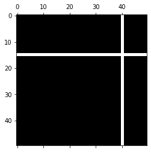
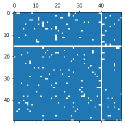

# 如何使用 Matplotlib 在 Python 中可视化稀疏矩阵？

> 原文:[https://www . geesforgeks . org/how-visualization-稀疏矩阵-在 python 中使用-matplotlib/](https://www.geeksforgeeks.org/how-to-visualize-sparse-matrix-in-python-using-matplotlib/)

**[Matplotlib](https://www.geeksforgeeks.org/python-matplotlib-an-overview/)** 是 Python 中一个惊人的可视化库，用于数组的 2D 图。Matplotlib 绘图库是一个基于 NumPy 阵列的多平台数据可视化库，旨在与更广泛的 SciPy 堆栈协同工作。

## 使用 Matplotlib 可视化稀疏矩阵

***【Spy】***是一个类似于 matplotlib [imshow](https://www.geeksforgeeks.org/matplotlib-axes-axes-imshow-in-python/) 函数的函数，用于将数组可视化为一个图像，但是它是在稀疏矩阵而不是密集矩阵的情况下使用的。一个*稀疏矩阵*是一个大部分元素为零的矩阵。


稀疏矩阵及其表示

Spy 函数使用两种绘图样式来可视化数组，它们是:

*   图像样式
*   标记样式

这两种样式都可以用于全数组，但是在 spmatrix 实例中，只有标记样式有效。如果*标记*或*标记*为*无*，则使用 imshow 函数，剩余的所有关键字参数都传递给该函数；否则，将返回一个 Line2D 对象，其标记值决定标记类型，任何剩余的关键字参数将传递给[绘图](https://www.geeksforgeeks.org/matplotlib-axes-axes-plot-in-python/)功能。

> **语法:** matplotlib.pyplot.spy(Z，precision=0，marker=None，markersize=None，aspect='equal '，origin='upper '，\*\*kwargs)
> 
> **返回值:**
> 
> 返回类型取决于打印样式，即轴图像或线 2D。

**参数:**

| 参数 | 价值 | 使用 |
| --- | --- | --- |
| Z | 类数组(M，N) | 要绘制的数组 |
| 精确 | 浮动或“存在”，可选
默认:零 | 如果精度为 0，将绘制任何非零值；否则，将绘制&#124;Z&#124; >精度的值。
对于 spmatrix 实例，有一种特殊情况:如果精度为“存在”，则数组中存在的任何值都将被绘制，即使它完全为零。 |
| 起源 | { '上'，'下' }，可选
默认:'上' | 将数组的[0，0]索引放在轴的左上角或左下角。 |
| 方面 | { '相等'，'自动'，'无'或浮动，可选
默认:'相等' | 它控制轴的纵横比。该方面与图像特别相关，因为它可能使图像失真，即像素不是正方形。 |

*   “相等”:确保纵横比为 1。像素将是方形的。*   “自动”:轴保持固定，纵横比调整，以便数据适合轴。通常，这将导致非方形像素。*   None: Use rcParams[“image.aspect”]

    **其他参数:**kwargs**

    这些是有助于获得不同打印样式的附加参数。

    | 财产 | 描述 |
    | --- | --- |
    | agg _ 筛选器 | 一个过滤函数，接受(m，n，3)浮点数组和 dpi 值，并返回(m，n，3)数组 |
    | 希腊字母的第一个字母 | 浮动或无 |
    | 愉快的 | 弯曲件 |
    | 抗锯齿 | 弯曲件 |
    | 剪辑盒 | Bbox |
    | 剪辑 _on | 弯曲件 |
    | 剪辑路径 | 修补或(路径、转换)或无 |
    | 颜色 | 颜色 |
    | 包含 | 请求即付的 |
    | dash_capstyle | { '对接'，'圆形'，'突出' } |
    | dash_joinstyle | { '斜接'，'圆形'，'斜角' } |
    | 破折号 | 浮动顺序(以磅为单位的开/关油墨)或(无，无) |
    | 数据 | (2，N)阵列或两个 1D 阵列 |
    | 变速器 | { '默认'，'步骤'，'步骤-前'，'步骤-中'，'步骤-后' } |
    | 数字 | 数字 |
    | fillstyle(填充样式) | {“完整”、“左侧”、“右侧”、“底部”、“顶部”、“无”} |
    | 格子 | 潜艇用热中子反应堆（submarine thermal reactor 的缩写） |
    | in _ 布局 | 弯曲件 |
    | 标签 | 目标 |
    | 线条样式 | {'-', '–', '-.'，':'，"，(偏移量，开-关-序列)，…} |
    | 行距 | 漂浮物 |
    | 标记 | 标记样式 |
    | 标记颜色 | 颜色 |
    | 标记宽度 | 漂浮物 |
    | markerfacecolor | 颜色 |
    | markerfacecoloralt | 颜色 |
    | 标记大小 | 漂浮物 |
    | 标记每一个 | 无或整数或(整数，整数)或片或列表[整数]或浮点或(浮点，浮点) |
    | 路径效果 | 抽象路径效应 |
    | 采摘者 | 浮动或可调用[[艺术家，事件]，元组[布尔，字典]] |
    | 拾取半径 | 漂浮物 |
    | 光栅化 | 布尔或无 |
    | 草图 _ 参数 | (比例:浮动，长度:浮动，随机性:浮动) |
    | 突然的 | 布尔或无 |
    | solid_capstyle | { '对接'，'圆形'，'突出' } |
    | solid_joinstyle | { '斜接'，'圆形'，'斜角' } |
    | 改变 | matplotlib . transforms . transform |
    | 全球资源定位器(Uniform Resource Locator) | 潜艇用热中子反应堆（submarine thermal reactor 的缩写） |
    | 看得见的 | 弯曲件 |
    | xdata | 1D 阵列 |
    | 伊妲 | 1D 阵列 |
    | 更糟 | 漂浮物 |

    **例 1:**

    ```py
    # Implementation of matplotlib spy function
    import matplotlib.pyplot as plt
    import numpy as np

    x = np.random.randn(50, 50)

    x[15, :] = 0.
    x[:, 40] = 0.

    plt.spy(x)
    ```

    **输出:**
    

    **例 2:**

    ```py
    # Implementation of matplotlib spy function
    import matplotlib.pyplot as plt
    import numpy as np

    x = np.random.randn(50, 50)
    x[15, :] = 0.
    x[:, 40] = 0.

    plt.spy(x, precision = 0.1, markersize = 5)
    ```

    **输出:**
    