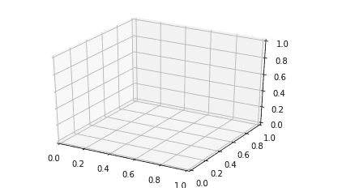
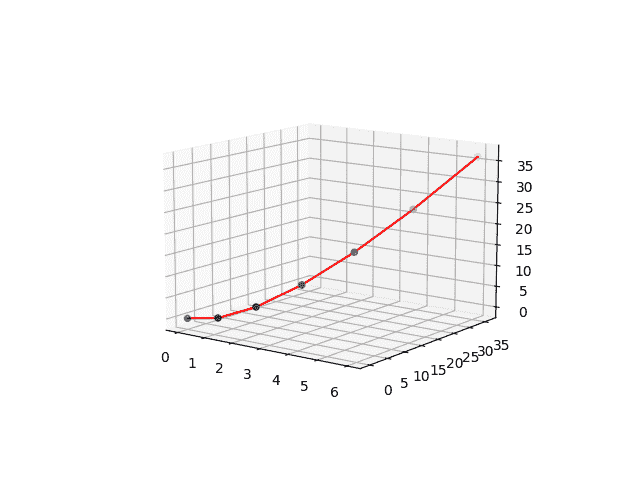
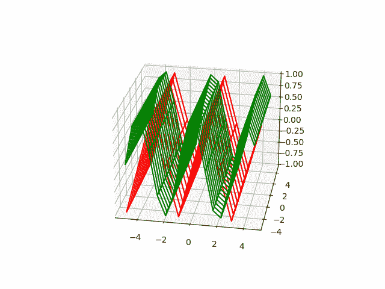
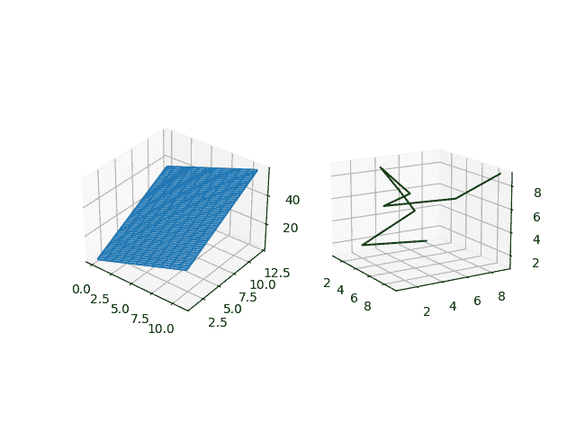
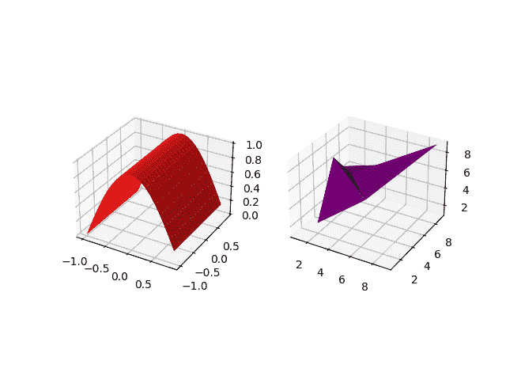
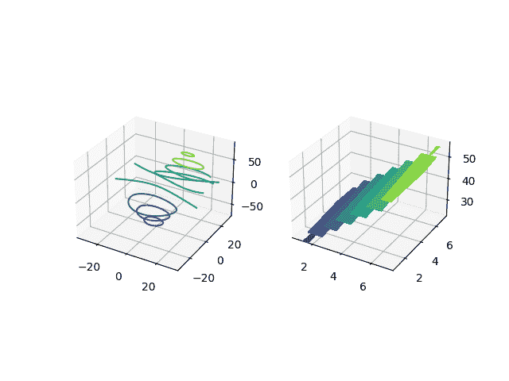
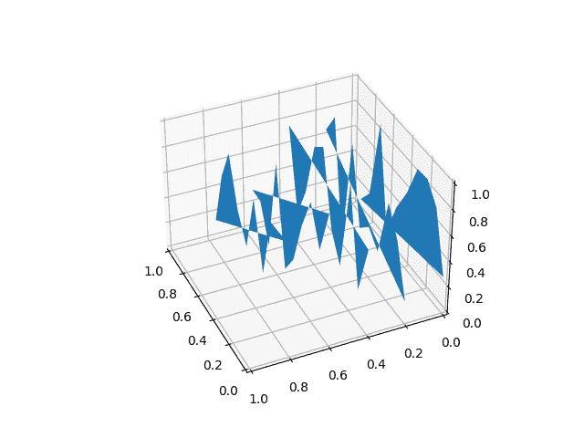
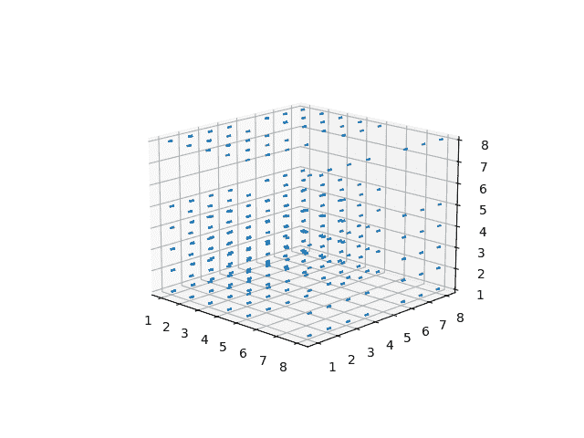
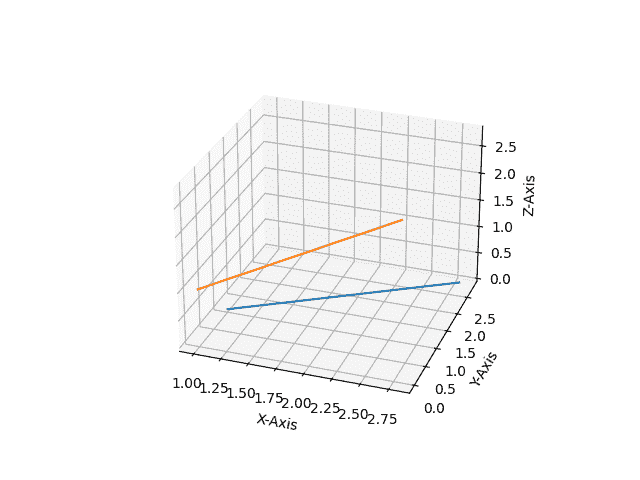

# 【Matplotlib 三维绘图入门

> 原文:[https://www . geesforgeks . org/introduction-to-3d-标绘-with-matplotlib/](https://www.geeksforgeeks.org/introduction-to-3d-plotting-with-matplotlib/)

在本文中，我们将学习使用 **Matplotlib** 进行三维绘图。我们可以通过各种方式使用 matplotlib 创建三维绘图，例如创建一个空画布并向其中添加轴，在这里您将投影定义为三维投影，***matplotlib . pyplot . GCA()*****等。**

### ****创建空的三维绘图:****

**在下面的代码中，我们将首先创建一个空画布。之后，我们将定义我们的 3D 绘图的轴，其中我们定义绘图的投影将是“ **3D** ”格式。这有助于我们在画布中创建三维空轴图形。在此之后，如果我们使用 **plt.show()** 显示该图，那么它将看起来像输出中显示的那样。**

****示例:**使用 Matplotlib 创建一个空的三维图形**

## **蟒蛇 3**

```
# importing numpy package from
# python library
import numpy as np

# importing matplotlib.pyplot package from
# python
import matplotlib.pyplot as plt

# Creating an empty figure
# or plot
fig = plt.figure()

# Defining the axes as a
# 3D axes so that we can plot 3D
# data into it.
ax = plt.axes(projection="3d")

# Showing the above plot
plt.show()
```

****输出:****

****

**现在，我们有了一个关于如何在空画布上创建 3D 绘图的基本想法。让我们来看一些三维绘图的例子。**

### ******3D 绘图示例**:****

****例 1:****

**在下面的例子中，我们将在我们的 3D 图中绘制一条简单的曲线。与此同时，我们将绘制一系列具有 X 坐标、Y 坐标和 Z 坐标的点。**

## **蟒蛇 3**

```
# importing numpy package
import numpy as np

# importing matplotlib package
import matplotlib.pyplot as plt

# importing mplot3d from
# mpl_toolkits
from mpl_toolkits import mplot3d

# creating an empty canvas
fig = plt.figure()

# defining the axes with the projection
# as 3D so as to plot 3D graphs
ax = plt.axes(projection="3d")

# creating a wide range of points x,y,z
x=[0,1,2,3,4,5,6]
y=[0,1,4,9,16,25,36]
z=[0,1,4,9,16,25,36]

# plotting a 3D line graph with X-coordinate,
# Y-coordinate and Z-coordinate respectively
ax.plot3D(x, y, z, 'red')

# plotting a scatter plot with X-coordinate,
# Y-coordinate and Z-coordinate respectively
# and defining the points color as cividis
# and defining c as z which basically is a
# defination of 2D array in which rows are RGB
#or RGBA
ax.scatter3D(x, y, z, c=z, cmap='cividis');

# Showing the above plot
plt.show()
```

****输出:****

****

****说明:****

*   **在上面的例子中，首先，我们从 python 库中导入包，以便在我们的空画布中有一个 3D 绘图。为此，我们正在导入 **numpy** 、 **matplotlib.pyplot** 和**mpl _ toolkit**。**
*   **导入所有必需的包后，我们使用 **plt.figure()** 创建一个空图形。**
*   **之后，我们定义图的轴，指定图是三维投影。**
*   **之后，我们取 3 个任意点的数组，分别作为绘制图形的 X、Y 和 Z 坐标。现在初始化点后，我们使用 ax.plot3D()绘制一个三维图，其中我们分别使用 X、Y、Z 作为 X、Y 和 Z 坐标，线条的颜色将是红色。**
*   **所有这些东西都作为括号内的参数发送。**
*   **之后，我们还用相同的一组值绘制散点图，随着每个点的进展，点的颜色将基于坐标包含的值。**
*   **在这之后，我们展示上面的情节。**

****例 2:****

**在本例中，我们将学习如何使用 **figure.gca()进行三维绘图。**这里我们将创建一条正弦曲线和一条余弦曲线，x 和 y 的值在-5 到 5 之间，间隙为 1。让我们看看代码来理解实现。**

## **蟒蛇 3**

```
# importing matplotlib.pyplot from
# python
import matplotlib.pyplot as plt

# importing numpy package from
# python
import numpy as np

# creating a range of values for
# x,y,x1,y1  from -5 to 5 with
# a space of 1 between the elements
x = np.arange(-5,5,1)
y = np.arange(-5,5,1)

# creating a range of values for
# x,y,x1,y1  from -5 to 5 with
# a space of 0.6 between the elements
x1= np.arange(-5,5,0.6)
y1= np.arange(-5,5,0.6)

# Creating a mesh grid with x ,y and x1,
# y1 which creates an n-dimensional
# array
x, y = np.meshgrid(x, y)
x1,y1= np.meshgrid(x1,y1)

# Creating a sine function with the
# range of values from the meshgrid
z = np.sin(x * np.pi/2 )

# Creating a cosine function with the
# range of values from the meshgrid
z1= np.cos(x1* np.pi/2)

# Creating an empty figure for
# 3D plotting
fig = plt.figure()

# using fig.gca, we are creating a 3D
# projection plot in the empty figure
ax = fig.gca(projection="3d")

# Creating a wireframe plot with the x,y and
# z-coordinates respectively along with the
# color as red
surf = ax.plot_wireframe(x, y, z, color="red")

# Creating a wireframe plot with the points
# x1,y1,z1 along with the plot line as green
surf1 =ax.plot_wireframe(x1, y1, z1, color="green")

#showing the above plot
plt.show()
```

****输出:****

****

****说明:****

*   **在这个例子中，我们从 python 中导入了两个包***matplotlib . pyplot*****和 ***NumPy*** 。****
*   ****之后，我们用 x、y、x1、x2 等各种变量创建各种各样的值。现在这里有一个陷阱。第一组 x，y 具有从-5 到 5 的值，每个元素彼此相差 1。第二组元素的范围也是从-5 到 5，每个元素彼此相差 0.6。它产生的区别是，第一个图形将有陡峭的曲线，因为点之间的差异更大，而在第二个集合中，与第一个相比，图形将更平滑，因为我们取的点范围比 x 和 y 更广。这就是为什么第二个曲线(余弦曲线)比第一个曲线更平滑。****
*   ****使用*网格*，我们从坐标向量返回坐标矩阵。*网格*制作二维坐标阵列，用于对二维网格上的三维标量场/矢量场进行矢量化评估，其中有一个一维阵列。现在，我们分别在 z 和 z1 的帮助下创建正弦和余弦曲线。****
*   ****之后，我们将创建一个空的图形，在那里我们将绘制出三维图。使用<u>图 gca，</u>我们正在定义我们将要制作的图将是使用**投影='3d'** 的 3D 投影。使用*绘制线框*我们正在用我们创建的上述点创建一个三维正弦和余弦曲线(不同颜色)。最后，我们展示上面的情节。****

******例 3:******

****在最后一个也是最后一个例子中，我们将在单个图形/画布中创建两个 3D 图形，其中我们将是我们的 3D 点。让我们进入代码实现。****

## ****蟒蛇 3****

```
**#importing matplotlib.pyplot from
# python
import matplotlib.pyplot as plt

# importing numpy package from python
import numpy as np

# creating an empty figure for plotting
fig = plt.figure()

# defining a sub-plot with 1x2 axis and defining
# it as first plot with projection as 3D
ax = fig.add_subplot(1, 2, 1, projection='3d')

# creating a range of 12 elements in both
# X and Y
X = np.arange(12)
Y = np.linspace(12, 1)

# Creating a mesh grid of X and Y
X, Y = np.meshgrid(X, Y)

# Creating an expression X and Y and
# storing it in Z
Z = X*2+Y*3;

# Creating a wireframe plot with the 3 sets of
# values X,Y and Z
ax.plot_wireframe(X, Y, Z)

# Creating my second subplot with 1x2 axis and defining
# it as the second plot with projection as 3D
ax = fig.add_subplot(1, 2, 2, projection='3d')

# defining a set of points for X,Y and Z
X1 = [1,2,1,4,3,2,7,5,9]
Y1 = [8,2,7,4,3,6,1,8,9]
Z1 = [1,2,4,7,9,6,7,6,9]

# Plotting 3 points X1,Y1,Z1 with
# color as green
ax.plot(X1, Y1, Z1,color='green')

# Showing the above plot
plt.show()**
```

******输出:******

********

******说明:******

*   ****在上面的例子中，我们将使用 2 个三维图形。为此，我们将在一个画布或图形中创建两个支线剧情。在代码中，我们像往常一样初始化了 python 中的包 *matplotlib.pyplot* 、*T3】和 NumPy。*****
*   ****然后，我们将创建一个空图形，其中将绘制两个三维图。现在我们正在创建第一个支线剧情。****
*   ****之后，我们取包含一系列点的 X，Y，用它们创建一个*网格*，这个网格由两个 1D 维数组组成，用于矩阵索引，创建一个 nd 数组。****
*   ****然后，使用 X 和 Y 的值，我们通过形成一个表达式来创建 Z。使用*绘制线框*我们在三维轴上绘制点。****
*   ****之后，我们进入第二个情节，定义第二个子情节参数。****
*   ****然后，我们将创建大量元素，并以数组的形式存储在 X1、Y1 和 Z1 中。****
*   ****之后，我们用上面的点绘制图形，稍后我们显示包含 2 个三维图形的图形。****

## ****使用 Matplotlib 绘制关键三维图:****

### ****曲面图和三曲面图****

****这里我们将看看如何创建一个表面图和一个三表面图。在这里，我们将这两个情节整合成一个单独的图形，这样我们就可以理解支线剧情的概念以及要绘制的大量点的情节的概念。因此，让我们开始实施这一概念。与线框图不同，这些图的表面将填充颜色。****

******示例:******

## ****蟒蛇 3****

```
**#importing matplotlib.pyplot from
# python
import matplotlib.pyplot as plt

# importing numpy package from python
import numpy as np

# creating an empty figure for plotting
fig = plt.figure()

# defining a sub-plot with 1x2 axis and defining
# it as first plot with projection as 3D
ax = fig.add_subplot(1, 2, 1, projection='3d')

# creating a range of values for
# x1,y1  from -1 to 1 with
# a space of 0.1 between the elements so that
# we can create a single curve in the plot
x1= np.arange(-1,1,0.1)
y1= np.arange(-1,1,0.1)

# Creating a mesh grid with x ,y and x1,
# y1 which creates an n-dimensional
# array
x1,y1= np.meshgrid(x1,y1)

# Creating a cosine function with the
# range of values from the meshgrid
z1= np.cos(x1* np.pi/2)

# Creating a wireframe plot with the points
# x1,y1,z1 along with the plot line as red
ax.plot_surface(x1, y1, z1, color="red")

# Creating my second subplot with 1x2 axis and defining
# it as the second plot with projection as 3D
ax = fig.add_subplot(1, 2, 2, projection='3d')

# defining a set of points for X1,Y1 and Z1
X1 = [1,2,1,4,3,2,7,5,9]
Y1 = [8,2,7,4,3,6,1,8,9]
Z1 = [1,2,4,7,9,6,7,6,9]

# Plotting 3 points X1,Y1,Z1 with
# color as purple
ax.plot_trisurf(X1, Y1, Z1,color='purple')

# Showing the above plot
plt.show()**
```

******输出:******

********

******说明:******

*   ****导入所有必需的包( **numpy** ， **matplotlib.pyplot** )后，我们使用 *plt.figure()，*创建一个空图形，我们在上面的图形中添加子图形，其中我们将 1，2，1 作为参数，投影作为 3D。这使我们能够创建 1×2 大小的图，我们将其定义为第一个图。****
*   ****然后我们创建一个从-1 到 1 的大范围的值，以 0.1 的差值均匀分布，并将它们存储在 x1 和 y1 中。****
*   ****然后，使用*网格*，我们为 x1 和 y1 创建一个 nD 数组。****
*   ****使用 x1 的值，我们创建一条余弦曲线，并将这组值存储在 z1 中。****
*   ****在 **ax.plot_surface()** 的帮助下，我们绘制了一个曲面图，定义了 x1、y1 和 z1 点，曲面图的颜色为红色。****
*   ****之后，我们定义相同大小的第二个图，即 1×2，并将其定义为第二个图。我们使用变量 X1、Y1 和 Z1 来创建一组点并将它们存储在这些列表中。****
*   ****使用 **ax.plot_trisurf()** 我们定义 X1、Y1 和 Z1 的点，图的颜色为紫色。最后，我们展示上面的情节。****

### ****等高线图和填充等高线图****

****在这里，我们将看到等高线和填充等高线图。由于两个图的类型相似，我们再次使用子图来绘制点。等高线图是通过绘制恒定的 z 切片来显示三维图形的一种方式。填充轮廓填充等高线图中直线所示的区域。****

## ****蟒蛇 3****

```
**# importing axes3d from mpl_toolkits.mplot
# module in python
from mpl_toolkits.mplot3d import axes3d

# importing matplotlib package from python
import matplotlib.pyplot as plt

#importing numpy package from
# python library
import numpy as np

# Creating an empty figure
fig = plt.figure()

# Creating a subplot where we are
# defining the projection as 3D projection
ax = fig.add_subplot(1,2,1, projection='3d')

# Creating a set of testing data using
# get_test_data from axes3d module in
# python. It creates a set of nD arrays
# for each of the variables X,Y,Z
X, Y, Z = axes3d.get_test_data(0.07)
#Plotting the contour plot with the
# following range of nD arrays
plot = ax.contour(X, Y, Z)

# Adding a second subplot in our figure with
# the projection as a 3D projection
ax=fig.add_subplot(1,2,2,projection='3d')

# Adding a range of values to the variables X1,Y1
X1=[1,2,3,4,5,6,7]
Y1=[1,2,3,4,5,6,7]

# Creating a meshgrid of X1 and Y1
X1, Y1 = np.meshgrid(X1,Y1)
# Creating an expression for Z1 with the
# help of X1 and Y1
Z1=(X1+4)*5+(Y1-5)/2

# Creating a contour plot
plot2 = ax.contourf(X1, Y1, Z1)

# Showing the above plot
plt.show()**
```

******输出:******

********

******说明:******

*   ****第一步是导入绘制上述图所需的所有包。除了***matplotlib . pyplot*****和 **NumPy** 之外，我们正在导入另一个包，即***mpl _ toolkits . mplot3d**。*******
*   ****之后，我们将创建一个空的图形，在那里我们将有我们的 2 个 3D 支线剧情。****
*   ****之后，我们添加大小为 1×2 的第一个子图，并定义第一个子图。****
*   ****之后，我们使用 3 个变量，在 ***get_test_data*** 的帮助下，我们正在创建一个自动化的*网格*，它将帮助我们绘制出图中的点。使用 ***ax.contour(X，Y，Z)*** 我们正在创建具有以下值范围的等高线图。****
*   ****之后，我们定义相同大小的第二个图。填充等高线图不需要*网格*。它可以用 X1、Y1、Z1 中的简单值范围来创建。Z1 借助于使用 X1 和 Y1 创建的表达式形成。使用 ***轮廓图(X1，Y1，Z1)*** 我们正在绘制填充轮廓图。****
*   ****最后，我们用 2 个支线剧情展示了上图。****

### ****多边形图****

****在这里，我们将探索一个多边形图。这个图不同于前面例子中绘制的图。在这个图中，我们将在 z 的不同轴点绘制一组连续的点。让我们进入实现。****

******示例:******

## ****蟒蛇 3****

```
**# import Axes3D from mpl_toolkits.mplot3d
# from python
from mpl_toolkits.mplot3d import Axes3D

# importing PolyCollection from
# matplotlib.collections module
from matplotlib.collections import PolyCollection

#importing matplotlib.pyplot from
# python
import matplotlib.pyplot as plt

# importing numpy package from
# python
import numpy as np

# Creating an empty figure
fig = plt.figure()

# Creating a 3D projection using
# fig.gca
ax = fig.gca(projection='3d')

# Creating a wide range of elements
# using numpy package from python
xs = np.arange(0, 1, 0.1)
# Creating an empty list
verts = []
# Creating a range of values on
# Z-Axis
zs = [0.0, 0.2, 0.4, 0.6,0.8]
# Looping through all the values in zs
# and creating random values in ys using
# np.random.rand() which creates a range of
# elements in ys and we are appending each of them
# inside verts[]
for z in zs:
    ys = np.random.rand(len(xs))
    verts.append(list(zip(xs, ys)))
# using polycollection, we are providing a
# series of vertices to poly so as to
# plot our required plot
poly = PolyCollection(verts)
# Using add_collection3d, we are plotting
# ur required ploygon plot where we define
# zs with the range of values we defined in our
# list zs and also the zdir as Y-Axis
ax.add_collection3d(poly,zs=zs,zdir='y')
# Showing the required plot
plt.show()**
```

******输出:******

********

******说明:******

*   ****在这个例子中，我们需要导入 4 个不同的包来创建这个图 *( **Numpy，matplotlib.pyplot，polycollection，Axes3d*** )。****
*   ****之后，我们将创建一个空的图形，我们将绘制上面的图形。使用*参数*和一系列任意值，我们在 x 和 z 中创建了一个值列表。现在我们是 *loopinf* 到 z，其中对于 z 的每个值，我们得到了 y 的随机数字列表，其长度与 x 的长度相同****
*   ****现在，对于每个 z，我们沿着直线绘制 x 对 y。使用*多集合*，我们将所有的图用每个图中相同的颜色放在一起。在 *add_collection3d* 的帮助下，我们确定该图将在 x-z 轴上绘制，并定义 zs=0。****
*   ****最后，我们展示上面的情节。****

### ****颤动图****

****在这里，我们将学习 matplotlib 中的箭袋剧情。颤图帮助我们绘制箭头的三维区域，以便定义指定的点。我们可以通过各种方式定制箭头。让我们看看代码实现。****

******示例:******

## ****蟒蛇 3****

```
**# import axes3d from mpl_toolkits.mplot3d
from mpl_toolkits.mplot3d import axes3d

# import matplotlib.pyplot from python
import matplotlib.pyplot as plt

# import numpy from python
import numpy as np

# Creating an empty figure
# to plot a 3D graph
fig = plt.figure()

# Creating a 3Dprojection for
# our 3D plots using fig.gca
ax = fig.gca(projection='3d')

# Creating a meshgrid for the range
# of values in X,Y,Z
x, y, z = np.meshgrid([1,2,5,2,4,8,3,3,1],[6,4,3,1,6,2,7,8,2],[1,2,5,2,4,8,3,3,1])

# Creating expressions for u,v,w
# with the help of x,y and z
# which will form the direction vectors
u = x*2+y*3+z*3
v = (x+3)*(y+5)*(z+7)
w = x+y+z

# Creating a quiver plot with length of the direction
# vector length as 0.2 ad normalise as true
ax.quiver(x, y, z, u, v, w, length=0.2, normalize=True)

#showing the above plot
plt.show()**
```

******输出:******

********

******说明:******

*   ****在上面的代码中，我们正在顶部导入所有必要的包( ***matplotlib.pyplot，numpy，mpl_toolkit.mplot3d*** )。****
*   ****然后我们借助 ***plt.figure()*** **创建一个空图。**借助*图 gca(投影='3d ')，*我们将投影指定为 3d，即 3D 绘图。****
*   ****使用*网格*我们正在创建一个具有 X，Y 和 z 的 N-D 阵列。在颤图中，绘制点不是唯一的任务。我们需要指定向量方向的分量。为此，我们取 u，v，z，它们是通过使用 X，Y 和 z 创建的不同表达式形成的。****
*   ****使用 ***ax .箭袋()*** 我们绘制箭袋图，其中我们将每个箭袋的长度指定为 0.1，并且为了使箭头具有相同的长度，我们将**归一化**定义为**真**。****

### ****2D 数据将在三维图中绘制****

****在这里，我们将在我们的三维绘图中的特定轴上绘制一组 2D 点，因为我们无法在三维平面上用所有坐标绘制 2D 点。因此，需要定义一个特定的轴来绘制 2D 点。让我们看看剧情的代码。****

## ****蟒蛇 3****

```
**# importing numpy package
import numpy as np
# importing matplotlib package
import matplotlib.pyplot as plt

# Creating an empty canvas(figure)
fig = plt.figure()

# Using the gca function, we are defining
# the current axes as a 3D projection
ax = fig.gca(projection='3d')

# Labelling X-Axis
ax.set_xlabel('X-Axis')

# Labelling Y-Axis
ax.set_ylabel('Y-Axis')

# Labelling Z-Axis
ax.set_zlabel('Z-Axis')

# Creating 10 values for X
x = [1,1.2,1.4,1.6,1.8,2.0,2.2,2.4,2.6,2.8]

# Creating 10 values for Y
y = [1,1.2,1.4,1.6,1.8,2.0,2.2,2.4,2.6,2.8]

# Creating 10 random values for Y
z=[1,2,4,5,6,7,8,9,10,11]

# zdir='z' fixes all the points to zs=0 and
# (x,y) points are ploted in the x-y axis
# of the graph
ax.plot(x, y, zs=0, zdir='z')

# zdir='y' fixes all the points to zs=0 and
# (x,y) points are ploted in the x-z axis of the
# graph
ax.plot(x, y, zs=0, zdir='y')

# Showing the above plot
plt.show()**
```

******输出:******

********

******说明:******

*   ****在这个例子中，我们在 Matplotlib 的三维图上绘制 2D 数据。为此，我们需要 **NumPy** 和*T3【matplotlib . pyplotT5】来创建值集并在 3D 投影中绘制它们。导入所有必要的包后，我们将在 X、Y 和 z 中创建一系列值。*****
*   ****现在在 *ax.plot()* 的帮助下，我们正在绘制我们的 2D 点，在这里我们指定要绘制的两个集合作为参数在 *ax.plot()* 内沿着它们要绘制的轴绘制。****