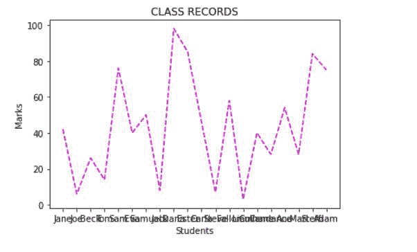
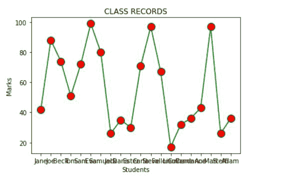

# Matplotlib 中的线图样式

> 原文:[https://www . geesforgeks . org/line-plot-style-in-matplotlib/](https://www.geeksforgeeks.org/line-plot-styles-in-matplotlib/)

Python 是一种高级的、解释的、动态类型的编程语言，可以用来管理巨大的数据集。Python 支持各种各样的数据可视化库，如 Matplotlib、Seaborn、Bokeh、Geoplotlib、Ggplot 和 Plotly。在所有这些库中，Matplotlib 相对简单且易于实现。Python 的 Matplotlib 库是数据可视化的一个流行选择，因为它有各种各样的图表类型，并且它的属性可以被操作来创建图表样式。matplotlib.pyplot.plot(*args，* * kwargs)matplotlib . py plot 的方法用于绘制图形并指定图形样式，如颜色或线条样式。

**Matplotlib 中有以下线型:**

<figure class="table">

| **以下线型在 Matplotlib** 中可用 |
| --- |
| **字符**

 | **定义** |
| **–** | 实线 |
| **—** | 短划线 |
| **-。** | 点划线 |
| **:**

 | 点线 |
| **。** | 点标记 |
| **o** | 圆形标记 |
| **、** | 像素标记 |
| **v** | 三角形向下标记 |
| **^** | 三角形向上标记 |
| **<** | 三角形 _ 左标记 |
| **>** | 三角形 _ 右标记 |
| **1** | 三向下标记 |
| **2** | 三向上标记 |
| **3**

 | 三左标记 |
| **4** | 右三标记 |
| **s** | 正方形制造者 |
| **p** | 五角大楼制造商 |
| ***** | 星形标记 |
| **h** | 六边形 1 标记 |
| **H** | 六边形 2 标记 |
| **+** | 加记号 |
| **x** | X 标记 |
| **D** | 钻石标记 |
| **d**

 | 薄菱形标记 |
| **&#124;** | 非织造布标记 |
| **_** | hline 标记 |

</figure>

**可与线条样式一起使用的颜色代码缩写:**

<figure class="table">

| 

**代码**

 | 

**描述**

 |
| --- | --- |
| **b** | 蓝色 |
| **g** | 绿色的 |
| **r** | 红色 |
| **c** | 蓝绿色 |
| **米** | 品红 |
| **y** | 黄色 |
| **k** | 黑色 |
| **w** | 白色 |

</figure>

以下示例演示了绘制具有不同线型的图形:

**例 1:**

在本例中，导入了 matplotlib.pyplot 库。学生姓名被添加到学生列表中，而分数列表是用 random.randint()方法创建的。接下来，标记 X 轴和 Y 轴，并给图表一个标题。最后，使用 matplotlib.pyplot 的 plot()方法绘制图形。这里使用了颜色和线条样式的缩写形式。选择的颜色缩写是“m ”,它是洋红色，选择的线条样式是“–”,它是虚线样式。

**下面是实现:**

## 蟒蛇 3

```
import matplotlib.pyplot as plt
import random as random

students = ["Jane","Joe","Beck","Tom",
            "Sam","Eva","Samuel","Jack",
            "Dana","Ester","Carla","Steve",
            "Fallon","Liam","Culhane","Candance",
            "Ana","Mari","Steffi","Adam"]

marks=[]
for i in range(0,len(students)):
     marks.append(random.randint(0, 101))

plt.xlabel("Students")
plt.ylabel("Marks")
plt.title("CLASS RECORDS")
plt.plot(students,marks,'m--')
```

**输出:**



**例 2:**

在本例中，导入了 matplotlib.pyplot 库。学生姓名被添加到学生列表中，而分数列表是由 random.randint()方法创建的。接下来，标记 X 轴和 Y 轴，并给图表一个标题。最后，使用 matplotlib.pyplot 的 plot()方法绘制图形。这里不使用缩写格式，而是使用关键字参数控制线条属性。关键字被分配了必需的值。使用的颜色是绿色，线型是实心的，标记是圆形标记，标记颜色是红色，标记大小是 12px。

**下面是实现:**

## 蟒蛇 3

```
import matplotlib.pyplot as plt
import random as random

students = ["Jane","Joe","Beck","Tom","Sam",
            "Eva","Samuel","Jack","Dana","Ester",
            "Carla","Steve","Fallon","Liam","Culhane",
            "Candance","Ana","Mari","Steffi","Adam"]

marks=[]
for i in range(0,len(students)):
     marks.append(random.randint(0, 101))

plt.xlabel("Students")
plt.ylabel("Marks")
plt.title("CLASS RECORDS")
plt.plot(students, marks, color = 'green',
         linestyle = 'solid', marker = 'o',
         markerfacecolor = 'red', markersize = 12)
```

**输出:**

