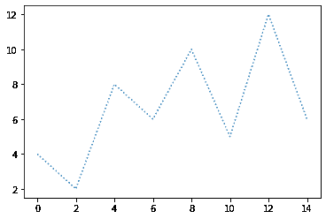
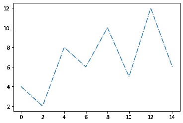
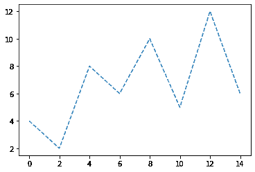
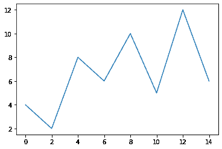

# matplot lib python 中的线型

> 原文:[https://www . geesforgeks . org/linestyles-in-matplotlib-python/](https://www.geeksforgeeks.org/linestyles-in-matplotlib-python/)

[Matplotlib](https://www.geeksforgeeks.org/python-introduction-matplotlib/) 是 Python 中一个惊人的可视化库，用于数组的 2D 图。 *Matplotlib* 是一个多平台数据可视化库，构建在 *NumPy* 阵列上，旨在与更广泛的 *SciPy* 堆栈一起工作。

绘制数据时的默认*线型*是 *matplotlib* 中的实体*线型*。我们可以使用 *plot()* 方法的**线型**或 **ls** 参数来更改此*线型*。

### **以下是*****matplotlib*****中可用的线型:**

**使用** ***线型*** **参数:**

*   固体
*   虚线
*   有点的
*   达什特
*   没有人

**使用** ***ls*** **参数:**

*   **'-'**
*   **':'**
*   **'–’**
*   **'-'**
*   **' '**

### **逐步逼近**

*   导入模块。
*   创建数据。
*   通常通过设置 *plot()* 方法的*线型*或 *ls* 参数来绘制数据。
*   显示图。

### 以下是在 *matplotlib* 模块中描述各种线条样式的各种程序:

**示例 1:** 在一个情节中描绘*虚线*线条样式的程序。

## 蟒蛇 3

```
# importing libraries
import matplotlib.pyplot as plt

# creating data
xdata = [0, 2, 4, 6, 8, 10, 12, 14]
ydata = [4, 2, 8, 6, 10, 5, 12, 6]

# plotting data
plt.plot(xdata, ydata, linestyle='dotted')

# Displaying plot
plt.show()
```

**输出:**



**示例 2:** 在一个情节中描绘*虚线*线条样式的程序。

## 蟒蛇 3

```
# importing libraries
import matplotlib.pyplot as plt

# creating data
xdata = [0, 2, 4, 6, 8, 10, 12, 14]
ydata = [4, 2, 8, 6, 10, 5, 12, 6]

# plotting data
plt.plot(xdata, ydata, linestyle='dashdot')

# Displaying plot
plt.show()
```

**输出:**



**示例 3:** 使用 *ls* 参数在剧情中描绘*虚线*线条样式的程序。

## 蟒蛇 3

```
# importing libraries
import matplotlib.pyplot as plt

# creating data
xdata = [0, 2, 4, 6, 8, 10, 12, 14]
ydata = [4, 2, 8, 6, 10, 5, 12, 6]

# plotting data
plt.plot(xdata, ydata, ls='--')

# Displaying plot
plt.show()
```

**输出:**



**示例 4:** 使用 *ls* 参数在情节中描绘*实线*样式的程序。

## 蟒蛇 3

```
# importing libraries
import matplotlib.pyplot as plt

# creating data
xdata = [0, 2, 4, 6, 8, 10, 12, 14]
ydata = [4, 2, 8, 6, 10, 5, 12, 6]

# plotting data
plt.plot(xdata, ydata, ls='-')

# Displaying plot
plt.show()
```

**输出:**



使用*线型*或 *ls* 参数可以可视化上述所有类型的线型。可视化时*无*或*将生成空白图。*