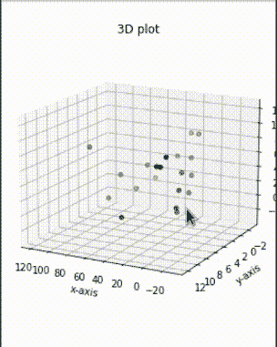
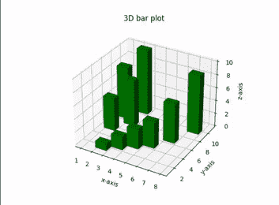

# 在 Jupyter 笔记本中制作 3D 互动 Matplotlib 图

> 原文:[https://www . geesforgeks . org/make-3d-interactive-matplotlib-plot-in-jupyter-notebook/](https://www.geeksforgeeks.org/make-3d-interactive-matplotlib-plot-in-jupyter-notebook/)

Matplotlib 是一个数据可视化库。不把数据可视化，就很难分析/洞察数据。而 [matplotlib](https://www.geeksforgeeks.org/python-introduction-matplotlib/) 是一个用 python 做数据可视化分析的很棒的库。使用 matplotlib，我们可以绘制一维、二维甚至三维数据。在本文中，我们将学习如何使用 matplotlib 绘制各种三维图。要用 python 绘制三维图，我们需要从 python 的 matplotlib 库的标准安装中导入 **mplot3d** 库。

由于 matplotlib 是一个第三方库，它没有标准的 python 安装，因此您需要在阅读本文之前安装 matplotlib。下面是可以用来安装 matplotlib 库的命令。

**语法:**

> *pip3 安装 matplotlib*

要使绘图具有交互性，您只需安装另一个名为 **ipympl** 的库，即交互式 python matplotlib。

**语法:**

> *pip3 安装 ipympl*

创建三维图形时使用**轴 3D.plot()** 功能。

> **语法:**
> 
> 三维打印轴(xs、sys、zs、*args、**kwargs)
> 
> **参数:**
> 
> *   **xs:** 顶点的 x 坐标值。
> *   **ys** :顶点的 y 坐标值。
> *   **zs**:z 坐标值，所有点一个或每个点一个。

要生成交互式三维图，首先导入必要的包并创建随机数据集。现在使用 mplot3d 库中的 Axes3D(图)函数，我们可以直接生成所需的图。将数据传递到三维图，并配置标题和标签。

**注意:**我们必须需要添加**% matplotlib 小部件】，**这是一个 jupyter 魔法小部件，用于告诉 Jupyter 使用交互式后端进行剧情。我们必须将其添加到脚本的顶部，以在 **ipython** 笔记本(即 Jupyter 笔记本、Google Colab、Kaggle Kernel 等)中创建一个交互式剧情。)将图形渲染为交互式图形。

下面给出了一些同样的实现。

**示例:**交互式散点图

## 蟒蛇 3

```py
# creating 3d plot using matplotlib 
# in python

# for creating a responsive plot
%matplotlib widget

# importing required libraries
from mpl_toolkits.mplot3d import Axes3D
import matplotlib.pyplot as plt

# creating random dataset
xs = [14, 24, 43, 47, 54, 66, 74, 89, 12,
      44, 1, 2, 3, 4, 5, 9, 8, 7, 6, 5]

ys = [0, 1, 2, 3, 4, 5, 6, 7, 8, 9, 6, 3,
      5, 2, 4, 1, 8, 7, 0, 5]

zs = [9, 6, 3, 5, 2, 4, 1, 8, 7, 0, 1, 2, 
      3, 4, 5, 6, 7, 8, 9, 0]

# creating figure
fig = plt.figure()
ax = Axes3D(fig)

# creating the plot
plot_geeks = ax.scatter(xs, ys, zs, color='green')

# setting title and labels
ax.set_title("3D plot")
ax.set_xlabel('x-axis')
ax.set_ylabel('y-axis')
ax.set_zlabel('z-axis')

# displaying the plot
plt.show()
```

**输出:**



Jupyter 笔记本中的交互式 3D 绘图

**示例:**交互式条形图

## 计算机编程语言

```py
# creating 3d bar plot using matplotlib 
# in python

# to interacte  with plot
%matplotlib widget

# importing required libraries
from mpl_toolkits.mplot3d import Axes3D
import matplotlib.pyplot as plt
import numpy as np

# creating random dataset
xs = [2, 3, 4, 5, 1, 6, 2, 1, 7, 2]
ys = [1, 2, 3, 4, 5, 6, 7, 8, 9, 10]
zs = np.zeros(10)
dx = np.ones(10)
dy = np.ones(10)
dz = [1, 2, 3, 4, 5, 6, 7, 8, 9, 10]

# creating figure
figg = plt.figure()
ax = figg.add_subplot(111, projection='3d')

# creating the plot
plot_geeks = ax.bar3d(xs, ys, zs, dx, 
                      dy, dz, color='green')

# setting title and labels
ax.set_title("3D bar plot")
ax.set_xlabel('x-axis')
ax.set_ylabel('y-axis')
ax.set_zlabel('z-axis')

# displaying the plot
plt.show()
```

**输出:**



交互式 3D 绘图